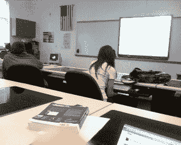
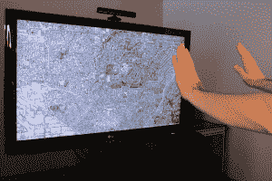

# 创新:我们将何去何从？实际上是很多地方 

> 原文：<https://web.archive.org/web/https://techcrunch.com/2012/12/31/innovation-where-can-we-go-from-here-a-lot-of-places-actually/>

就在你认为我们已经尽我们所能进行创新的时候，一些新的东西出现了，让我们大吃一惊。它可能是硬件、软件的进步，或者只是一种思考事物的新方式。当涉及到想出新的东西来修补和使我们的生活更容易时，人类是非常有弹性的。

今年在创新方面非常棒，而且不是你可能会想到的那种创新。没有“下一个大事件”可言，这意味着没有新的大公司来转移苹果、谷歌、脸书和微软的注意力。不过，这没什么，因为有很多公司关注我们的日常工作，并找到了新的和酷的方法来使它更有趣或更省时。这也是创新。

我想到了 Lyft 和 T2 和优步为了让我们在大城市的骑行更愉快、压力更小所做的事情，你必须看看 Lytro 对相机做了什么，以及 T4 的 Lit Motors 将为机动车辆做什么。今年*非常令人兴奋。对于消费者应用来说，这可能是一个小年。没关系，因为 2013 年有很多地方可以创新。*

让我们来谈谈其中的几个。

### 卫生保健

 与你的个人医疗团队成为“一体”是我们目前所缺乏的。有一些服务可以帮助你找到最适合你的治疗方法，什么样的保险单可以保证你的安全，以及你将来可能会接受什么样的保险。但是去那里还有很长很长的路要走。

最终，你将能够通过手机或其他移动设备将你的全部病史直接传送到急诊室或新医生那里。你不再需要等待记录被送过来或者实验室被读取。他们都将在那里，医疗专业人员也将有设备来支持它。

我们离那个目标不远了，但是苹果和谷歌在移动设备能做什么方面取得了巨大的进步。在未来，我们需要更好的应用于医疗保健的软件和技术，仅此一项就能减轻去体检或发现自己有长期疾病需要处理时的压力和担忧。

这不是一个可以进入的性感空间，老实说，吓到了很多人。不过，我们会到达那里的。

### 教育

 天啊，学校在技术和软件方面还有很长的路要走。现在，一切都是拼凑起来的，我不能责怪管理员不想从遗留系统中切换出来。“如果它没坏，就不要修理它”这句古老的咒语在教育领域闪耀着光芒，主要是因为创新者没有花时间在那里创新。是的，已经做了一些事情，但是这个领域是时候进行大的颠覆了。

如果你剥开我们学校系统中的所有层面，就会发现有太多的低效率让我们的老师感到沮丧，家长感到紧张，孩子们落在了后面。技术不能解决世界上所有的问题，但它可以帮助你清理日常生活中绊倒我们的更简单的事情。有些人仍然必须登录 Lotus 才能获得他们的大学成绩，这是胡说八道。

如果我们诚实地用我们的集体能量用技术使我们的学校系统变得更好，老师可以专注于教学，孩子们可以专注于学习。请在 2013 年继续这样做。

### 运输

对大多数人来说，Lyft 和优步似乎是他们小城镇地区的白日梦。然而，[按需运输](https://web.archive.org/web/20221207102956/http://ubernye.tumblr.com/)的想法，多亏了技术，才刚刚起步。如果你将这项技术与上面提到的其他一些领域结合起来，救护车可以运行在一个完全移动的警报系统上，学校可以在需要讨论事情的时候联系家长。

再说一次，有些东西已经拼凑起来了，但是没有真正的技术先进的交通“产业”。如果你想加入 Lit Motors 和埃隆·马斯克的[特斯拉](https://web.archive.org/web/20221207102956/https://beta.techcrunch.com/2012/07/18/test-driving-the-super-connected-all-electric-tesla-model-s-tctv/)，这里有令人兴奋的酝酿和赚钱的机会。

嘿，别忘了谷歌的那辆[无人驾驶汽车，它有一天会真正拯救生命。](https://web.archive.org/web/20221207102956/https://beta.techcrunch.com/2012/08/07/google-cars-300000-miles-without-accident/)

### 娱乐

 你现在怎么看电视和电影？在接下来的两三年里，这种情况可能会发生巨大的变化。现在，我们注册了将内容传送到各种设备的服务。我们必须决定购买、挑选和使用哪种设备。是的，这听起来像是第一世界的问题，但公司将开始思考新的方式来开发和分发基于我们手中设备的内容。现在，我们陷入了多重分销的困境。这将随着创新而消失。

就书籍和杂志而言，苹果、谷歌和亚马逊刚刚开始在分发这些类型的媒体上提供服务。随着越来越多的创业公司成为分销的中间人，神奇的事情可能会发生。还记得亚马逊收购 Zappos 的时候吗？这与文化及其电子商务机制有很大关系。

我们将能够用手移动东西，更多地相互交流，享受生活。

### 无聊？不了

我们自己的迈克尔·阿灵顿[说他对](https://web.archive.org/web/20221207102956/https://beta.techcrunch.com/2012/12/30/im-bored-whats-next/)感到厌烦，但他真正想说的是“加快步伐，企业家们，现在不要原地踏步。”这是一个很好的建议，因为当你习惯于发布蹩脚的应用程序来复制别人正在做的事情时，会有很多周期浪费在可以用在其他地方的东西上。

如果你正在开发一个照片分享应用程序，为什么不考虑如何使它适应高等教育、特殊教育或医疗保健行业呢？是的，这听起来像是一件苦差事，但是最难的事情是值得做的事情。我们正在远离 Instagram 和 Snapchat 这样的“快速点击”,并开始专注于更大、更冗长的问题。这需要时间，不会一蹴而就。

如果更多的创业公司专注于解决让消费者最痛苦的看似微不足道的问题，那么也能赚很多钱。对所有相关人员。

不无聊，这只是开始。

【图片鸣谢: [Flickr](https://web.archive.org/web/20221207102956/http://www.flickr.com/photos/cesarmascarenhas/5513486071/) 、 [Flickr](https://web.archive.org/web/20221207102956/http://www.flickr.com/photos/openexhibits/5449150604/sizes/z/) 、 [Flickr](https://web.archive.org/web/20221207102956/http://www.flickr.com/photos/zoovroo/3029617973/sizes/z/)