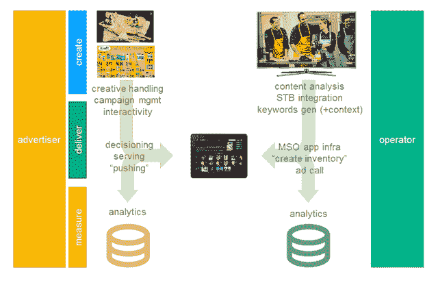

# Innovid 和思科从你正在观看的节目中提取关键词，瞄准第二屏广告 

> 原文：<https://web.archive.org/web/https://techcrunch.com/2014/01/06/innovid-cisco-keyword-targeting/>

红杉资本支持的视频广告公司 [Innovid](https://web.archive.org/web/20221006125932/http://www.innovid.com/) 宣布将与思科合作，推出一种针对第二屏幕应用(特别是有线电视提供商的智能手机和平板电脑应用)的新型广告。

这个想法是根据你正在看的节目来定位广告，不仅仅是根据节目，而是根据当时屏幕上正在讨论的内容。为此，思科与有线电视运营商合作，实时分析电视内容，识别该内容中的相关关键词(以及这些关键词的上下文)，然后提供针对这些关键词的广告。

例如，这些公司说，如果你在看脱口秀，主持人开始谈论平板电脑，他们可以为你提供一个与平板电脑相关的广告。或者，如果你在看一个平板电脑的广告，这款应用可能会弹出一个页面，让你了解更多信息，并订购相关设备。

随着第二屏幕活动的增加，投放这类广告可能变得更加重要，因为如果你在看电视时摆弄手机或平板电脑，你可能不会太关注传统广告。

该领域的其他实验包括 [Shazam 识别电视广告和提供相关内容的能力](https://web.archive.org/web/20221006125932/https://beta.techcrunch.com/2012/02/02/mobile-tv-apps-shazam-intonow-reveal-super-bowl-plans/)。Innovid 的联合创始人兼首席技术官 Tal Chalozin 认为，这些早期努力的问题是，有问题的单个应用程序没有达到电视广告客户所期望的广泛覆盖范围，广告客户需要创建许多不同的广告来适应不同的格式。

另一方面，通过 Innovid 和思科与有线电视运营商合作的方式，Chalozin 表示，广告商可以开展大规模的活动。即使有人没有打开康卡斯特(Comcast)或时代华纳(Time Warner)的应用，它仍然可以向他们发送关于独家优惠或独家内容的推送通知。(需要说明的是，这些公司还没有宣布任何合作伙伴，所以思科和时代华纳只是可能涉及的应用类型的例子。)

此外，与有线电视公司合作意味着你不必手动“签到”节目，应用程序就可以知道你在看什么。Chalozin 表示，借助 Innovid 的工具，单个广告将在多个应用程序和设备上运行。

这些公司将在本周的消费电子展上展示这项技术，在会议之前，Chalozin 给了我一个快速演示。基本上，他在屏幕上显示脱口秀的片段，当它播放时，每隔几秒钟就会识别出一个不同的关键词。偶尔，这些关键词中的一个会被突出显示，表明广告客户正在瞄准该关键词。

我猜速度将是一个重要的因素——如果一个广告正好出现在一个相关的话题正在讨论的时候，它可能会觉得相关，但如果它出现在一两分钟后，它可能会令人困惑或奇怪。Chalozin 同意，他指出思科的技术只需要大约两秒钟就可以生成关键词，尽管他承认，“显然这需要全面测试。”

正如我上面提到的，这些公司本周只展示了这项技术，没有宣布合作伙伴或可用性，但 Chalozin 说，“我们的意图是在今年上半年末或第三季度初推出这项技术。”