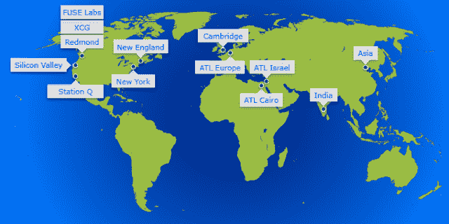
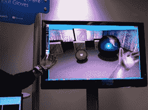

# 微软的创意大熔炉:从 Kinect、Bing 和 Killing The Blue Screen Of Death，到可以学习的代码、可以保存的像素和从 DNA 中提取的药物 

> 原文：<https://web.archive.org/web/https://techcrunch.com/2012/11/17/inside-microsofts-cauldron-of-ideas-from-kinect-bing-and-killing-the-blue-screen-of-death-to-code-that-can-learn-pixels-you-can-hold-and-drugs-compiled-from-dna/>

如果史蒂夫·沃兹尼亚克担心 T2，微软现在比苹果更具创新性，那么这种担心的根源无疑在于微软的研究实验室网络。这些大学式的研究机构遍布全球，从雷德蒙到印度和亚洲，再到英国，它们是创新背后的安静引擎，比如将人类动作转化为可计算手势的 Kinect 深度摄像头，以及将 Xbox 用户的动作转化为游戏性的游戏。

另一个值得注意的微软产品是必应搜索引擎，其研究部门在开发中发挥了重要作用——研究人员正在努力解决一些问题，如如何计算相关性和设计搜索广告背后的拍卖机制。微软研究院还通过开发微软的[静态驱动程序验证器](https://web.archive.org/web/20221006040510/http://msdn.microsoft.com/en-gb/library/windows/hardware/gg487498.aspx)帮助提高了 Windows 操作系统的可靠性(该验证器解决了信任第三方软件的问题——并使蓝屏死机成为罕见现象，这曾经是一个笑话)。

从外面看，微软的研究实验室看起来像是一家成立于冰河世纪前的公司皇冠上的宝石，从技术角度来说，这有助于确保，尽管是技术领域的老爷爷——前首席执行官的销售总监——雷德蒙仍然是其参与的许多领域中不可忽视的巨大力量。

微软剑桥研究院(T4)的实验室主任 Andrew Blake 说，这些实验室是“微软的高瞻远瞩的眼睛”，他给出了内部人士的观点。他告诉 TechCrunch:“我们的工作是成为一个充满想法的大锅，这些想法在合适的时候被拿出来。”。

“从本质上来说，很难预测什么是重要的，所以这就是为什么你让大锅沸腾，因为让百花齐放，让我们看看会发生什么。你真的不知道结果会是什么。”

微软在 2012 财年花费了 98 亿美元用于研发，但是布莱克说实验室只占其中的“一小部分”。“我们不公布我们的预算，但这只是研发总支出的一小部分，”他说。“我不知道如何花费(98 亿美元)！”

在一次对微软剑桥研究实验室的媒体访问中，我们看到了在安静的公司外表下冒泡的大量研究项目，无论其预算多么有限:从使用机器学习来利用大数据的力量来更好地预测地球气候的项目；研究新的用户界面机制，[将现实和虚拟融合在一起](https://web.archive.org/web/20221006040510/http://research.microsoft.com/apps/video/dl.aspx?id=154571)，这样你就可以将一个 3D 像素球‘握’在手中；一个博士项目，回收 Kinect 组件，制作一个戴在手腕上的无手套手指动作捕捉设备(下图)；多学科研究着眼于使用计算机软件制作可编程的生物细胞[。](https://web.archive.org/web/20221006040510/http://research.microsoft.com/apps/video/dl.aspx?id=152139)

如果有一条统一的主线将微软研究院旗下所有不同的项目连接起来，那就是正在进行的各种各样的研究工作。这不是一个与产品团队和直接商业目标紧密相关的企业研究模型，这与谷歌的[研究不同，谷歌【】的](https://web.archive.org/web/20221006040510/http://research.google.com/)[研究有一个明确的目标](https://web.archive.org/web/20221006040510/http://static.googleusercontent.com/external_content/untrusted_dlcp/research.google.com/en//pubs/archive/38149.pdf)“为我们的用户带来显著的实际利益，并且最多在几年内迅速实现。”

布莱克说，微软研究院更像是一个大学研究机构，他认为这种结构有助于一个更健康、更可持续的实体。“我们很清楚，一个健康的研究实验室需要一个更新机制，”他说。“如果你只是让那些习惯于做研究和做自由思考者的人，给他们套上轭，就像给牛套上轭一样，让他们驾驶技术车，最终他们会感到疲惫，他们去哪里恢复精力？新的想法将来自哪里？这就是为什么我们把它作为我们组织结构中不可或缺的一部分——基础研究、出版、参加会议以及与学术界的自由联系就在我们的 DNA 中。”

Blake 指出，他最近刚刚组织了一个学术会议，主题是他自己的专业领域——计算机视觉，他补充道:“我们微软研究院的高级人员轮流做这些事情，我们在这些会议上发表了很多东西，我们有来自其他大学的研究人员访问我们，我们也访问其他大学。有很多这样的事情正在发生，与你在大学里看到的没有什么不同。”

当然，大学有重要的区别。一方面，微软研究院掌握了大量的商业数据——它可以利用这些数据作为研究辅助。不需要建立一个迷你数据中心，比如说，来测试提高数据中心效率的研究，微软研究人员可以“随时去和运营 Azure 业务的人交谈，尝试他们的想法，看看他们是否抓到了正确的痒处，”正如布莱克所说。(是的，该实验室正在进行一项旨在提高数据中心效率的研究项目。)

因此，研究人员当然与微软的产品团队有关系——但根据布莱克的说法，企业开发的产品不会限制正在进行的研究工作。信息和想法是双向流动的。

“我们可能会有一个产品团队说，看，我们必须在规定的时间内开发这个东西，你会帮助我们吗？大多数人都非常热衷于尝试，我们会发现我们是否能帮上什么忙。业务目标来自业务；我们不是商人，我们是研究人员，”他说。

然后从另一个方向说:“我们经常去那里，向(企业)推销我们的想法，但如果这些想法没有被立即采纳，我们也不会感到困扰，因为我们有点认为现在可能不是合适的时机，”布莱克说。“商业有它自己的周期，你不能在商业中做所有的事情；你必须把注意力集中在今天的任何事情上。因此，如果我们发明了一些我们认为很棒的东西，而企业当时并不完全符合他们的需求，这也不会让我们放弃。”

布莱克说，在 Kinect 的例子中，剑桥实验室回应了来自企业的商业压力，通过利用相关的研究(在某些情况下是几年前的)来开发该产品，看看它们是否可以连接起来——这些研究最终形成了商业产品的技术基础。

## Kinect 的人找到了我们，因为我们手边有想法，所以我们能够从货架上拿一个出来。

“在 Kinect 的想法之前，我们一直在猜测各种各样的事情，有些事情我们从来没有想到他们会特别制造产品，”布莱克说。“但是 Kinect 的人找到了我们，因为我们手边有很多想法，所以我们能够从货架上取下一个我们认为合适的产品，它确实做到了。这个解决方案让我们大吃一惊。我们对这些想法了如指掌。我们不认为这些想法对这个问题有好处，但后来我们真的受到了压力，因为只有一年的时间与 Xbox 团队一起开发解决方案，所以我们不得不下注。

“我们最终将一些非常令人惊讶的东西放在一起，但它们是我们背景中的东西，我们已经玩了多年。如果有人说现在就玩这些，那就没用了。这必须是你研究经历的一部分，所有这些东西要么在你的指尖，要么至少在你的脑海里。”

企业对研究实验室有一个明显的影响:他们选择雇佣的研究人员的类型。“我们可能不会雇佣一些分析化学师，因为我们目前真的看不出这会对业务产生什么影响——并不是说这是不可能的——但我们不会雇佣很多分析化学师，”Blake 说。

“我们在计算的一些核心学科和一些边缘学科周围雇用了很多人，有时我们几乎完全脱离了计算——就像我们的[计算科学小组](https://web.archive.org/web/20221006040510/http://research.microsoft.com/en-us/groups/science/default.aspx)一样，他们所做的主要目标实际上是科学。但与业务的联系是，他们是计算工具的超级用户，他们的用户经常给我们的系统施加压力，以至于发明了新事物。因此，我们在这些领域雇佣了与业务广泛相关的专家。但是，当我们打响发令枪时，这些人就会发飙，你不知道他们会想出什么。”

[T2](https://web.archive.org/web/20221006040510/https://beta.techcrunch.com/2012/11/17/inside-microsofts-cauldron-of-ideas-from-kinect-bing-and-killing-the-blue-screen-of-death-to-code-that-can-learn-pixels-you-can-hold-and-drugs-compiled-from-dna/photo-14-11-2012-11-06-24/)

当被问及他认为实验室里正在进行的哪些项目最有前景时，布莱克不愿意扮演宠儿。“你在让我在我最喜欢的孩子之间做出选择——我不可能这么做，”他开玩笑说。

他说:“做好研究的能力在很大程度上不仅仅是深入的分析性思考，这更是公众可能对研究的看法，但通过运用良好的品味——你选择不调查什么和你选择调查什么同样重要。”这呼应了史蒂夫乔布斯的产品箴言——“决定不做什么和决定做什么同等重要”。“机会成本，也就是看起来很有前景的东西。人们凭直觉去选择他们认为会令人兴奋的东西。这就是为什么我聘用最优秀的研究人员至关重要，因为良好的品味正是你为公司带来的东西之一。因此，我真的很难预测公司将迎来怎样的发展。”

他愿意触及有前途的研究领域——机器学习是一门他认为将在构建新一代软件系统中发挥越来越重要作用的学科。机器学习技术已经被用于制造产品——例如 Kinect 手势识别器(它可以确定你是在举肘还是举膝)，以及为 Xbox 的游戏、电视和电影推荐引擎提供动力(它处理你的观看数据，预测你可能还喜欢什么)。但在大数据和日益复杂的时代，机器学习技术正成为越来越多应用的必要条件。

“人工智能最早的教训之一是，编写智能行为太难了——你无法捕捉它，”布莱克说。“更好的是软件按照人类学习的方式开发，动物学习的方式:通过例子。你给他们看一些东西，这些东西被概括，这些概括变成了软件——你实际上并没有写软件，不完全是。关键部分通过这些学习程序自动构建。

“我们这里有一个进行机器学习的小组——大约占实验室的五分之一——现在这些想法正在这个小组之外蔓延。”

## 在未来，也许微软将从事的是生成生物结构的软件，它太重要了，我们不能忽视。

布莱克说，具体来说，机器学习研究人员正在与设计编程语言的研究人员合作，探索如何开发能够学习和理解不确定性的软件。“现在我们正在做的是编写程序，而不是仅仅将数字相加或处理字符串，实际上是对概率进行推理，并将估计事情有多可能，”他说。“这是一项非常基本的能力，我们是这方面的先锋。”

当被要求看得更远，考虑微软在 10 年或 20 年后可能会是什么样子，如果那时它还存在的话，布莱克很快指出，没有办法知道未来会发生什么，无论实验室的眼睛看得多远，或者它的想法有多深刻和丰富。但是他确实指出“计算和生物学之间的界面”是一个“迷人的领域”——微软的一项研究现在“非常投入”。

这项工作的多学科性质意味着具有计算机科学背景的研究人员正在与生物学家合作。或者，在微软研究院首席研究员[卢卡·卡德里](https://web.archive.org/web/20221006040510/http://research.microsoft.com/en-us/people/luca/)的情况下，他们已经将注意力从设计编程语言转移到试图使用计算思维作为一种方式来解开细胞分裂等生物机制。

“卢卡和他的合作者所做的是，他们进一步开放了这一机制，以显示更多的细节。但是他们的洞察力来自于计算思维，如果你喜欢，可以用计算过程和类比来表达细胞在做什么。不同寻常的是，他们只是发表了理论论文，同时也发表了实践论文。一篇实验论文发表了，它展示了几乎完全相同的东西——但是是在实验环境中——所以这是一项具有里程碑意义的工作，”布莱克说。

“将来，也许微软会从事生成生物结构的软件；这太重要了，我们不能忽视。我们目前不知道这是否能赚钱，”他补充道。“我们正在调查的一些事情看起来与任何类型的业务都相去甚远，但谁知道它们将来是否会成为微软业务的一部分。

“我认为很明显，20 年后生物学和计算机的交叉将会是一件大事……人们可能会通过编写程序来设计药物。从头开始设计它们，用 DNA 制造它们。他们只是把程序送去编译。他们这样做的方式是将它们通过网络发送给产生 DNA 的人。”

设计 DNA 片段与你想象的一家科技公司生产下一代消费科技产品的距离肯定很远。但是，微软公司无疑是一个更强大、经得起未来考验的企业，因为它有如此高瞻远瞩的眼光。

苹果电视让你心碎。