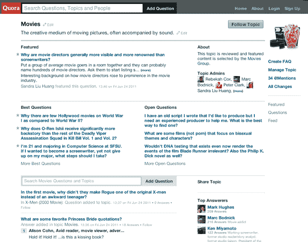
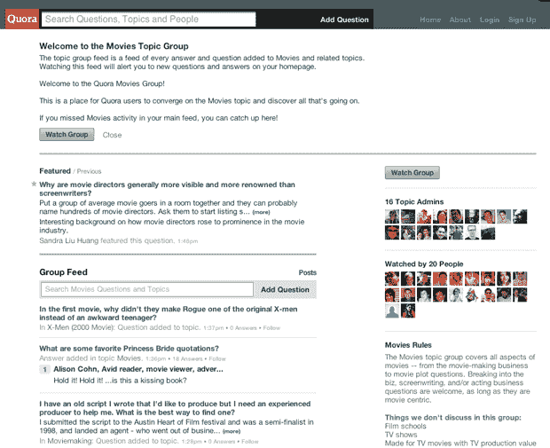

# 受维基百科的启发，Quora 的目标是与主题组相关联，并重组主题页面

> 原文：<https://web.archive.org/web/https://techcrunch.com/2011/06/24/inspired-by-wikipedia-quora-aims-for-relevancy-with-topic-groups-and-reorganized-topic-pages/>

# 受维基百科的启发，Quora 的目标是与主题组相关联并重组主题页面

[Quora](https://web.archive.org/web/20230326022446/http://www.quora.com/) 刚刚宣布[重新设计其主题页面](https://web.archive.org/web/20230326022446/http://www.quora.com/Edmond-Lau/New-Topic-Pages-and-Topic-Groups)并引入主题群组，旨在使网站上的信息发现和导航变得更加容易。这些变化背后的动机是为了方便 Quora 上的搜索和内容相关性，因为目前网站上有大量的内容，人们需要知道如何导航。

现在，用户将根据主题看到最佳问题、开放式问题以及特色问题和常见问题，而不是主题页面上的时间顺序流(可以通过问题中的标签获得)。

一个主题页面也可以对应一个主题组，该主题组将关注主题页面上的所有活动，并且可以将多个主题合并为一个主题，为用户提供一种自我组织和共享信息的方式。例如，这个[电影组](https://web.archive.org/web/20230326022446/http://www.quora.com/Movies/group)对应于这个[电影页面](https://web.archive.org/web/20230326022446/http://www.quora.com/Movies/group)。

Quora 联合创始人 Adam D'Angelo 将主题页面和主题小组之间的区别比作维基百科文章和维基百科对话页面之间的区别，其中对话页面展示了页面背后致力于主题、主持问题和展示内容的小组的活动。这个页面只是这个群体知识总和的一个前哨。

“如果你不知道某个主题，现在你可以在主题页面上对该主题有一个大致的了解，”D'Angelo 告诉我，他说主题小组将成为那些想深入研究的人的空间。

一些主题组将是官方的(你可以在这里看到一个列表)，即由一组具有主题专业知识的管理员来管理，而其他的主题组将简单地包括所有进入主题页面的活动。

D'Angelo 写道，“我们最近在 Quora 上与编剧和好莱坞的其他人进行了很多活动。现在有了一个明确的空间，他们可以专注于电影，而不会被 Quora 上他们感兴趣的其他事情分心或打断。总的来说，这种结构会让我们有更深入的社区和话题领域。”

power Quora 用户 Semil Shah 说:“(在维基百科上)你有主题，你从一页移到另一页，就像节点一样。这里，在 Quora 中，主题是以一种最终可以深入探究和调查的方式组织的。真是天才。”

尽管没有用户数量可以公布，但 D'Angelo 告诉我，去年冬天 Quora 增长速度超过预期后，设计和组织的变化是必须仔细研究哪些有效哪些无效的结果。D'Angelo 说，这项服务的最终目标是在互联网上获得更多的知识，获得更多的问题和答案。

同样在信息发现和相关性方面，但在光谱的另一端是令人愉快的新推出的 Quora [Shuffle 按钮](https://web.archive.org/web/20230326022446/http://blog.louisgray.com/2011/06/quora-hits-shuffle-button-for-increased.html)，它让用户在 Quora a la [StumbleUpon 上查看随机内容。你可以在每个 Quora 页面的底部找到不起眼的 Shuffle 按钮。一步步来。](https://web.archive.org/web/20230326022446/http://www.stumbleupon.com/)