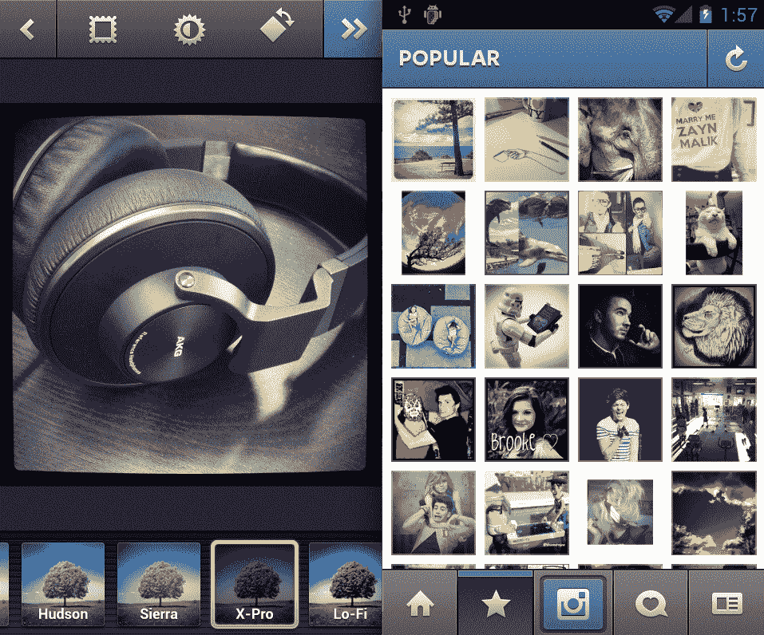

# 在 iOS 上拥有超过 3000 万用户的 Instagram 终于来到了 Android 

> 原文：<https://web.archive.org/web/https://techcrunch.com/2012/04/03/instagram-android-demum/>

早上好伙计们！对于安卓用户来说，这将是一个阳光灿烂的日子，因为照片分享的宠儿 Instagram 已经在安卓市场上市了。如果你想在没有看完剩下的这部分(是*那*直观)的情况下，赶快尝试一下，你可以在这里下载 app [。如果你已经在 iOS 上使用 Instagram，并且不想坐着听完 n00b 解释器，请直接跳到第 7 段。](https://web.archive.org/web/20230326200007/https://play.google.com/store/apps/details?id=com.instagram.android)

**适合初学者**

对于那些不熟悉整个 Instagram 体验的人来说，这个应用程序非常简单，这就是它令人惊叹的地方。要使用 Instagram，只需打开它，捕捉照片或从照片库中选择一张现有的照片。一旦上传，应用程序允许你移动和缩放你的图像。选择构图后，您可以通过“Lux”功能运行图像，方法是按下下一个屏幕最左侧的太阳图标(Lux，[类似于 Camera+的“Clarity”，](https://web.archive.org/web/20230326200007/https://techcrunch.com/2012/02/10/instagram-just-gave-me-one-less-reason-to-use-camera/)通过提高对比度来放大照片)。

在这一步，你可以添加边框或去 sans，旋转图像，或使用应用程序顶部导航栏中的图标取消导航屏幕。在屏幕底部，你会看到 Instagram 上著名的滤镜，包括受科幻小说启发的 Valencia、Sutro 和布兰南，以及我最终一直使用的 X-Pro。因为我们都是有特质的小雪花，每个人都有自己独特的喜好。

一旦你决定了你要发布的照片的确切规格，你就点击提供的绿色复选标记，应用程序的流程允许你输入描述和类似 Twitter 的标签进行搜索，给照片添加地理标签，并分享到 Twitter，脸书，Tumblr，Posterous，Foursquare 或通过电子邮件。除了分享之外，点击“完成”会将该项目发布到您的 Instagram feed，如果您有关注者，他们会喜欢它。除了您关注的人的照片之外，您还可以通过单击主页图标来查看照片。

点击星星图标会将你带到 Instagram 热门页面。我从来没有真正弄明白如何让一张照片在 Instagram 上“流行”,所以如果你做到了，请告诉我。我觉得诀窍就是有很多关注者(不都是这样的诀窍吗！？)——我仍然不相信凡人能做到。

除了热门页面，Instagram 主导航屏幕允许你通过选择“Heart Comment”图标来查看“新闻”,通过选择最右边看起来像“索引卡”的图标来查看你的个人资料。在这里，您可以找到要关注的人，以网格或时间列表视图查看您的所有照片，并编辑您的个人资料。

**送给大家**

Instagram 的联合创始人凯文·斯特罗姆告诉我，Instagram iOS 应用程序在上市约一年半后，现在已经有 3000 万用户，随着安卓[的 5 亿激活量](https://web.archive.org/web/20230326200007/http://www.asymco.com/2012/02/29/when-will-android-reach-one-billion-users/)(相比之下，苹果大约在[售出 1.8 亿部 iPhones】)这家初创公司很有可能很快在这两种设备上达到 1 亿用户，足以产生影响。](https://web.archive.org/web/20230326200007/http://www.learn-cocos2d.com/2012/03/ios-sales-statistics-q1-2012-split-by-model-opengl-es-2-0-support/)

脸书用了大约四年时间达到第一个 1 亿；Instagram 成为世界上第一个强大的纯移动社交网络的想法非常引人注目。

Systrom 告诉我，他的一个主要问题是两个平台之间的一致性，开发 iOS 应用程序的 13 个人也开发了 Android，可以在任何装有 Android 2.2 或更高版本的拍照手机上运行，支持 OpenGL ES 2(insta gram 滤镜所需的技术)。

“与 iOS 应用相比，Android 应用提供了极其熟悉的 Instagram 体验，”Systrom 写道，“你会发现所有与我们的 iOS 版本完全相同的过滤器和社区。”倾斜/移位、Flickr 集成和内嵌发布等 iOS 功能这次没有入选，但会在未来版本中推出。该应用程序还提供中文、法语、德语、意大利语、日语、韩语、葡萄牙语和西班牙语版本。

他们怎么花了这么长时间？嗯，整个“精益创业”的心态可能与此有关。“在单一平台上推出产品让我们能够专注于产品和用户体验，”Systrom 说。“它让我们能够保持小而灵活，并且我们能够快速响应用户反馈。”

据传，该公司将从顶级风险投资公司的通常嫌疑人那里筹集 4，000 万美元至 5 亿美元。也许我们将来会看到更多的扩张？Systrom 没有对下一步将在什么平台上发布发表评论，也没有回答我关于 iPad 应用程序或网站的问题。

我猜这个团队将会忙于扩展 Android。一周前的早期注册页面已经有超过 43 万人在等待名单上！虽然 Android 已经有了本质上具有 Instagram 功能的应用程序，但 Systrom 并没有被竞争对手抛弃，“iOS 上也有很多克隆产品——但归根结底，它是人们希望成为其中一员的社区。我们很高兴看到该社区在全球范围内以更多的视角发展壮大。”

我很高兴能把我的 Android 用户朋友包括进来。最后。你好[杰森。](https://web.archive.org/web/20230326200007/http://www.twitter.com/jasonkincaid)