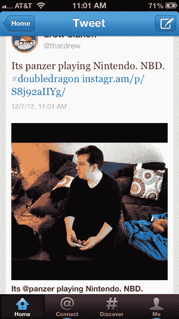

# Instagram 似乎已经恢复了推特上的照片，但时间不长

> 原文：<https://web.archive.org/web/https://techcrunch.com/2012/12/07/instagram-appears-to-have-turned-twitter-cards-back-on-for-its-photos/>

# Instagram 似乎已经恢复了推特上的照片，但不会持续太久

如你所知，前几天，脸书旗下的 Instagram 决定关闭其照片的 Twitter 卡功能,引发了一场大混乱。基本上，你再也看不到那些光彩夺目的图像了；相反，你会看到一个裁剪过的版本。

Instagram 联合创始人凯文·斯特罗姆[在 LeWeb](https://web.archive.org/web/20221206231744/https://beta.techcrunch.com/2012/12/05/kevin-systrom-on-pulling-twitter-cards-integration-we-want-images-viewed-on-instagram-com/) 上表示，这样做是为了给 Instagram 的网络体验带来更多流量，这是它认为必须要做的一步。

今天，它们似乎又被打开了。我们已经联系了两家公司进行评论(查看我们的**更新**，了解发生了什么):

我们在 Twitter 的网络和移动版本上都看到了这一点。

许多人讨论 Instagram 为什么会这样做，我们自己的迈克尔·阿灵顿[在这里](https://web.archive.org/web/20221206231744/https://beta.techcrunch.com/2012/12/06/they-screwed-us-right-before-they-screwed-us-again-poohead/)展示了这一切。基本上，从长远来看，这一举措本身对用户并没有好处。

Twitter 卡允许你查看嵌入在推文中的内容，并带有一个链接，让你知道你将要点击和将要去哪里。在某些情况下，它可能会阻止事情被完全看到。不过，有了 Instagram 照片，你只需看一眼就能得到你需要的一切。如果您想进一步参与，那么您可以选择单击该链接。

归根结底，这一切都是为了用户的选择。不要把它们锁在里面。

可以理解的是，公司不得不做出艰难的决定，就像 Twitter 自己在一些情况下所做的那样，特别是在[逐步恢复对其数据消防软管的访问](https://web.archive.org/web/20221206231744/https://beta.techcrunch.com/2012/11/28/peoplebrowsr-vs-twitter/)的情况下。有时候，移动不值得伤害用户，就像我觉得的这个例子。如果这步棋真的是永远逆转的话，Instagram 这招很聪明。

**更新:**我们听说这可能是一种“回归”，而不是 Instagram 有意为之。

来自 Instagram 发言人的消息:“正如 Kevin 在 LeWeb 上提到的，Instagram 正在放弃对 Twitter 卡的支持。你现在看到的可能是取决于移动客户端的某种回归，但我们正在与工程师核实。”

如果真的是这样，对于 Instagram 和 Twitter 用户来说，这是一个悲伤的时刻。又来了。

我们以为他们已经醒悟了。一个支持用户的人需要和两家公司坐在一个房间里，把这一切都解决掉。

[图片来源: [Flickr](https://web.archive.org/web/20221206231744/http://www.flickr.com/photos/vincentsl/3543888150/)