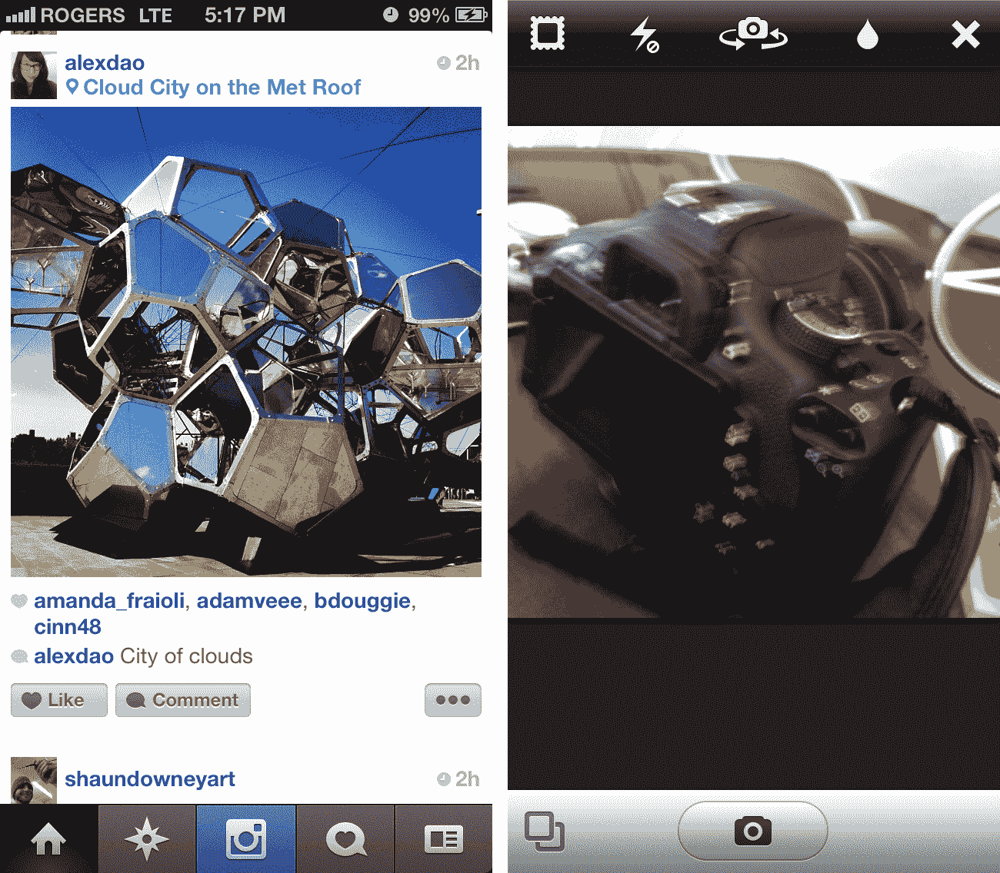

# Instagram 为 iPhone 5 的 4 英寸屏幕和 iOS 6 TechCrunch 更新

> 原文：<https://web.archive.org/web/https://techcrunch.com/2012/09/25/instagram-gets-updated-for-iphone-5s-4-inch-screen-and-ios-6/>

# Instagram 针对 iPhone 5 的 4 英寸屏幕和 iOS 6 进行了更新

新的快乐脸书大家庭肯定会使用 iPhone 5，不仅为自己的应用程序提供更新，还为新的子公司 Instagram 提供更新，旨在用于新的 iPhone 和 iOS 6。更新现在确保你能够使用 iPhone 5 的全 4 英寸荣耀查看你的照片。

使用更大的屏幕不会给桌面带来任何重大的界面变化:你只会一次看到更多的提要。如果能看到额外空间的一些额外用途，那就太好了，但至少这款旨在提供愉快观看体验的应用不再是信箱式的了。您还将获得一个针对新用户的新入职流程，如果您是第一次使用该流程，这将非常有用，同时还有更好的密码恢复选项。现在可以从 App Store 获得免费更新。

【T2