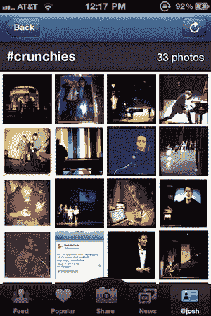
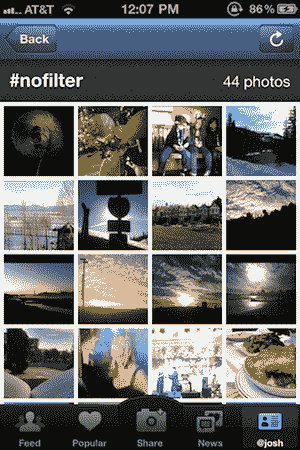
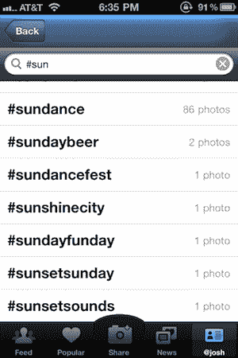
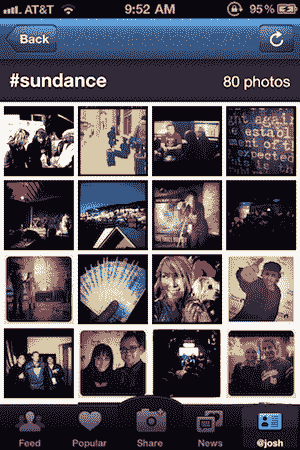

# Instagram 轻点标签捆绑图片；品牌迅速加入 

> 原文：<https://web.archive.org/web/http://techcrunch.com/2011/01/27/instagram-hashtags/>

你来参加脆饼干了吗？如果有，你有没有用 Instagram 拍照片？如果是的话，你有没有给它贴上标签？如果你做了，你帮助创造了一些很酷的东西，只是你没有意识到。

Instagram 的伟大之处在于它的简单。你拍一张照片，添加一个过滤器，上传，然后你就可以去探索流中的其他图片。不幸的是，除非你碰巧在拍照的时候看着这条小溪，否则你可能永远也看不到它。当然，Twitter、脸书和其他整合点在某种程度上对此有所帮助，但以前没有一个好方法可以在 Instagram 上展示旧照片。今天发布的一项新功能可能会改变这种情况。

Instagram 今天推出了该应用程序最新版本的标签支持。Twitter 的用户会很清楚标签现象，但它实际上可能在 Instagram 中更有用。想法是一样的:你给你拍的任何一张照片加上你想要的标签，放在图片的标题或评论中。例如，几周前，我和几个朋友在纳帕进行葡萄酒之旅。我们中的许多人都在使用 Instagram，并开始使用#winowagon 标签来标记我们的照片(我知道这很经典)。这使得所有的图片被组合在一起，并以小方块缩略图的形式放置在它们自己的特殊页面上(见上图)。

换句话说，Instagram 上的标签给了你一种创建相册的方式。但它们是相册，任何人都可以简单地通过标记实时添加任何图片。这对于像嘎吱嘎吱这样的事件特别有用。人们甚至没有意识到他们会通过使用标签将照片分组在一起，他们只是简单地使用它们发送到 Twitter。但现在，由于 Instagram 的最新版本，Instagram 上有了一个不错的 Crunchies 相册(如下)可供探索。

你可以通过点击一张照片下的标签来获得这些相册，或者在应用程序的个人资料标签中有一个新的搜索区域。每个标签都有自己的 RSS 提要，所以你可以订阅你感兴趣的标签。

虽然这对用户来说是一个很酷的功能，但品牌可能会更喜欢这个功能。“慈善:水”、“清爽冰茶”、“NPR”、“Photojojo”和“joshjohnson”已经开始使用标签来宣传他们正在开展的各种品牌活动或活动。例如，在今年的 SXSW 上，Brisk[提供](https://web.archive.org/web/20230205033110/http://briskpic.com/)在他们的易拉罐上展示最好的 Instagram 照片。如果你使用#briskpic 这个标签，你就会被选中。正如我们之前提到的，[品牌正迅速开始以有趣的方式利用](https://web.archive.org/web/20230205033110/https://techcrunch.com/2011/01/13/instagram-brands/) Instagram。

就我个人而言，我只是对#winowagon 将永远存在感到兴奋。

你可以在应用商店找到 Instagram [的最新版本。](https://web.archive.org/web/20230205033110/http://itunes.apple.com/us/app/instagram/id389801252?mt=8)

 

 