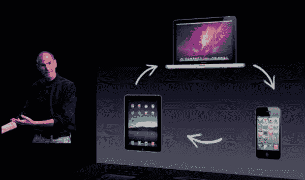

# Instagram 发布，希望通过图片点燃交流 

> 原文：<https://web.archive.org/web/http://techcrunch.com/2010/10/06/instagram-launch/>

# Instagram 的推出是希望通过图片点燃交流

 " *我认为通过图像交流是未来几年你将会看到的媒介之一，因为实现技术的根本转变。*

如果你需要一句话来总结为什么[凯文·斯特罗姆](https://web.archive.org/web/20230212104949/http://www.crunchbase.com/person/kevin-systrom)建立 [Instagram](https://web.archive.org/web/20230212104949/http://instagr.am/) ，那就是了。

几周前，我写了一篇关于照片分享应用的长预览。今天在 App Store 正式上线。

我知道你可能在想:哦，又一个照片分享应用。但事实是，这些应用程序中至少有一个可能会在不久的某个时候大规模起飞。在某种程度上，Hipstamatic 已经做到了，但其中一个可能会变得更大。Systrom 说:“目前还没有手机版的 Flickr。

他继续说道，“*我这么说是什么意思？一个社区，专注于帮助你从手机上收集、组织和分享你的生活图像。我们现在拥有的最好的东西是微小的相机图标，它们被填充为大型复杂应用程序的被遗忘的功能，这些应用程序*必须*做所有的事情*。”显然，他想让 Instagram 提供那个缺失的社区。

这是一个很好的观点。iPhone 4 现在是我的主要相机。它和 DSLR 一样好吗？当然不是。它和我的傻瓜相机一样好吗？不，但已经很接近了。总是把它放在口袋里的便利胜过了它缺乏的质量。用它拍的照片非常好。通过 Instagram 提供的效果和滤镜，我的摄影作品获得了前所未有的赞誉。它让我忙碌的生活变得有趣。

这也是 Instagram 的部分关键。Systrom 说，他已经查看了 App Store 中所有的顶级照片应用，所有这些应用都很突出，因为它们不是"*普通的老式照片共享应用*"“*你必须做一些特别的事情*，”他说。*照片分享作为一个概念，作为一个卖点，相对来说没什么意思。但是现在处理器的速度非常快，我们只需轻轻一按按钮就可以对你的照片做非常酷的事情。我们可以把那台漂亮的 500 万像素的相机变成全景相机或者 lofi 1980 年代的宝丽来。*，”他继续说道。

Systrom 知道他的应用成功的一个关键是实际用户如何使用它。到目前为止，当 Instagram 处于私人测试阶段时，一些网络最佳设计师喜欢上了它，这让他很兴奋。一旦它今天开放，他希望更多志同道合的人会。

你可以在 App Store 这里找到[insta gram](https://web.archive.org/web/20230212104949/http://itunes.apple.com/us/app/instagram/id389801252?mt=8)。这是免费下载的。

 