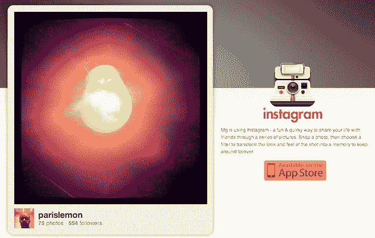

# Instagram 在不到一周的时间里捕获了 10 万名手机照片爱好者

> 原文：<https://web.archive.org/web/https://techcrunch.com/2010/10/13/instagram-users/>

# Instagram 在不到一周的时间里捕获了 10 万名手机照片上瘾者

Instagram 度过了美好的一周。七天前，经过[个月的测试](https://web.archive.org/web/20230308031815/https://techcrunch.com/2010/09/20/instagram/)，他们[在苹果的应用商店发布了他们的第一款应用](https://web.archive.org/web/20230308031815/https://techcrunch.com/2010/10/06/instagram-launch/)。几天之内，我在 Twitter、Tumblr 和脸书上的消息就被 Instagram 图片淹没了。我有很多早期用户类型的朋友，所以我想知道是不是这个应用看起来无处不在。但事实证明，不仅是我的朋友在使用它，还有他们的朋友、他们的朋友、他们的朋友……昨晚，仅仅过了六天，这项服务的用户就超过了 10 万。

现在，在脸书拥有 5 亿用户的世界里，10 万似乎并不令人印象深刻，但同样，这是在仅仅存在一周之后，并且只在 iPhone 上可用。你甚至还不能在他们的网站上注册，你需要获得应用程序才能成为用户。作为对比，it [花了](https://web.archive.org/web/20230308031815/http://www.nytimes.com/2009/10/19/technology/internet/19foursquare.html?_r=1)新媒体宠儿 [Foursquare](https://web.archive.org/web/20230308031815/http://foursquare.com/) 七*个月*才获得 6 万用户。

联合创始人[凯文·斯特罗姆](https://web.archive.org/web/20230308031815/http://www.crunchbase.com/person/kevin-systrom)告诉我们:“*我们每两秒钟就会收到一张来自世界各地的照片。我问他在科技泡沫之外的使用情况，他指出，他们的照片中只有大约 12%来自旧金山和纽约等科技中心附近的地区。他还说，欧洲和亚洲的活动都很强劲，并指出除了美国以外，使用率最高的地区是香港、西班牙、德国和澳大利亚。*

那么 Instagram 的下一步是什么？现在他们显然专注于缩放，但 Systrom 确实表示其他相机过滤器正在工作中。他们认识到，如果他们利用 iPhone 的应用内购买来销售优质过滤器或新功能，这肯定是一个潜在的收入领域，但他们现在主要关注的是增长。

你可以在 App Store 这里找到[insta gram](https://web.archive.org/web/20230308031815/http://itunes.apple.com/us/app/instagram/id389801252?mt=8)。这是免费下载的。