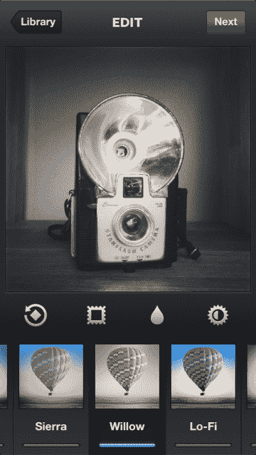

# Instagram iOS 3.2 更新重新设计了相机和图像选择器，添加了单色柳树滤镜(也适用于 Android)

> 原文：<https://web.archive.org/web/https://techcrunch.com/2012/12/10/instagram-willow/>

Instagram[刚刚发布了](https://web.archive.org/web/20221205221027/http://blog.instagram.com/post/37657978245/instagram-3-2-improved-camera-with-a-new-filter)其[一年来最大的 iOS 应用更新](https://web.archive.org/web/20221205221027/https://itunes.apple.com/us/app/instagram/id389801252?mt=8)，这一切都是为了改善发布体验和加强 insta gram 品牌。首先有一个新的 Instagram 主题快门和快门释放按钮。一个令人想起脸书相机的新图像选择器可以更快地选择最近拍摄的照片。今天，iOS 和 [Android](https://web.archive.org/web/20221205221027/https://play.google.com/store/apps/details?id=com.instagram.android&hl=en) 也推出了一款名为 Willow 的新单色滤镜。

对于照片分享应用程序来说，这是多事之秋。它在照片大战中开了一枪，关闭了 Twitter 卡支持，这样当人们发布链接时，Instagram 照片不再显示为预览。与此同时，谣言在 AllThingsD 满天飞，称它将在假期后面临新的竞争，因为 Twitter 正在完善和测试自己的照片过滤系统。

最后，就在一个小时前，脸书的网站治理投票结束，没有足够的票数来阻止社交网络与包括 Instagram 在内的附属公司整合数据的能力。这可能为 Instagram 通过广告赚钱铺平道路，因为它将能够利用脸书的数据来锁定他们。

至于 iOS 3.2 的 Instagram 有什么新功能，让我们来看看这些变化。脸书/ Instagram 没有给出大部分内容何时会进入安卓应用的时间表。

**重新设计的摄像头**

Instagram 不再是一个看起来像默认 iOS 相机的普通照片拍摄器，而是在你拍照时有自己的外观。一个带有蓝色 Instagram 标志的按钮可以让你拍照，还有一个自定义按钮可以打开照片卷，显示你最近拍摄的照片。整个事情让你看起来像是通过一些旧的柯达布朗尼 Starflash(在更新的宣传片中看到)的取景器，而不是智能手机。

**改进的图像选择**

类似于脸书相机，你现在可以滑动最近拍摄的照片的网格视图，这样你就可以立即编辑和发布照片。您可以选择在拍摄时添加参考标尺，它们也会在您裁剪照片时出现。

**新滤镜:柳树**

iOS 3.2 版的 Instagram 和 Android 3.3 版的新版[insta gram](https://web.archive.org/web/20221205221027/https://play.google.com/store/apps/details?id=com.instagram.android&hl=en)都将在今天收到一个名为 Willow 的新过滤器。这是一个带有紫色的单色滤镜。

**更好的倾斜移位**

以前，当您将倾斜偏移应用到照片时，您发布的版本与预览相比，会有“模糊的有效强度的巨大差异”。现在这两者都是同步的，所以没有什么意外，倾斜移动的质量和准确性已经有了很大的改进，以提供 Instagram 所说的“更真实的景深渲染”似乎所有的风景摄影都让 Instagram 团队以“广阔”的角度思考。

**四方整合**

Instagram 现在在位置页面上显示了一个 Foursquare 按钮，这样你就可以点击打开 Foursquare 应用程序，获得有关该场地的详细信息。这意味着，如果你看到一堆照片从音乐厅出来，你可以深入了解人们是否喜欢这个地方，以及你的哪些朋友在那里。

由于 Instagram 将向 Foursquare 发送流量，你会想知道它会得到什么回报。也许 Foursquare venue 页面会先开始显示 Instagram 照片，当人们点击通过时，会将人们送回 Instagram。脸书和 Foursquare 最近成了好朋友。就在今天，脸书发表了一篇[开发者展示文章](https://web.archive.org/web/20221205221027/https://developers.facebook.com/showcase/foursquare/)，讲述了 Foursquare 是一个利用脸书登录和开放图形发展应用的光辉典范。

**杂项更新**

Instagram feed 现在显示更大的图像，并且经过重新设计，更容易消化。现在，用户个人资料和任何你看到网格视图的地方都可以无限滚动，还有一个漂亮的新欢迎页面。最后，当您应用滤镜时，过滤后的图像会保存到 Instagram 相册，而不是您的相机胶卷。

随着过滤照片分享空间随着 Twitter 和谷歌新的 SnapSeed 而升温，Instagram 不得不利用其身份进行交易。现在它是一个名牌照片应用，新的主题按钮和自定义布局确保你知道你在使用 Instagram，而不是其他东西。这可能有助于锁定用户，防止他们进行实验，并使脸书的收购保持在照片堆的顶部。