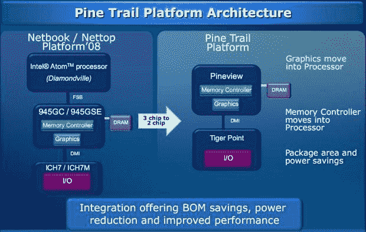
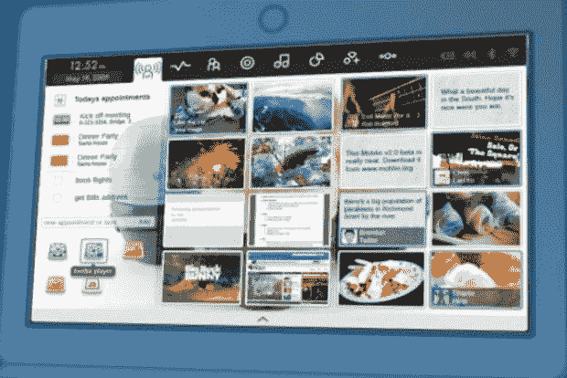

# 英特尔详细介绍下一代“Pine Trail”凌动平台，介绍更新的“移动”用户界面

> 原文：<https://web.archive.org/web/https://techcrunch.com/2009/05/19/intel-details-next-generation-pine-trail-atom-platform-intros-updated-moblin-ui/>

英特尔刚刚召开了一次电话会议，概述了其代号为“Pine Trail”的下一代凌动平台的一些信息，并推出了其“Moblin”用户界面的新测试版，用于即将推出的基于凌动的上网本、上网本、mid、嵌入式系统和车载娱乐系统。以下是此次通话的一些记录…

**英特尔下一代凌动平台，代号 Pine Trail**

从架构角度来看，将会转向双芯片架构，支持四层 PCB 布线。这与当前由 CPU、芯片组(图形、RAM 等)组成的 3 芯片设置形成对比。)，以及 I/O

有了 Pine Trail，CPU、图形和内存控制器现在都将在“北”组合系统中，而 I/O 将在“南”组合系统中。这种新配置允许从六层板转移到四层板。这意味着更薄的设计、无风扇(在上网本中)、更低的成本、更好的电池、更好的性能等。

折算功率

*   高能效的英特尔凌动微架构
*   更低的 TDP–更薄的外形、无风扇的潜力
*   平均功耗降低=电池寿命延长

改进的性能

*   更高的处理器性能
*   增强的图形性能
*   与处理器集成的存储控制器

**莫布林的最新消息**

Moblin 是一款开源 Linux 操作系统，针对基于英特尔凌动处理器的设备进行了优化，具有以下特性:

*   快速启动—大大缩短了启动时间。Alpha 版本的启动时间快至 5 秒。完成的版本将接近十秒。
*   占用空间小——去除低内存设备不必要的无用信息。
*   电池寿命优化

移动 2.0 测试版用户体验——现已在 MoblinZone.com[推出](https://web.archive.org/web/20230326182520/http://www.moblinzone.com/)

*   动感地带(My Zone)取代桌面；这是上网本和上网机的入口点。旨在让您只需一次点击，即可访问 90%的内容。日历/任务/约会、常用应用程序、最近的文档和文件、来自社交网络的状态和更新。
*   简单且个性化的社交网络——通过各种 API 进行交互，无需访问完整的网页。
*   简化的互联网和富媒体消费—基于 Mozilla 的浏览器针对屏幕尺寸、功能和性能进行了优化。媒体播放器功能搜索，找到你所有的文件，等等。
*   可为 OEM 和服务提供商定制
*   开源，从头开始设计。
*   15 个 Linux OSVs(开源供应商)已经开始设计 Moblin 产品。

Moblin 的主要目标是在基于 Atom 的平台上统一基于 Linux 的操作系统。有数以千计的应用程序无需移植就可以“直接运行”,还有数百个专为 Moblin 优化的应用程序。

**问题**

*问:你在 Moblin 上与哪些原始设备制造商合作？*

答:我不能对未来的产品发表评论。各个厂商可能会在 Computex 上宣布未来的计划。

*问:松树小径什么时候首次亮相？规格、时钟速度等细节？*

答:英特尔将在第 4 季度发货，原始设备制造商将自行推出产品。目前没有关于规格的细节。

*问:为什么英特尔觉得有必要推自己的操作系统？*

答:我们参与开源已经有一段时间了。这些新类别的设备包括许多不同的外形，Moblin 试图统一所有这些设备的 Linux 体验，同时优化电池寿命、电源等。

*问:为什么客户更喜欢 Moblin 而不是微软，这会如何影响您与微软的关系？Ubuntu 呢？*

答:Moblin 并不是设计用来和微软比较的。我们的许多 OEM 供应商都需要这两种环境。对于原始设备制造商来说，这最终是一个选择平台的问题。Ubuntu 与 Moblin 路线图保持一致。

*问:你如何看待 Windows 和 Moblin 之间的市场分割？*

答:现在大约有 20%到 25%的人在移动，而且很可能会继续这样下去。实际上取决于原始设备制造商试图投入市场的使用体验。Windows 7 也将是一个不错的选择。

*问:图形内存是否会移到带有 Pine Trail 的芯片上？*

答:是的，这是一个单片模具。

*问:为什么要优化某些 Linux 应用程序，如果它们应该“只是运行”的话？*

答:主要是因为低分辨率设备的屏幕尺寸——确保所有按钮都适合屏幕，等等。然而，许多应用程序不需要优化。主要是一个 UI 选择。一些功耗改进。

*问:图形呢——有什么具体的吗？NVIDIA 给上网本体验带来什么了吗？*

答:目前没有图形细节，但更多信息将在 Computex 上展示。NVIDIA (Ion)将不会出现在 Pine Trail 平台中，尽管原始设备制造商正在自己使用 Ion。

*问:Moblin V2 用户界面是否可用于目前已经上市的移动互联网设备中使用的 Menlow CPUs？*

答:目前没有在 Menlow 设备上移动 V2 的计划，只有未来的设备。