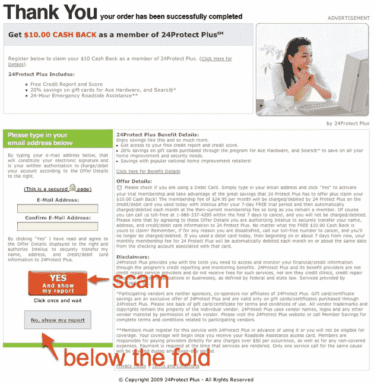

# 英特留斯再次申请上市。仍然是一个巨大的有毒骗局

> 原文：<https://web.archive.org/web/https://techcrunch.com/2009/10/27/intelius-files-to-go-public-again-still-a-huge-toxic-scam/>

Intelius 正试图再次涉足公开市场。去年我们[报道了他们的业务](https://web.archive.org/web/20230308165935/https://techcrunch.com/2008/05/29/naveen-jains-intelius-prepares-to-go-public-how-much-of-their-revenue-is-a-scam/)，它将付费用户搜索信息与交易后营销骗局结合在一起。在购买人员信息后，用户被鼓励参加一项调查，并获得 10 美元的现金返还。实际上，如果用户点击了“是”,那 10 美元就不会再被提及，他们注册了一个几乎不可能取消的每月 20 美元信用卡费用。

IPO 从未发生。但是上周，该公司悄悄地向美国证券交易委员会提交了一份新的注册声明，表明他们试图再次尝试市场。

他们的业务没有什么变化。他们仍在向人们出售你可以在 WhitePages.com 等其他网站上免费找到的信息。在交易期间和交易之后，用户会被询问是否想要 10 美元的现金返还。如果他们点击是，他们就注册了每月 25 美元的信用卡订阅。

消费者的投诉继续涌入公司。在过去的 36 个月里，商业改善局已经收到了 1159 起消费者投诉。RipoffReport 上还有另一个 [214 投诉](https://web.archive.org/web/20230308165935/http://www.ripoffreport.com/Search/intelius.aspx)。他们不得不处理华盛顿和加州的集体诉讼。而这还只是[冰山一角](https://web.archive.org/web/20230308165935/https://techcrunch.com/2009/03/18/naveen-jains-intelius-begins-to-crumble-good/)。

该公司甚至承认投诉越来越多。来自注册声明:*“在过去的两年中，客户投诉的数量比交易的数量增长得更快。”*

该公司 2008 年的收入为 1.23 亿美元，2009 年前三个季度为 7400 万美元。2008 年的净收入为 1200 万美元。

没有交易后营销骗局，公司就不会盈利。2008 年 PTM 的收入为 3300 万美元，约占总收入的 27%。而且这一比例还在增加——2009 年至今，PTM 的收入为 2260 万美元，占总收入的 31%。

在我最近的搜索测试中，我发现 Intelius 甚至在没有数据的时候也在收费(除非你付钱，否则你是看不到数据的)。当数据可用时，在任何情况下，我都可以在其他地方免费找到。

Intelius 不是一家企业。从头到尾都是一个巨大的有毒骗局。

