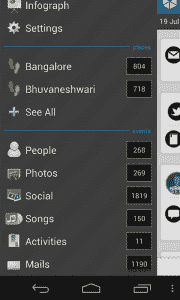
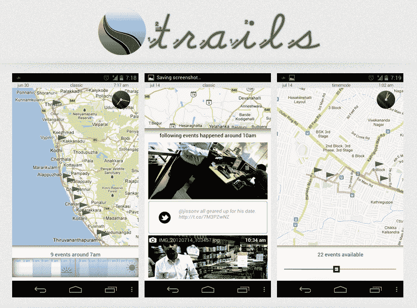
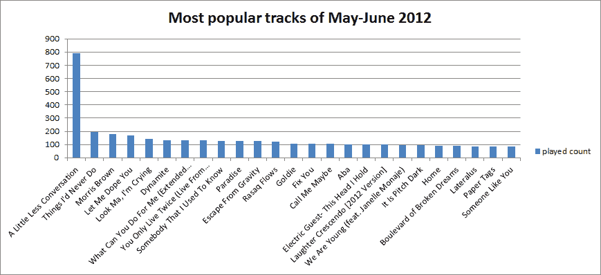

# 智能的环境感知个人助理应用程序“星期五”首次公开亮相| TechCrunch

> 原文：<https://web.archive.org/web/https://techcrunch.com/2012/07/20/intelligent-context-aware-personal-assistant-app-friday-makes-its-public-debut/>

多么合适。那个叫做星期五的疯狂的安卓个人助理应用程序今天在星期五首次亮相。营销天才！[星期五](https://web.archive.org/web/20230330021415/http://www.fridayed.com/)来自一家名为 Dexetra 的初创公司，与之前推出类似 Siri 的安卓应用程序 Iris 的[是同一批人。周五的想法是提供你的通信历史，如通话、短信、电子邮件等，并将这些与你的手机能够记录的其他事件结合起来，如拍照和电池电量下降，然后与第三方服务的数据融合在一起，如脸书和 Foursquare。最终结果？你生活的搜索引擎。](https://web.archive.org/web/20230330021415/https://techcrunch.com/2011/10/17/iris-is-sort-of-siri-for-android/)

 如果这个概念听起来有点耳熟，那是因为其他创业公司之前也曾试图涉足这个领域——至少在某种程度上是这样。像[派单](https://web.archive.org/web/20230330021415/https://dispatch.io/)、 [Jolicloud](https://web.archive.org/web/20230330021415/http://my.jolicloud.com/) 、 [Greplin](https://web.archive.org/web/20230330021415/https://www.cueup.com/greplin) 、 [Kitedesk](https://web.archive.org/web/20230330021415/http://www.kitedesk.com/) 等公司。试图从第三方服务中收集用户数据，然后使其可搜索和互操作。然而，有些人后来改变了主意。(参见 [Jolicloud Me](https://web.archive.org/web/20230330021415/https://techcrunch.com/2012/03/19/jolicloud-me-a-personal-cloud-organizing-serivce-opens-in-beta-today/) ， [Greplin 成为 Cue](https://web.archive.org/web/20230330021415/http://www.techmeme.com/120620/p10#a120620p10) )。

但是需要明确的是，星期五不仅仅是一个聚合游戏。虽然它从你的手机和第三方获取数据，但它实际上是对这些数据采取行动。这就是为什么，随着今天的公开亮相，星期五推出了它所谓的“小程序”。首席执行官纳拉扬·巴布告诉我，这些都是独立的环境感知应用程序——它们是单独安装的，但是能够使用星期五跟踪的信息。这是科幻小说里的东西！

一些可能的例子包括:

*   一个应用程序，通知用户当手机电池电量不足，附近有充电器。
*   和备用拨号器应用程序，它不是显示最近的通话记录，而是根据您的上下文显示您最有可能*给*打电话的用户列表。(巴布说当他在家，夜深的时候，它会自动把他女朋友的号码显示在最上面，哈！)
*   一个向你展示每日游记和活动图表的应用程序。

第一个可用“applet”是 [Trails](https://web.archive.org/web/20230330021415/http://trails.fridayed.com/) ，这是上面的第三个例子。它使用星期五的 API 来创建各种各样的旅行日记。使用 Trails，您可以选择一天，并在地图上查看您去了哪里以及在每个点发生了什么。这包括从抓拍的照片到推文到签到等等的一切。个人数据爱好者会喜欢这种东西。

Dextera 现在开放了 Friday API，因此其他第三方开发者可以在它的基础上进行开发。巴布说，至少还有六个小程序正在开发中，并暗示这些小程序可以为音乐、电影或应用程序等提供个性化推荐。他指出，其中一些可能是免费的，另一些可能是付费的小程序。

在为期两个月的私人测试中，星期五由几千名用户进行了测试，它已经捕获了超过 1000 万份文件，包括超过 100 万张照片，100 万首歌曲，数千个地点等等。查看星期五收集的任何一份数据，你都可以看到它观察模式的潜力。一个例子(下图):用户最喜欢的歌曲。(看到了吗？我们现在都被“打电话给我，也许”搞得焦头烂额。巴布说，该公司还可以看到其他有趣的模式，比如一个城市中最受欢迎的地方。

【T2

巴布说，星期五每天增加大约 10 万条记录。现在是时候看看星期五是否能成功了。为此，该公司正在筹集资金。在此之前，该团队只有来自 One97Mobility 基金的一点种子资金(约 25 万美元)。他们现在正和一个不知名的硅谷风投结束一轮交易。

我知道你们都在想什么:*去他的 iPhone，我要换安卓了。*(哈，我开玩笑)。但说真的，像这样的应用程序和谷歌自己的“Google Now”显示了平台的潜力，由于其更开放的性质，允许应用程序和服务的更深入集成。但是不要担心，iOS 的粉丝们，星期五的路线图上有苹果的平台，至少，只是不会在不久的将来。

与此同时，你可以在公司网站上下载 Android 的星期五应用程序[。~~今天晚些时候应该会出现在 Google Play 中。~~该应用程序现已在 Google Play](https://web.archive.org/web/20230330021415/http://www.fridayed.com/) [这里](https://web.archive.org/web/20230330021415/https://play.google.com/store/apps/details?id=com.dexetra.friday)。“轨迹”小程序在这里是。

【YouTube http://www.youtube.com/watch?v=NWREmW9ymoc？feature=player_detailpage]