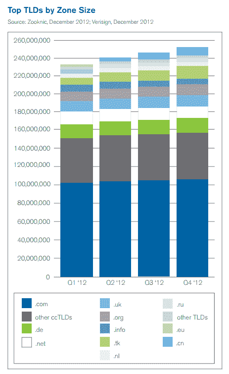

# 报道:现在已经有超过 2 . 5 亿个域名被注册，几乎一半。Com 和。Net | TechCrunch

> 原文：<https://web.archive.org/web/https://techcrunch.com/2013/04/08/internet-passes-250m-registered-top-level-domain-names/>

# 报道:现在已经有超过 2 . 5 亿个域名被注册，几乎一半。Com 和。网

根据 Verisign 最新发布的[域名行业简报](https://web.archive.org/web/20230313083855/http://ctt.marketwire.com/?release=1004406&id=2828134&type=1&url=http%3a%2f%2fwww.verisigninc.com%2fDNIB)，2012 年最后一个季度，注册域名总数超过 2 . 5 亿。2012 年第四季度注册的域名超过 600 万个，使全球总数达到 2 . 52 亿个。

最基本的。当然，com 域名占注册域名的大多数。截至 12 月底，用户注册人数已达 1.062 亿。com 域名，以及 1490 万。网络地址。的。com 和。net 顶级域名也占了新注册域名的大多数。总共八百万。com 和。净顶级域名在 2012 年第四季度注册，比去年同期的 790 万略有增加。

 约占百分之二十一。com 和。顺便说一下，net 网站只是单页网站，15%的网站注册了，但根本没有指向一个工作网站。

除了这两个顶级域名之外，国家代码顶级域名环比增长 5%，同比增长 21.6%，域名总数达到 1.102 亿个，其中中国在很大程度上推动了这一增长。事实上，根据 Verisign 的数据，中国现在是第七大 TLD。

## 顶级顶级域名:。COM，。德，。NET 和。坦克

以下是最大顶级域名的完整运行顺序:

> 按区域大小排序，最大的 TLD 是。com，。德(德国)。网，。tk(托克劳)。英国(英国)。组织，。cn(中国)。信息，。nl(荷兰)和。俄罗斯联邦。

这里最突出的一个领域是。tk，[托克劳](https://web.archive.org/web/20230313083855/http://en.wikipedia.org/wiki/Tokelau)的顶级域名。这些。通过[自由注册中心](https://web.archive.org/web/20230313083855/http://www.freedomregistry.com/en/freedom_aboutus.html)可以免费获得的传统知识域名，因托管钓鱼网站而有点[的名声，但是免费域名的诱惑很有可能推动了这些注册。](https://web.archive.org/web/20230313083855/http://www.zdnet.com/pacific-atoll-a-phishing-haven-1339313909/)