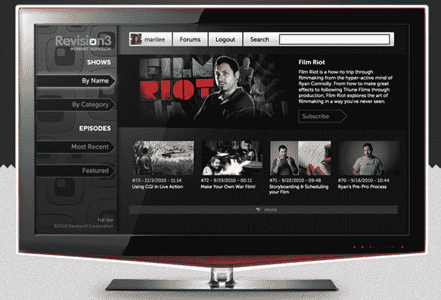

# 网络电视网络改版 3 要你靠着看...在您的电视上 TechCrunch

> 原文：<https://web.archive.org/web/http://techcrunch.com/2010/11/22/internet-tv-network-revision3-wants-you-to-lean-back-and-watch-on-your-tv/>

# 网络电视网想让你靠在椅背上，在你的电视上看

网络电视网[改版 3](https://web.archive.org/web/20230202214111/http://www.crunchbase.com/company/revision3) 今天正式[亮相](https://web.archive.org/web/20230202214111/http://www.prnewswire.com/news-releases/revision3-invites-viewers-to-lean-back-and-watch-revision3-on-your-tv-bringing-full-line-of-online-video-programming-to-the-bigger-screen-109871524.html)一个[新的电视优化网站](https://web.archive.org/web/20230202214111/http://tv.revision3.com/)并将其全部在线内容引入[多个平台](https://web.archive.org/web/20230202214111/http://revision3.com/leanback)包括谷歌电视、雅虎！联网电视、Windows Media Center、AppleTV、Boxee 和 Roku。

由[凯文·罗斯](https://web.archive.org/web/20230202214111/http://www.crunchbase.com/person/kevin-rose)、[杰伊·阿德尔森](https://web.archive.org/web/20230202214111/http://www.crunchbase.com/person/jay-adelson)和[大卫·普雷格](https://web.archive.org/web/20230202214111/http://www.crunchbase.com/person/david-prager)创立的 Revision3 正在将其超过 [20 个节目](https://web.archive.org/web/20230202214111/http://revision3.com/shows)的全部阵容移植到电视屏幕上，包括像 Tekzilla、Diggnation、AppJudgment、Dan 3.0 和 Film Riot 这样的节目。

你可以为各种支持互联网的电视机或组合电视使用定制的应用程序，或者你可以简单地访问 TV.revision3.com 观看节目。

据该公司称，该应用程序的用户界面旨在使查找内容变得简单，因为它可以根据名称、类别、特色内容和最新剧集对节目进行分类。观众还可以手动搜索他们最喜欢的剧集，并“向后靠着看”新鲜内容。

你会从电视上收看不再严格限于网络的互联网电视网吗？