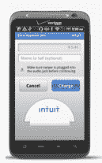

# Intuit 与威瑞森无线合作，在零售店销售 Square 竞争对手 go payment 

> 原文：<https://web.archive.org/web/http://techcrunch.com/2011/08/24/intuit-partners-with-verizon-wireless-to-sell-square-competitor-at-retail-stores/>

与 [Square、](https://web.archive.org/web/20230203095006/https://squareup.com/)直接竞争的 [GoPayment](https://web.archive.org/web/20230203095006/http://gopayment.com/) 阅读器今天在移动支付领域取得了重大进展，[与](https://web.archive.org/web/20230203095006/http://b2b.vzw.com/promotions/gopayments.html)威瑞森无线合作，在威瑞森无线的 2300 家零售店和 B2B 销售渠道销售其信用卡阅读器。

两年前推出的 GoPayment 提供了一个免费的应用程序和信用卡读卡器，允许小企业通过智能手机进行收费。GoPayment 可用于 iOS、Android 和黑莓手机，读卡器只需插入手机或平板电脑的音频插孔即可。信用卡数据也是加密的，(并且从不存储在手机上)。

现在，GoPayment 将在零售商店和威瑞森无线的网站上提供，价格为 29.97 美元，但你可以通过激活 GoPayment 帐户和购买价格的邮件折扣免费获得阅读器。与 Square 类似，GoPayment 移动支付应用程序是免费的，基本服务没有月费、交易费或取消费，并为刷卡交易提供 2.7%的费率。 [Intuit](https://web.archive.org/web/20230203095006/https://techcrunch.com/2011/05/01/intuits-gopayment-cuts-transaction-fees-pricing-now-more-in-line-with-square/) 和 [Square](https://web.archive.org/web/20230203095006/https://techcrunch.com/2011/02/22/mobile-payments-startup-square-ups-the-ante-drops-transaction-fee-for-businesses/) 实际上都取消了每笔交易费用。

虽然 Square 的阅读器免费已经有一段时间了，但直到去年 Intuit 才转变模式，免费提供其 go pay 读卡器。GoPayment 的付费版本也可用于更高使用率的业务，每月 12.95 美元，并为刷卡交易提供 1.7%的费率。通过合作，当威瑞森无线用户选择这种每月付费计划时，Intuit 将向他们提供两个月的免费服务。

威瑞森表示，购买智能手机用于 go pay 的客户需要订阅威瑞森无线全国通话计划，每月接入费用为 39.99 美元。平板电脑和智能手机用户需要每月 30 美元起的 2g 数据套餐。

Intuit 支付解决方案部门总经理克里斯·海伦(Chris Hylen)将这种合作关系定位于吸引使用威瑞森无线智能手机或平板电脑的小企业。考虑到该运营商提供 iPhone、Android 手机和黑莓手机，搬到威瑞森是有道理的。还需要注意的是，这是 GoPayment 的第二个零售版本——Intuit 的阅读器可以在苹果的零售网站上买到([Square](https://web.archive.org/web/20230203095006/https://techcrunch.com/2011/04/16/square-apple/)和 VeriFone 也是如此)。对于 coma 监狱的基础，square 的设备在苹果商店的售价为 9.95 美元，但用户在注册账户时可以获得 10 美元的 Square 信用。

Hylen 解释说:“现在，任何销售产品或服务的人都可以轻松、经济地为他们的客户提供用塑料支付的选择，而不是失去潜在的业务……go payment 满足了巨大的需求，是市场上增长最快的移动支付解决方案之一。有了威瑞森无线，我们将帮助更多的人发现，他们也可以在自己已经拥有的手机或平板电脑上处理信用卡支付。”

当然，像威瑞森这样受欢迎的运营商投下的信任票肯定会帮助 GoPayment 保持与 Square 的竞争力，Square 最近从 Visa 获得了[投资，还有 VeriFone 和其他像](https://web.archive.org/web/20230203095006/https://techcrunch.com/2011/04/27/visa-makes-a-strategic-investment-in-disruptive-mobile-payments-startup-square/) [Erply 这样的小公司。](https://web.archive.org/web/20230203095006/https://techcrunch.com/2011/08/22/erply-takes-on-square-and-intuit-with-nfc-enabled-mobile-credit-card-reader-for-ios/)

Hylen 告诉我们，选择 GoPayment 而不是竞争对手有很多原因，包括 Intuit 的“值得信赖的品牌”，该公司的“以消费者为中心”，24 小时客户服务支持，安全性，以及最重要的是，与 Intuit 非常受欢迎的会计软件 Quickbooks 的集成。GoPayment 还可以将交易与最新版本的 QuickBooks 同步。GoPayment 还支持一个账户最多 50 个用户，非常适合有多名员工在现场工作的企业。

GoPayment 实际上是 Intuit 增长最快的业务之一，Hylen 表示，这项服务有望在今年处理超过 10 亿美元的交易。Intuit 拒绝透露有多少企业正在使用 GoPayment，但表示自 1 月份以来，客户获得量增加了 8 倍。

Intuit 表示，未来将考虑类似的合作关系。我要说的是，整个回扣陷阱确实让我有点迷惑，考虑到许多人忘记提交他们的回扣，Square 在与苹果的交易中采用的信用选项似乎更适合消费者。但毫无疑问，运营商的支持是 Intuit go pay 的胜利，应该有助于提高使用率。