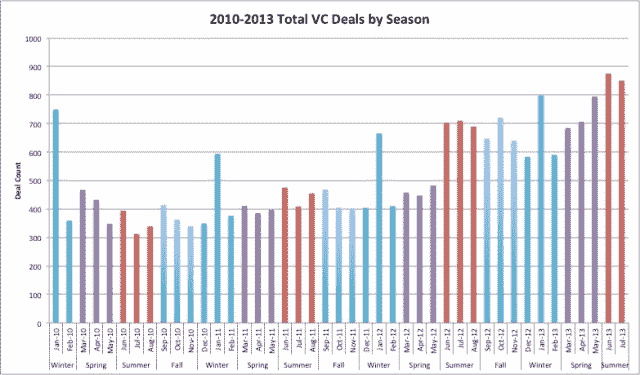
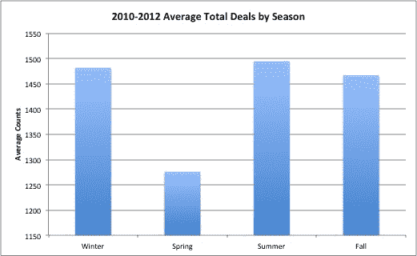

# 按季度对投资活动的分析

> 原文：<https://web.archive.org/web/https://techcrunch.com/2013/08/17/investment-practices-by-season/>

# 按季节对投资活动的 CrunchBase 分析

许多科技界人士认为，风投会在夏季放缓投资步伐，尤其是在 8 月份。我们希望通过比较过去几年的交易，使用 CrunchBase 数据集来验证这一点。

我们在 CrunchBase 中绘制了从 2010 年 1 月到 2013 年 7 月的月度交易总量，但在夏季的几个月中没有出现明显的下滑。然而，我们确实在 1 月份发现了一个有趣的趋势——一个类似新年决心的现象:1 月份交易总额突然飙升，2 月份交易总额突然下降。

从 2010 年到 2012 年，每个季度的平均交易总额在夏季最高，在春季最低。尽管 1 月份交易量激增，但冬季仍是第二高的交易季节。对这些 1 月份的飙升贡献最大的风投是 [SV Angel](https://web.archive.org/web/20221209173727/http://www.crunchbase.com/financial-organization/sv-angel) 、 [500 Startups](https://web.archive.org/web/20221209173727/http://www.crunchbase.com/financial-organization/500-startups) 、[凯鹏华盈&拜尔斯](https://web.archive.org/web/20221209173727/http://www.crunchbase.com/financial-organization/kleiner-perkins-caufield-byers)、 [New Enterprise Associates](https://web.archive.org/web/20221209173727/http://www.crunchbase.com/financial-organization/new-enterprise-associates) 、[红杉资本](https://web.archive.org/web/20221209173727/http://www.crunchbase.com/financial-organization/sequoia-capital)和 [Accel Partners](https://web.archive.org/web/20221209173727/http://www.crunchbase.com/financial-organization/accel-partners) 。这些风投在 2010 年至 2012 年的 1 月份就完成了 100 多笔交易，占 2010 年至 2012 年冬季交易的 8%。

同样的投资者也继续在春季投资，只是增加了一些投资。2010-2012 年春季的活跃投资者有[英特尔投资](https://web.archive.org/web/20221209173727/http://www.crunchbase.com/financial-organization/intel-capital)、[首轮资本](https://web.archive.org/web/20221209173727/http://www.crunchbase.com/financial-organization/first-round-capital)、SV 天使、500 Startups、New Enterprise Associates 和红杉资本，合计占所有交易的 7%。同一批风投在夏季也很活跃，但在秋季略有下降。

纵观 2010 年至今的所有交易，SV Angel 占所有交易的 0.9%，500 Startups 占所有交易的 0.8%，New Enterprise Associates 和 Accel Partners 占所有交易的 0.6%。

从 CrunchBase 的数据中，我们得出结论，最活跃的风投往往全年活跃，夏季平均交易量最多，这与风投会在夏季休息的普遍看法相反。