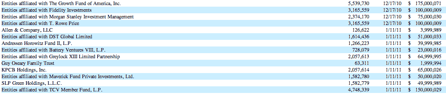

# 给 Groupon 投资了 10 亿美元的投资者已经接近盈亏平衡了 

> 原文：<https://web.archive.org/web/https://techcrunch.com/2012/04/23/investors-who-gave-groupon-like-a-billion-dollars-get-closer-to-like-breaking-even/>

# 给 Groupon 投资 10 亿美元的投资者已经接近收支平衡了

还记得 Groupon 融资 10 亿美元的时候吗？我们当然有。

好吧，看起来 Groupon 过去一个月的下滑让它的最后一轮风险投资者更加接近盈亏平衡。该股今天上午小幅反弹至 11.49 美元，但值得关注的数字是 7.90 美元。

这实际上是包括 Kleiner Perkins、Greylock 和 Andreessen Horowitz 在内的几家顶级硅谷风险投资公司在 2010 年 12 月至 2011 年 1 月期间向 Groupon 投资 9.46 亿美元时支付的每股价格。当时，他们以每股 31.59 美元的价格购买了 G 系列优先股。[这些股票后来在去年 10 月 31 日](https://web.archive.org/web/20221207065725/http://www.sec.gov/Archives/edgar/data/1490281/000104746911009142/a2206165z424b4.htm)转化为 4 股 A 类普通股，就在[Groupon 11 月 4 日](https://web.archive.org/web/20221207065725/https://beta.techcrunch.com/2011/11/04/groupon-ipo-shares-pop-40-on-first-trade-debuts-at-17-8b-market-cap/)首次公开募股的前几天。

所有的目光都集中在 5 月 14 日(T7)，届时 Groupon 将作为上市公司第二次公布季度收益。更值得注意的是，禁售期即将结束。到那时，投资者实际上就可以出售他们在公司的股份了。它将在 6 月 1 日到来，因为离他们的收益日期太近，所以从最初的 5 月 2 日推迟了。

目前，他们在 Groupon 的股份比一年半前支付的价格上涨了约 45%。这是一种通常听起来令人敬畏的回报，但这可能不是晚期风险投资者希望的那种回报，当时 Groupon 在 2010 年末拒绝了谷歌 60 亿美元的报价后看起来很容易获胜。当 Groupon 首次亮相时，它在第一天就涨到了 28 美元，这将给投资者带来至少 3 倍的投资回报。现在，利润下降到了一份糟糕的收益报告可以瞬间吞噬的程度。

对于那些喜欢记录分数的人来说，下面是谁参与了那一轮以及他们投资了多少的表格:

值得注意的是，这些股票有优先权或保护，并且[优先于其他几轮优先股(这意味着这些投资者有权在其他人之前先取出他们的钱)](https://web.archive.org/web/20221207065725/http://www.sec.gov/Archives/edgar/data/1490281/000104746911005613/a2203913zs-1.htm)。但这些优先权适用于“清算事件”或公司解散、清盘或清算的情况。

现在需要明确的是，当禁售期结束时，这些投资者将仅仅拥有出售股票的选择权。他们可能会决定更长时间地持有这些股票，因为他们认为这是一次短期的失败，Groupon 将会反弹。将亏损锁定在底部也是愚蠢的。当 Groupon 在 3 月 30 日宣布由于薄弱的会计控制不得不重新公布第四季度的收益时，公司的股票急剧下跌。这份报告将该公司的净亏损从 4270 万美元扩大到 6540 万美元。

对于下一份报告，Groupon [已经给出了第一季度收入预计为 5.1 亿至 5.5 亿美元的指导，运营收入将在 1500 万美元至 3500 万美元之间。这将高于去年同期的 2.955 亿美元收入和 1.171 亿美元运营亏损。](https://web.archive.org/web/20221207065725/http://investor.groupon.com/releasedetail.cfm?ReleaseID=660861)

有分析师认为 Groupon 前景乐观。高盛(Goldman Sachs)的研究团队给出了买入建议，截至 4 月 1 日的 12 个月目标价为 25 美元。摩根士丹利(Morgan Stanley)分析师表示，该公司通过其 5000 人的销售队伍与当地商家建立的关系，有助于使该公司的模式具有可辩护性。摩根士丹利(Morgan Stanley)的斯科特·德维特(Scott Devitt)在一份研究报告中写道，收益重述是“Groupon 引人注目的长期故事中的一个小插曲”。

所以很有可能这篇文章标志着所有负面消息已经被消化。看在 Groupon 的份上，希望如此。

又及:你知道哪些晚期投资者如果今天能卖出，实际上会出现亏损吗？他们在 2011 年 2 月以每股 14.03 美元的价格购买了 Zynga 的 C 轮优先股。他们随着公司的 IPO 一对一转换成 B 类普通股。Zynga 的股价目前为 8.72 美元。(哎哟！)

这些投资者包括与摩根士丹利(Morgan Stanley)有关联的 11 只共同基金，以及凯鹏华盈(Kleiner Perkins)通过两家公司的数字增长基金和另一只数字增长创始人基金进行的象征性投资。不过，不要为凯鹏华盈哭泣。Zynga 董事会成员宾·戈登(bing Gordon)[几年前将该公司并入公司](https://web.archive.org/web/20221207065725/http://www.crunchbase.com/company/zynga)。Zynga 的大部分投资者[都受到禁售期的限制，禁售期大约在 5 月 28 日](https://web.archive.org/web/20221207065725/http://www.sec.gov/Archives/edgar/data/1439404/000119312512138469/d312579d424b4.htm)结束，尽管根据该公司的招股说明书，一些员工将能够在一周后的 4 月 30 日左右开始出售他们的股份。

那么 Zynga 和 Groupon 教会了我们什么呢？对于高度炒作的消费类科技公司 IPO，公开市场的价值判断比之前想象的要苛刻得多。