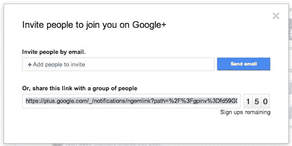

# 邀请您的朋友加入 Google+,使用新的可在推特上发布的链接 TechCrunch

> 原文：<https://web.archive.org/web/http://techcrunch.com/2011/08/06/invite-your-friends-to-google-with-new-tweetable-link/>

# 邀请您的朋友加入 Google+,使用新的可发布推文的链接

谷歌只是让你更容易邀请朋友加入它的新社交网络 Google+，通过提供一个你可以在网上发布或通过即时消息与其他人分享的短链接。谷歌产品经理 Shimrit Ben-Yair 表示，为了获得链接，你只需点击页面右侧的“邀请朋友”按钮——与之前发现邀请的位置相同。

谷歌工程师[巴拉吉·斯里尼瓦桑](https://web.archive.org/web/20230205023249/https://plus.google.com/118170059441102440825/posts/hWNioesVJzW)昨天宣布了这一消息，但该功能直到昨晚才上线。

有了这个新功能，你可以邀请 150 多个人加入网络。

聪明的思维，谷歌。使用 Twitter 获得更多注册！我喜欢。

我记得上个月在 Twitter 上浪费了几个小时，手动发出邀请(很痛苦！)将通过@回复或直接消息发送给我的电子邮件地址复制并粘贴到 Google Plus 邀请表单中。这就简单多了。我可以发个链接就搞定了！实际上，我想我现在就去做。看起来我不是唯一的一个，如果这个推特搜索有任何暗示的话。

不过，这个链接有一个小问题——如果你发布到 Twitter 上，你必须自己缩短它，否则你会以像这样的混乱结束[。谷歌为什么不使用自己的网址缩短服务](https://web.archive.org/web/20230205023249/http://twitter.com/#!/sarahintampa/status/99916466148753408) [Goo.gl](https://web.archive.org/web/20230205023249/http://goo.gl/) 提供自动缩短的链接？你知道吗，它称之为[的“最稳定、最安全、最快”的网络网址缩短器](https://web.archive.org/web/20230205023249/https://techcrunch.com/2010/09/30/googlegoo-gl-is-a-go-the-stablest-most-secure-and-fastest-url-shortener-on-the-web/)？这看起来确实是一个错失的机会。

http://www.youtube.com/watch?v=4IJPOhT4nOU