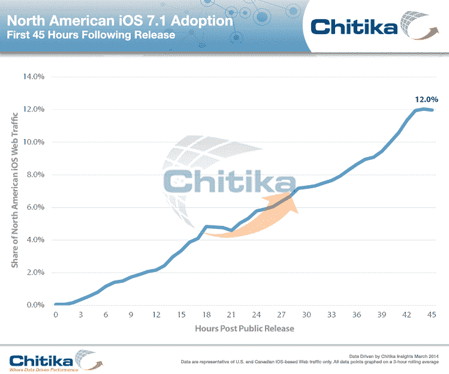

# 广告网络 TechCrunch 报道，iOS 7.1 的采用率在 48 小时内达到 12%

> 原文：<https://web.archive.org/web/http://techcrunch.com/2014/03/12/ios-7-1-adoption/>

# 广告网络报告称，iOS 7.1 的采用率在 48 小时内达到 12%

据在线广告网络 Chitika T1 称，iOS 7.1 已经在多达 12%的活跃消费者设备上运行。该公司发现，访问其网络的网络流量从 24 小时后的 5.9%上升到 45 小时后的 12%，这与该公司见证的 iOS 7.0.6 的采用人数大致相当。

苹果于 3 月 10 日发布了 iOS 7.1，此次更新带来了许多视觉上的改进，以及一系列新的软件调整，包括支持 CarPlay，改变应用内购买的工作方式等。此次更新是 iOS 7 的第一次重大(即非维护)更新，iOS 7 是苹果对其 iPhone 手机操作系统的重大视觉改革。

这些数字与每个人看到的不一样: [Mixpanel 的实时 iOS 版本跟踪器](https://web.archive.org/web/20230130001857/https://mixpanel.com/trends/#report/ios_frag/from_date:-365,to_date:0)显示 7.1，当天仅为 0.24%**编辑**:更正一下，单日统计数据实际上[显示不到 16%](https://web.archive.org/web/20230130001857/https://mixpanel.com/trends/#report/ios_frag/from_date:0,to_date:0)，我输入的日期有误】，这可能是由于不同的业务类型。Mixpanel 是一家针对各种软件的移动分析公司，而 Chitika 则为在线广告提供支持，并专门在美国和加拿大调查了数千万次 iOS 展示的样本池。

iOS 7.1 的采用率似乎很高，很快就会像重要的、以安全为重点的 7.0.6 一样被采用。Chitika 表示，在所有版本中，iOS 7 代表了同期 80%的基于 iOS 的网络流量，所以总的来说，这是一个好迹象，表明重新设计并没有成为消费者更新的主要障碍。