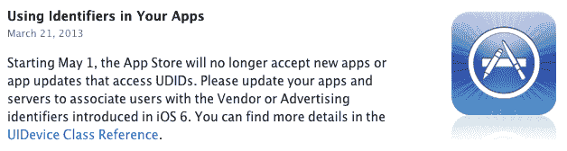

# iOS 7 取消了 MAC 地址作为跟踪选项，标志着苹果公司向自己的广告识别技术 TechCrunch 的最后冲刺

> 原文：<https://web.archive.org/web/https://techcrunch.com/2013/06/14/ios-7-eliminates-mac-address-as-tracking-option-signaling-final-push-towards-apples-own-ad-identifier-technology/>

随着 iOS 7 测试版的推出，苹果现在已经采取了另一项措施，推动应用程序出版商使用其首选的广告跟踪选项，即广告商标识符(IDFA)。证实了许多人的怀疑，苹果公司正在消除一个替代选项，涉及跟踪 MAC 地址。这种方法是在 2011 年苹果开发者文档发生变化后出现的，当时苹果宣布打算结束开发者对被称为 UDID 的唯一标识符的依赖。

苹果[宣布将开始逐步取消开发者在 iPhone 和 iPad 等 iOS 设备上访问 UDID 已经有很长一段时间了——这起初导致了行业内的一些](https://web.archive.org/web/20221005222313/https://beta.techcrunch.com/2011/08/19/apple-ios-5-phasing-out-udid/)[混乱](https://web.archive.org/web/20221005222313/https://beta.techcrunch.com/2012/06/29/udid-confusion-led-to-pullback-in-app-marketing-spending-last-month-fiksu-says/)。多年来，开发人员已经学会了将标识符用于广告目的，并作为存储用户数据的一种方式。但这种方法引发了隐私问题，因为号码与每台设备都有关联，不能被最终用户删除、清除或控制。

[几个替代方案很快出现在 UDID 的位置](https://web.archive.org/web/20221005222313/https://beta.techcrunch.com/2012/03/29/apple-post-udid/)，每个都希望成为新的默认方法。今天，许多开发人员仍然在使用其中的一些——或者很可能是其中一些的组合。

今年早些时候，苹果开始再次发出信号，当它开始拒绝使用 cookie 跟踪方法的应用程序时，它为后 UDID 世界设想的替代方案是它自己的。然后在 3 月，公司[宣布](https://web.archive.org/web/20221005222313/http://www.fiksu.com/blog/end-udid-what-you-should-do-about-it)从 2013 年 5 月 1 日起不再接受访问 UDIDs 的新应用或应用更新。

随着最后期限的到来，苹果再次将其社区推向 UDID 更注重隐私的替代品——IDFA。这种苹果批准的方法提供了广告商需要的属性，以及苹果希望为其用户提供的隐私和安全控制。

根据移动应用营销公司 [Fiksu](https://web.archive.org/web/20221005222313/http://www.fiksu.com/) 收集的数据，该公司帮助应用发行商获得用户，iOS 7 设备——目前都是测试版——现在总是返回 02:00:00:00:00:00:00 的 MAC 地址。例如，这个“虚拟”地址相当于电话号码 555-1212。Fiksu 移动应用营销技术平台负责人克雷格·帕利(Craig Palli)表示，本周早些时候，Fiksu 的日志中出现了数万台独特的 iOS 7 设备。

在分发给开发者的 iOS 7 预发布说明中也提到，这个单一的、无意义的 MAC 地址现在是新的预期行为。

“MAC 地址是一种基于硬件的标识符，长期以来一直是广告商为每台设备提供永久、唯一标识符的一种方式，提供了一种稳定的跟踪选项，作为备受争议的 UDID 的替代选择，”Palli 解释道。“然而，对 UDID 提出的同样的隐私担忧同样适用于 MAC 地址——它只是受到的宣传较少，”他补充道。现在，对于那些还没有转换到 IDFA 的人来说，迁移的窗口正在关闭。

也就是说，Palli 表示，大多数出版商和广告网络通常都知道 MAC 方法将不会得到支持，并且最近几个月 MAC 地址的流量已经“迅速减少”。他告诉我们，如今，这一比例非常小，只有一位数。其他方法，包括数字指纹和在较小程度上的 HTML5 cookies，今天也仍在使用，它们都有自己的优点和缺点。

目前，还没有因为使用 MAC 地址方法而拒绝应用程序的报告，尽管如上所述，cookie 跟踪方法在今年早些时候[遇到过一些拒绝](https://web.archive.org/web/20221005222313/https://beta.techcrunch.com/2013/02/25/apple-rejecting-apps-using-cookie-tracking-methods-signaling-push-to-its-own-ad-identifier-technology-is-now-underway/)。

应用发行商和广告客户群体已经花了很长时间来为 UDID 的灭亡和向 IDFA 的转移做准备。虽然[并不是一个完全没有错误的过程](https://web.archive.org/web/20221005222313/https://beta.techcrunch.com/2012/09/27/source-apples-udid-replacement-for-advertisers-in-ios-6-is-broken/)，但现在是时候完成这一步了。

“幸运的是，作为一个生态系统，我们已经过渡到了 IDFA，”帕利说，“所以当 iOS 7 推出时，从应用程序开发者或营销人员的角度来看，应该没有什么区别。”