# 苹果 iOS 7 评论:一次大改造，带来了好处，但需要一些时间来适应

> 原文：<https://web.archive.org/web/https://techcrunch.com/2013/09/17/ios-7-review-apple/>

对苹果来说，这是重要的一周；它有两款新手机上架，一个全新的操作系统将于 9 月 18 日在兼容设备上推出。新的移动操作系统是一个巨大的视觉变化，可能会让从 iOS 6 升级的用户感到有些迷惑，但在最重要的方面，它与你习惯的东西没有什么不同，许多变化肯定是最好的。

#### 大胆的新造型

如果你是全新的 iOS 7 用户，并且在过去的三个月里忽略了互联网，你将会受到视觉冲击。苹果在第 7 版中彻底改革了 iOS 的外观，从锁屏开始，扩展到默认应用程序的图标，系统字体，状态栏指示器，通知中心等系统元素。还有新的声音，包括铃声和通知提示，以防你的眼球处理的大量新信息不够。

[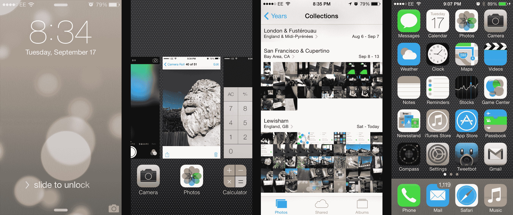](https://web.archive.org/web/20230226003051/https://techcrunch.com/wp-content/uploads/2013/09/ios-7-design.png) 这种目光必然会引起争议；苹果选择了明亮、大胆的颜色，线条更清晰，纹理、阴影和渐变更少。不过，OS 仍然有一些深度，透明效果给人一种背景和前景元素的感觉(例如，dock 行是一个不透明的矩形，通过它可以看到主屏幕壁纸)。

苹果的视觉改革在今年早些时候的 WWDC 上被披露时，受到了很多下意识的批评，但在实践中，视觉上的变化实际上是非常令人愉快的，并随着时间的推移逐渐为用户所接受。现在回想起来，iOS 6 感觉过时了，尽管当我第一次开始使用 iOS 7 时，我觉得它在外观和感觉上不如旧的操作系统。苹果 iOS 7 的新外观需要适应，但总的来说，这是一个进步。

#### 控制中心

这是 iOS 7 的一个全新功能，而且非常有用。控制中心提供了对常用设置切换的快速访问，包括 Wi-Fi、蓝牙、旋转锁和勿扰模式，以及媒体播放器控制、隔空投送和 AirPlay，以及一些关键应用程序，包括计算器、定时器和相机。还有一个手电筒，它可能会击沉一千艘小型应用程序开发船，但这对用户来说是一个巨大的便利。

[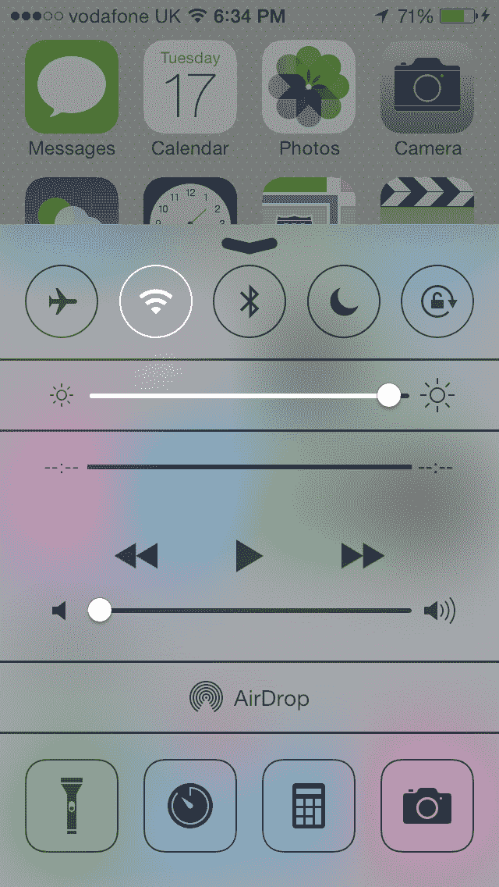](https://web.archive.org/web/20230226003051/https://techcrunch.com/wp-content/uploads/2013/09/img_0028.png)

控制中心简化了 iOS 6 中应用程序抽屉附带的媒体播放器/AirPlay/亮度和音量控制快速访问功能，并使其变得更加有用。将它从那个功能中分离出来，通过简单的从底部向上滑动就可以在整个 iOS 用户界面中访问，这真是一个很大的改进。

#### 隔空投送

苹果的隔空投送功能首次在 Mac 上亮相，作为 OS X 的一项功能。现在，简单的共享服务首次在移动设备上亮相，允许他们只需轻轻一点就可以与同一网络上的任何人共享文件。然后，收件人批准请求，文件被添加到他们自己的 iPhone 中。

[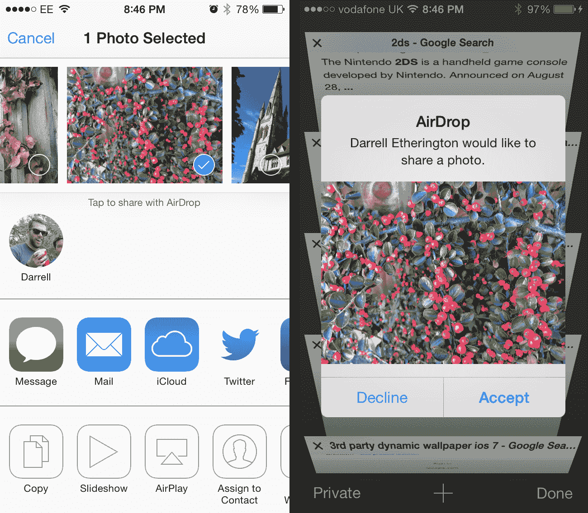](https://web.archive.org/web/20230226003051/https://techcrunch.com/wp-content/uploads/2013/09/airdrop.png)

这是一种从一台设备向家人或朋友共享图片的非常简单的方法，比发送电子邮件需要的步骤更少。您可以让当前网络中的任何人都可以使用隔空投送，也可以将其锁定为只有您的联系人可以使用。这个功能很棒，但让我希望苹果公司已经设置它在 iOS 和 Mac 之间工作，这还不可能。

#### iPhone4S 上的语音控制功能

除了像 iOS 7 中的 everything 一样的视觉更新，Siri 还增加了新的声音，旨在让它看起来更像人类，以及包括 Bing、维基百科和 Twitter 在内的其他数据源。它现在可以回电话，播放语音邮件，通常还可以做更多你希望免提助理能够做的事情，例如，可能在开车的时候。

[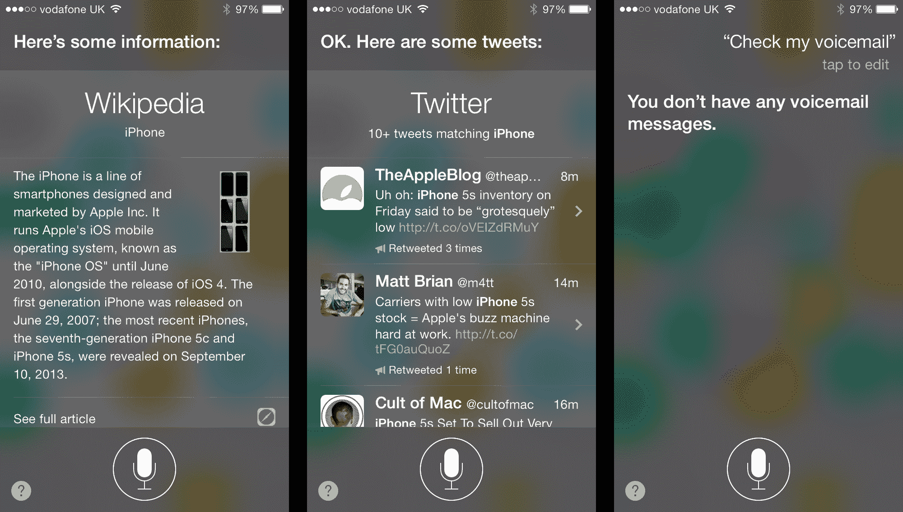](https://web.archive.org/web/20230226003051/https://techcrunch.com/wp-content/uploads/2013/09/siri-ios7.png)

Siri 的增加促使苹果取消了它的 beta 标签，事实上它似乎更有用，并减少了你访问外部资源的频率，这很好，因为它导致了“让我为你谷歌一下”的效果。我不确定 Siri 是否是我想要的虚拟助手，但它正在成为现实。

#### 多任务处理

苹果的多任务处理在过去并不出色，基本上就像一个快速的应用切换器。在 iOS 7 中，多任务处理变得更加智能，根据你定期使用应用程序的时间以及你连接电源和 Wi-Fi 的时间，学习你的习惯并在后台更新内容，以避免数据和能源消耗。

[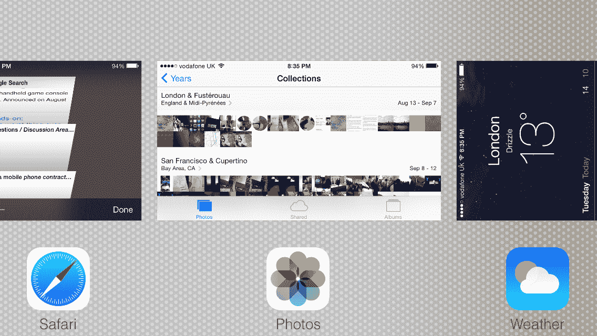](https://web.archive.org/web/20230226003051/https://techcrunch.com/wp-content/uploads/2013/09/img_0029.png)

新的应用切换器设计也更好，向你展示应用在关闭时的预览状态，而不仅仅是一个完全静态的应用图标，什么都不告诉你。向上滑动以关闭此屏幕中打开的应用程序。这些功能对 webOS 用户来说可能很熟悉，但是它们很聪明，不管它们来自哪里。

#### 旅行队

苹果的移动网络浏览器在 iOS 7 中得到了彻底的革新，它让 chrome 融入了背景。当你在一个页面上时，地址栏和底部导航栏逐渐消失，给你一个全屏的体验。地址栏最终也是一个统一的搜索栏，这足以让我们欢呼雀跃。

[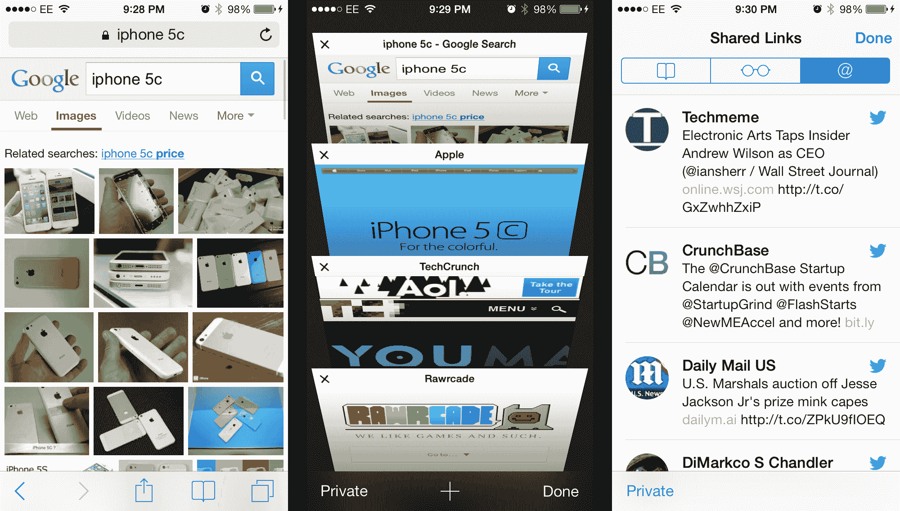](https://web.archive.org/web/20230226003051/https://techcrunch.com/wp-content/uploads/2013/09/safari-ios7.png)

苹果还在主应用程序中放置了一个私人浏览器，这意味着你不必每次想隐姓埋名时都去设置，还有一个新的标签浏览器，让你可以更容易地浏览和查看多个打开的标签。Shared links 使用内置的 iOS Twitter 集成来收集你在社交网络上关注的人的阅读列表，这是一个很好的内置内容发现功能。

#### 照相机

苹果的 iOS 相机软件在 7 中是全新的，其界面将所有模式都公开，而不是将功能隐藏在按钮后面。尽管现在所有的东西最多都是滚动过去，但界面与它所取代的界面非常不同，这可能会给新用户带来一些麻烦。

需要注意的关键组件是不同相机功能的新滑块——视频在最左边，全景在最右边。由于没有明显的箭头或控制按钮，这个模式列表本身是否是可滚动的可能不是很明显。

[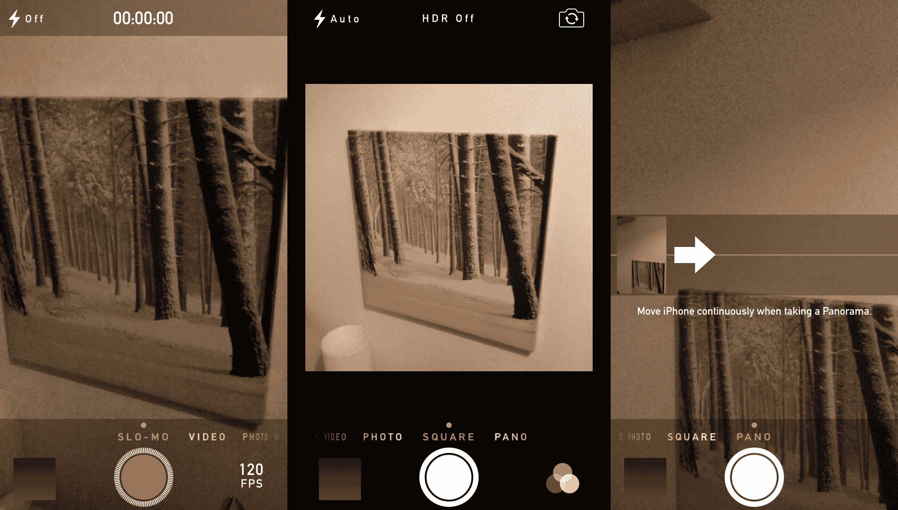](https://web.archive.org/web/20230226003051/https://techcrunch.com/wp-content/uploads/2013/09/camera-ios7.png)

这里的其他变化是实时滤镜的出现，你可以在拍摄前应用，以及在 iPhone 5s 上拍摄连拍和慢动作视频的能力。事实上，所有能够安装 iOS 7 的手机都有一个连拍模式的变体，可以快速连续拍照，但没有 iPhone 5s 的 10fps 速率，也没有自动选择功能来建议哪个镜头最好。

在 5s 中，人们会真正注意到更快的自动对焦、更快的拍摄和其他改进。

#### 照片

苹果的新照片应用程序将一些基本的组织逻辑应用到你的图片库，让你更容易找到特定的时刻，并根据地点和日期进行浏览，这比你自己组织活动要好得多。你也可以缩小屏幕，以年为单位查看你的整个手机照片历史。

[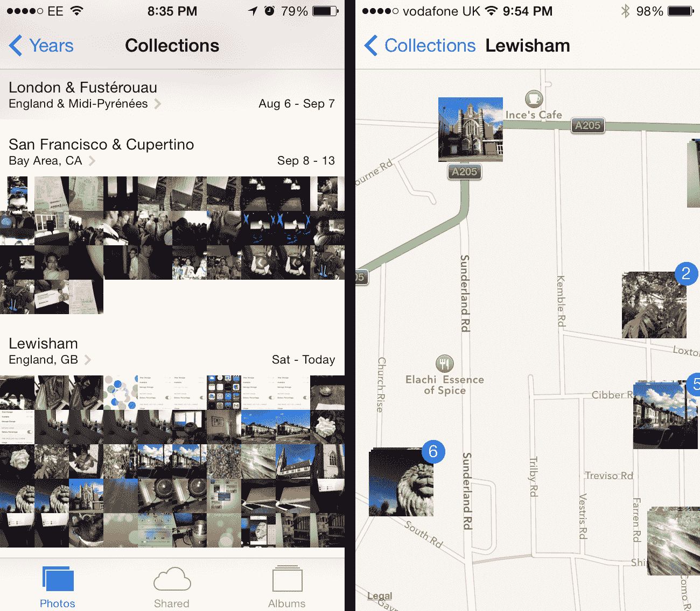](https://web.archive.org/web/20230226003051/https://techcrunch.com/wp-content/uploads/2013/09/photos-ios7.png)

其他改进包括增加了一个共享相册标签，它可以与 iCloud 照片共享配合使用，以及照片地图，允许你在内置的苹果地图上浏览你的照片历史。这比它所取代的相当无聊的界面有趣多了。

#### iTunes 收音机

iTunes 是数字音乐内容的主要来源，因此苹果推出 iTunes radio 是一件大事，iTunes radio 是一种无限制的流媒体服务，通过广告支持的模式免费提供，如果你是 iTunes Match 的订户，则无需广告。这是一项仅限美国账户持有人的服务，因此国际 iOS 7 用户将不得不等待，可能要等到许可协议到位。

[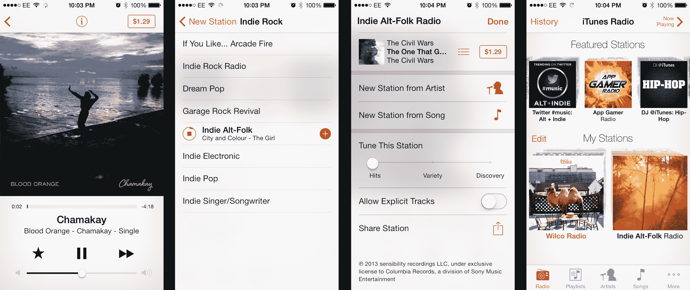](https://web.archive.org/web/20230226003051/https://techcrunch.com/wp-content/uploads/2013/09/itunes-radio.png)

iTunes Radio 根据我喜欢的流派和艺术家提供的推荐非常(可怕？)准确，这使得一个完全愉快的后仰聆听体验。谈到流媒体音乐服务，我仍然是 Rdio 的粉丝，他们新的个性化电台也令人印象深刻，但苹果将通过这一新功能在定制互联网电台中提供大多数用户所需的一切，这一新功能也可以在即将到来的 iTunes 桌面更新中使用。

#### 通知中心

iOS 7 中新的通知中心是对之前版本的一大改变。有一个新的“今天”面板，可以显示任何一天发生的事件和生日，以及天气状况、股票和第二天要注意的即将发生的事情，包括闹钟和日历事件。

滑动会将你带到“所有”和“错过的”通知列表，它会显示你的应用程序发送的内容，或者是全部，或者是自上次检查你的设备以来的新内容。在“设置”中，您可以关闭或打开“今日”视图的每个元素，并限制对该视图和您的常规通知列表的锁屏访问。

[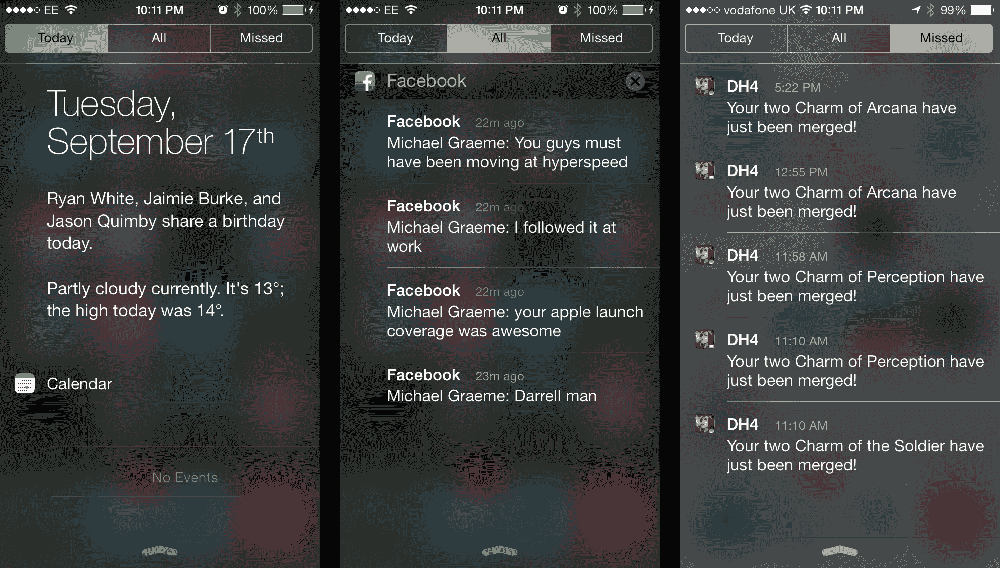](https://web.archive.org/web/20230226003051/https://techcrunch.com/wp-content/uploads/2013/09/notification-center-ios7.png)

今天是通知中心的一部分，具有一些真正的潜力，特别是如果苹果扩大其功能，使其成为 Google Now 的竞争对手，但总的来说，通知中心的更新并不令人兴奋。通知本身似乎仍然不是非常有用，所以也许提供更多的上下文或类似的东西才是正确的做法。

#### App Store 并找到我的 iPhone

苹果对 App Store 和使用 iOS 7 的 Find My iPhone 提供了一些小的更新，包括更容易保护和找回丢失或被盗设备的工具。

App Store 有一个新的“受欢迎的我附近”功能，到目前为止，除了基于我的位置的交通应用程序之外，它还没有显示太多。不过，这是另一种让发现 iPhone 不断增长的软件库更容易的方式，随着使用，它可能会变得更加智能。此外，如果你是一个在新景点寻找相关应用程序的游客，交通信息应用程序将排在列表的前列。

[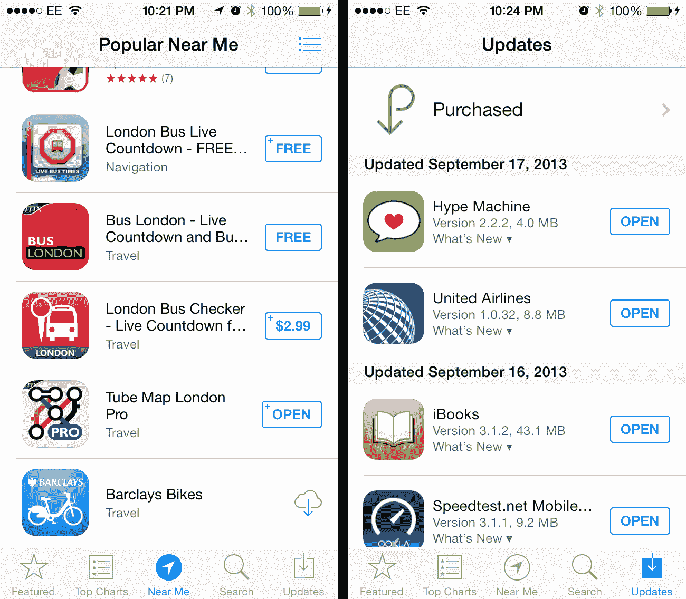](https://web.archive.org/web/20230226003051/https://techcrunch.com/wp-content/uploads/2013/09/appstore-ios7.png)

“查找我的 iPhone”获得了新的高级安全功能，比如没有 Apple ID 或密码就无法擦除或关闭“查找我的 iPhone”。它还可以在被擦除的设备上显示一条消息，因此您无需在尝试恢复丢失的硬件和保护数据之间做出选择。另外，任何拥有你手机的人都必须输入你的 Apple ID 和密码才能再次使用它。所有这些都是很好的功能，解决了犯罪分子在“查找我的 iPhone”和如何绕过它方面日益增长的精明。

#### 所有其他的

iOS 7 还有更多的功能，包括新的声音、动态壁纸、日历、笔记、提醒等设计的变化，但除了新设计之外的重大变化是上面列出的那些。毫无疑问，iOS 7 将是许多用户已经知道和喜爱的 iOS 的一个巨大变化，但总的来说，它是一个包含大量新功能的更新，使使用苹果的移动设备更容易和更愉快。

拥有 iPhone 4 或更高版本、iPad 2 或更高版本、iPad mini 和 iPod touch(第五代)的 iOS 用户将能够下载更新，但苹果公司尚未确定具体时间，因此请关注该空间的更新。