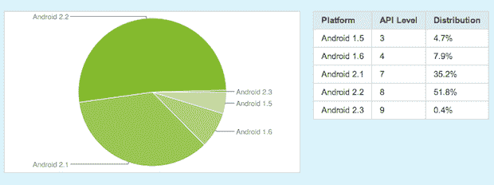

# iPhone 用户？你有 90%的机会使用最新的操作系统。安卓用户？0.4%的几率 

> 原文：<https://web.archive.org/web/https://techcrunch.com/2011/01/17/ios-android-breakdown/>

作为媒体的一员，我有幸在几周前拿到了一台运行 Android 2.3“姜饼”的 Nexus S。[太棒了](https://web.archive.org/web/20230203002701/https://techcrunch.com/2010/12/31/nexus-s-iphone-review/)，无疑是迄今为止最好的安卓版本。我希望有一天你们都能尝试一下。但是这种可能性少得可怜。事实上，如果 Android 3.0“蜂巢”在你们大多数人有机会使用姜饼之前就出来了，不要感到惊讶——甚至可能用于手机和平板电脑。

有了 iPhone，情况就大不相同了。你已经在运行最新版本的 iOS 软件的可能性要高得多。事实上，如果 Bump 的首席执行官分享的一些数字可信的话，这一比例约为 90%。

David Lieb 上周在 Quora 上分享了他的数据，标题是:[所有 iPhone 用户中使用 iOS4 的比例。*今天](https://web.archive.org/web/20230203002701/http://www.quora.com/What-proportion-of-all-iPhone-owners-use-iOS4-*-today)？

"*有了 Bump，我们的下载和使用基数如此之大，应该是一个很好的统计样本。这是我们从 2011 年 1 月 7 日到 1 月 10 日之间所有 Bump 用户的数据。*注意，这包括所有 iOS 设备，而不仅仅是问题中提到的 iPhone*，”Lieb 写道。

然后，他给出了以下统计数据:

> 按主要版本分类:
> 4。X: 89.73 %
> 3。X: 10.25 %
> 2。X: 0.02 %

换句话说，只有大约 90%的 Bump 用户在使用 iOS 的最新主要更新。他给出了一些更详细的数字，表明了个别修订细目，但以上这些可能是最好的与 Android 修订进行比较，因为。iOS 中的 x 更新往往很小(bug 修复)，而。Android 中的 x 通常是相当重要的(新功能)。

此外，Loopt 的工程师伊恩·彼得斯-坎贝尔(Ian Peters-Campbell)证实，他们看到了相同的基本故障，可能会有更多的 iOS 4。x 用户。

(哦，那另外 10%不使用 iOS 4 的 iPhone 用户呢？他们当然可以升级，如果他们想——他们可能刚刚破解和/或越狱了他们的手机。)

因此，iOS 4 在 iOS 设备用户中占有 90%的份额。Android 2.3 呢？几周前的数据是 0.4%。是的，那是百分之**零点四**。

好吧，我意识到比较 iOS 4 和 Android 2.3 有点不公平，因为后者刚刚发布，只在一款手机上可用(还是 Nexus S)。尽管如此，它在公开几周后仍然只能在一部手机上使用的事实说明了很多问题。

但是为了稍微公平一点，让我们比较一下 iOS 4 和 Android 2.2——一个早在 iOS 4 之前[就发布的操作系统。那里的领养率如何？百分之五十一点八。还是挺可怜的。](https://web.archive.org/web/20230203002701/https://techcrunch.com/2010/05/22/android-froyo-nexus-one/)

显然，这不是安卓用户的错。问题是，原始设备制造商和运营商出于各种各样的原因推迟了这些更新，其中 99%无疑是胡说八道。[这里有一个完美的例子](https://web.archive.org/web/20230203002701/http://androidspin.com/2011/01/12/breaking-t-mobile-internals-confirm-samsung-is-holding-the-android-world-hostage/)。据推测，Android 2.2 更新已经为 T-Mobile 上的三星 Android 手机做好了准备，但三星不想推出它，以便他们可以吸引人们购买新宣布的充满活力的 4G+。

很可爱。

相反，许多三星 T-mobile Android 用户对 Android 2.1 印象深刻。一个可能只有一年历史的操作系统，现在在 Android 领域已经有两个完整的版本了。换句话说，是恐龙。他们并不孤单。大约 35.2%的安卓用户还停留在同一个版本的操作系统上。

想象一下，如果 35%的 iOS 用户停留在 iOS 2(它太老了，以至于当时都不叫“iOS”)上，而我们中的少数人有 iOS 4，大多数人有 iOS 3？是啊…

更幽默的是，超过 12%的 Android 用户仍然停留在 Android 1.5 和 1.6 上。我的意思是，Android 1.5 现在已经快两年了。同样，更重要的是，这是*前四次*重大修订。iOS 甚至还没经历过四次大改版。

所以这有点像如果一些 iPhone 用户有 iOS 4，大多数人有 iOS 3，很多人有 iOS 2，一些人有 iOS 1，然后近 5%的人坚持使用 [MotoROKRs](https://web.archive.org/web/20230203002701/http://direct.motorola.com/hellomoto/rokr/) 。

与此同时，[谷歌一直承诺](https://web.archive.org/web/20230203002701/https://techcrunch.com/2010/10/08/android-carriers/)这种令人沮丧的趋势将会改善。他们确信，运营商最终会看到光明，并在任何一天加入进来。那些 99.6%看过 Android 2.3 但不会使用它的 Android 用户正在极其耐心地等待。

与此同时，不到一个月，iPhone 将在其第二家美国运营商上推出。它将推出 iOS 4.2.5 或 iOS 4.3 版本。其他每个 iOS 用户都可以访问的操作系统。