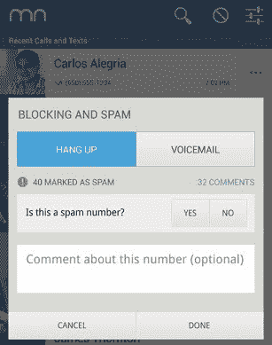

# iOS 7 通过阻止来自特定号码的电话和短信的选项来打击手机垃圾邮件 

> 原文：<https://web.archive.org/web/https://techcrunch.com/2013/06/10/ios-call-blocking/>

# iOS 7 通过阻止特定号码的来电和短信来对抗手机垃圾邮件

电话营销垃圾邮件困扰你？粘人的前任半夜打电话来？iOS 7 会让你屏蔽特定号码的来电，以保持理智。苹果没有允许第三方开发者像在 Android 上一样修改原生手机应用，而是选择自己提供这一功能。

苹果在 WWDC 的主题演讲中提到了新的隐私选项[的 iOS 7](https://web.archive.org/web/20221206085246/https://beta.techcrunch.com/2013/06/10/apple-ios-7/) 中的新内容，并在[的新闻稿](https://web.archive.org/web/20221206085246/http://www.apple.com/pr/library/2013/06/10Apple-Unveils-iOS-7.html)中详细介绍了今年秋天对其移动操作系统的更新，包括“电话、FaceTime 和消息阻止，以防止特定的人能够联系到你。”

昨天我想知道苹果是否最终会向 iOS 开发者开放更多的灵活性，允许他们提供这种功能。Android 允许像 [Mr Number](https://web.archive.org/web/20221206085246/http://mrnumber.com/) 和许多其他应用程序让你屏蔽特定的号码或整个区号，立即挂断，或自动发送到语音邮件。来电和短信拦截功能建立在 iOS 免打扰功能的基础上，您可以安排拦截来自除某些收藏夹或群组之外的所有号码的来电和信息。

作为这项功能在 iOS 中受欢迎程度的衡量标准，在一周前被 WhitePages 收购之前,《数字先生》已经获得了超过 700 万的下载量。也许它怀疑来电屏蔽会在 iOS 中本地化，否认它在 iOS 中的潜力，并担心同样的事情会发生在 Android 上。除非你遇到过跟踪者或恶霸，否则很难评估屏蔽电话和短信的价值。对于那些拥有手机的人来说，这项功能可以成就或毁掉他们的移动体验。

被不想要的交流吵醒或打断感觉像是对隐私的严重侵犯，每次手机响起都会让人们感到害怕或愤怒。它让人们反击来自旧男友或女友的醉酒拨号，令人毛骨悚然的陌生人，以及破坏他们工作流程的无礼营销人员。

运气好的话，苹果会随着时间的推移以更精细的方式发展这一功能。在我们的口袋里放上任何人都能用正确的数字串拿到的通讯设备，迫使我们放弃对注意力的控制。iOS 的通话和短信屏蔽功能将让数百万人重新获得控制权。

