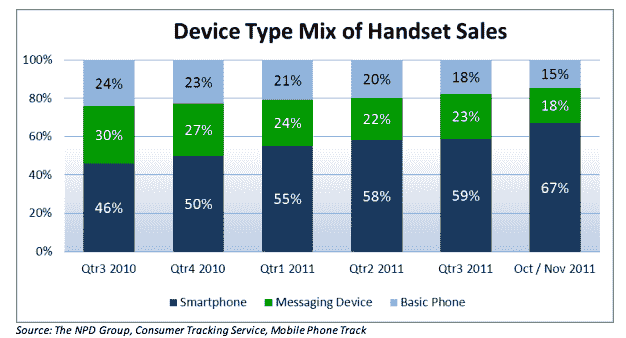
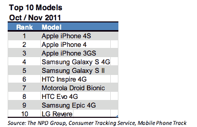

# iOS 市场份额从第三季度的 26%上升到 2011 年 10 月/11 月的 43% TechCrunch

> 原文：<https://web.archive.org/web/https://techcrunch.com/2012/01/09/ios-marketshare-up-from-26-in-q3-to-43-in-octnov-2011/>

根据研究公司 [NPD](https://web.archive.org/web/20230129153817/https://www.npd.com/) 的一份新报告，iOS 在美国的市场份额(按销售额计算)从 2011 年第三季度的 26%跃升至 10 月和 11 月的 43%。然而，Android 独占鳌头，这两个月的市场份额为 47%，低于第三季度的 60%。

NPD 说，在 2011 年的智能手机大战中，iOS 和 Android 逐渐远离竞争，变成了“两匹马的竞赛”

NPD 表示，总体而言，智能手机销量持续增长，在 2011 年 10 月/11 月售出的手机中，智能手机占到了三分之二。相比之下，这一比例高于 2010 年第四季度的 50%。

【T2

此外，10 月/11 月销售的前十款手机中有九款是智能手机，三星、HTC 和 Motorla 都至少有一款智能手机跻身 NPD 前十。苹果手机高居榜首，iPhone 4S 位居第一，iPhone 4 仍位居第二。

很明显，iOS 和 Android 正在主导这个市场，因为前领导者 RIM 的销售额从 2010 年第三季度的 20%下降到 2011 年 10 月/11 月的 6%。

当移动分析公司 Flurry 去年 12 月的一份报告证实了这些平台在 2011 年假日季取得的巨大收益时，我们最近瞥见了 iOS 和 Android 越来越受欢迎的程度。该公司发现[仅在圣诞节一天就有 680 万安卓和 iOS 设备被激活](https://web.archive.org/web/20230129153817/https://techcrunch.com/2011/12/27/android-ios-devices-xmas-day/)。这比 12 月前 20 天每天 150 万的激活量增长了 353%。Flurry 说，它还创下了新的记录:2010 年圣诞节只有 2.8 次激活。

我们也一直在关注 [Android 的市场份额根据激活量急剧攀升](https://web.archive.org/web/20230129153817/https://techcrunch.com/2011/12/22/android-700000/)——谷歌的安迪·鲁宾[在 12 月发推文](https://web.archive.org/web/20230129153817/https://twitter.com/#!/Arubin/status/149329329237667844)称，现在每天有超过 70 万部 Android 手机被激活，高于去年 6 月[每天 50 万的激活量](https://web.archive.org/web/20230129153817/https://techcrunch.com/2011/06/28/andy-rubin-daily-android-activations-reach-500000/)。Asymco 的移动分析师 Horace Dediu 估计，到目前为止，Android 设备的激活总数在 2 . 24 亿到 2 . 53 亿之间。相比之下，去年 10 月，苹果宣布累计售出 2.5 亿台 iOS 设备(包括 iPods 和 iPads)。

值得一提的是，研究公司 Chitika T1 今天也向 T2 T3 报告说，Android 以 51.6%的份额领先于 iOS 的 46.4%。但这些数据是基于 11 月和 12 月最后一周的网络浏览量。除了对一年中最繁忙的时段之一——假日激活期间的流量水平进行快速快照之外，这些数据还不够用。

在苹果发布下一份收益报告之前，我们无法确切知道它卖出了多少部 iPhones，但多亏了 NPD 的新数据，我们知道这将是不分上下的。