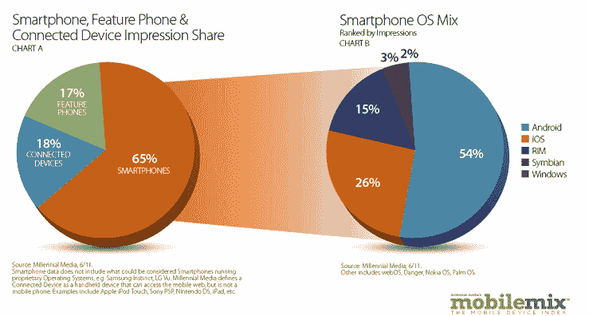

# 随着 Android 增长趋于平稳，iOS 和 RIM 在 Q2 的移动广告投放有所增加 

> 原文：<https://web.archive.org/web/http://techcrunch.com/2011/07/15/ios-rim-mobile-ad-impressions-pick-up-in-q2-as-android-growth-levels-off/>

# 随着安卓增长趋缓，iOS 和 RIM 在 Q2 的移动广告投放有所增加

现存最大的独立移动广告网络 [Millennial Media](https://web.archive.org/web/20230203121303/http://www.millennialmedia.com/) 发布了 2011 年第二季度的月度数据报告，与[上个月的报告不同，](https://web.archive.org/web/20230203121303/https://techcrunch.com/2011/06/15/windows-phone-7-ad-impressions-up-92-ios-and-android-neck-in-neck-for-app-revenue/)随着 Android 在移动广告印象方面的增长趋于平稳，iOS 和 RIM 似乎正在复苏。

根据 Millennial 的数据，iOS 印象季度环比增长 18%，而 Android 印象季度环比增长 11%。RIM 印象环比增长 29%，Symbian 印象环比增长 13%，Windows Phone 7 印象环比增长 31%。事实上，根据 Millennial 的数据，Android 是所有智能手机平台中移动广告印象增长最慢的。

Millennial 经常查看按网络收入排名的应用程序开发，在 Q2，Android 占应用程序平台组合的 41%，环比增长 14%。iOS 占该应用的 49%，环比增长 12%。

根据印象份额，Android 以 54%的印象份额连续第 7 个月保持网络上领先的操作系统(但这是与 5 月相同的[份额)，其次是 6 月份 26%的印象份额的 iOS。RIM 的印象份额为 15%，Symbian 和 Windows Phone 7 分别以 3%和 2%的份额紧随其后。](https://web.archive.org/web/20230203121303/https://techcrunch.com/2011/06/15/windows-phone-7-ad-impressions-up-92-ios-and-android-neck-in-neck-for-app-revenue/)

6 月份，iPhone 以 16%的印象份额继续主导千禧一代的网络，成为广告网络中的顶级手机。最接近的安卓手机是原版摩托罗拉 droid，为 2.95%。但安卓平台也占据了前 20 名手机中的 16 个。

按制造商来说，苹果领先，占前 15 名制造商印象份额的 30%
三星连续第五个月位居第二。今年 6 月，三星 Nexus S 的浏览量环比增长了一倍多，在 20 大手机排行榜上排名第四。

在千禧一代的所有印象中，智能手机占 65%，联网设备环比增长 13%，占所有印象的 18%。

看到 Android 的增长正在放缓当然很有趣。iOS 正在加速发展。我们将看看这种趋势是否会持续到 7 月和第三季度。InMobi 的[最新数据](https://web.archive.org/web/20230203121303/https://techcrunch.com/2011/03/08/inmobi-android-winnin/)显示，在全球用户和移动广告印象方面，Android 正在超过 iPhone。

至于 Millennial，还不清楚这家现存最大的独立移动广告网络公司是会成为上市公司还是会被收购。该公司一年前为[筹集了 2750 万美元的新资金](https://web.archive.org/web/20230203121303/https://techcrunch.com/2011/01/05/mobile-ad-network-millennial-media-raises-27-5-million-tripled-revenue-in-2010/)，并且[正在考虑在不久的将来进行首次公开募股](https://web.archive.org/web/20230203121303/https://techcrunch.com/2010/07/28/millennial-media-ipo-2011/)。考虑到越来越多的科技公司走上这条路，现在当然是 IPO 的好时机。

