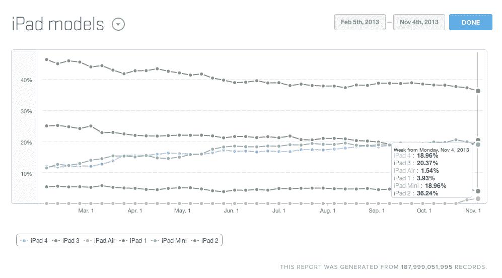

# Fiksu TechCrunch 表示，iPad Air 在周末首映后的采用率与 iPad 4 相当

> 原文：<https://web.archive.org/web/https://techcrunch.com/2013/11/04/ipad-air-first-weekend-adoption/>

根据移动应用分析公司的最新早期数据，与去年相比，苹果公司(Apple)重新设计的 9.7 英寸 iPad 可能确实吸引了更广泛的升级用户。根据 Fiksu 公司的数据，iPad Air 在第四代 iPad 上市后的第一个周末获得的销量是第四代 iPad 的五倍左右，比与 iPad 4 同时上市的 iPad mini 略低四倍。

 Fiksu 发现，在 iPad Air 上市三天后，使用其客户端应用的数百万人中有 0.88%的人在使用它——这比 iPad 4 上市三天后的 0.15%或同时期的 0.22%要好得多。事实上，iPad Air 吸引的早期用户比这两款设备的总和还要多，如果设备销售数据证明了这一点，这将意味着苹果在这个假期中的一大胜利。

支持 Fiksu 提前采用的是来自 Mixpanel 的数据，该数据报告称，截至本周一，iPad Air 占其客户应用程序所有 iPad 流量的 1.54%。iPad 2 和 iPad 1 似乎遭遇了最大的同时使用百分比下降，这可能表明苹果已经成功吸引了一批升级者，他们是 iPad Air 旧设备的长期坚持者。

 去年，在 iPad 4 和 iPad mini 发布的周末，苹果共售出 300 万台新平板电脑。今年，如果这些采用比较是正确的，这个数字应该会高很多，尽管使用和销售之间并不总是有直接的关系。传统上，苹果会在一款新设备的首周末发布新闻稿，说明它成功售出了多少台设备，但随着最近 iPhone 的发布，它[等到 iPhone 5c 和 iPhone 5s 都在](https://web.archive.org/web/20221206184323/https://beta.techcrunch.com/2013/09/23/apples-iphone-5s-and-iphone-5c-sell-9m-units-over-opening-weekend-topping-5m-for-iphone-5-last-year/)发布后，才透露数字，因为它很少按单个型号分列设备销售情况。

iPad 的情况略有不同，因为苹果尚未透露配备 Retina 显示屏的 iPad mini 的确切发布日期，而且这些数字表明，独立于 Retina mini 公布 Air 销售情况可能对苹果有利，因为两者似乎都在产生强劲的消费者需求。不管怎样，我们一定会让你知道苹果这次透露的单位销量。

苹果可能通过这次 iPad 发布找到了完美的平衡；一款更轻、更薄的 iPad Air，对那些喜欢大屏幕但没有真正需要从第一代和第二代设备升级的人来说很有吸引力，还有一款 iPad mini，其屏幕可能会说服许多第一代设备所有者也进行升级。错开发布日期可能也对他们有利——当一个有空，另一个没有空时，就不会那么尴尬了，一些选择了 iPad Air 的人可能会在后来让步，发现自己又买了一部设备，这取决于对这款较小平板电脑的评论和接受度。