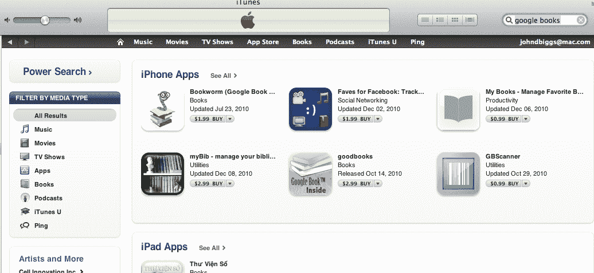

# iPad 图书应用步履蹒跚:只有现有账户持有人可以使用应用，谷歌图书启动 

> 原文：<https://web.archive.org/web/https://techcrunch.com/2011/07/25/ipad-books-hobbled/>

# iPad 图书应用程序步履蹒跚:只有现有的账户持有人可以使用应用程序，谷歌图书启动

年初时，苹果表示，它希望通过 iPad 平台销售的商品中有 30%来自苹果。你几乎可以出售任何东西——书籍、可下载内容、杂志、小猫照片——但是，根据他们的订阅规则，所有东西都必须经过苹果自己，简而言之，你不能去一个网页完成交易。这个承诺——关闭 iPad 上的外部网络商店——已经实现，Nook、Kindle、Kobo 和 Google Books 应用程序要么被彻底改变，要么完全从应用商店中删除。

[Nook](https://web.archive.org/web/20230205013526/https://techcrunch.com/tag/Nook) 、 [Kindle](https://web.archive.org/web/20230205013526/https://techcrunch.com/tag/Kindle) 和 Kobo 现在都无法访问网上书店，你也不能在应用程序中创建账户。只有在各种商店中拥有当前帐户和图书档案的用户才能阅读和购买图书。例如，截至今天，[Nook Kids](https://web.archive.org/web/20230205013526/http://www.the-digital-reader.com/2011/07/24/nook-kids-updated-ebookstore-link-gone/)应用程序的用户不再能够访问 Barnes & Noble 网络商店，而 Kobo 用户也不能在应用程序上创建帐户或购买书籍。

你还会注意到，谷歌图书应用程序现在已经从 iTunes 商店中消失了，这可能是因为全面检修或者(我对此表示怀疑)出于恶意。

在应用程序世界里，当谈到这些举措时，我犹豫不决。一方面，像《每日》这样的杂志(还记得它们吗？)更确切地说，[纽约客](https://web.archive.org/web/20230205013526/https://techcrunch.com/2011/05/12/it-is-finished-the-new-yorker-ipad-app-is-the-beginning-of-the-end-of-print/)证明了内部应用销售和订阅非常有效，让每个人——从内容提供商到“运营商”,在这里是苹果公司——都能维持延续我们文化遗产所必需的收入流。

但事情变得有点棘手:苹果基本上是在说，这是我们的方式或高速公路，那些不喜欢它的人可以完全放弃 iOS，或者重新致力于基于 HTML5 的阅读器，这些阅读器可能优于也可能不优于基于应用的系统。同样，这是苹果的设备和苹果的规则，但我这个热爱自由的自我出版商说，“嘿，亚马逊已经拿走了他们的份额，为什么我要冒险让他们因为这个愚蠢而拿走更大的份额？为什么我不得不满足于潜在的低于标准的阅读体验，因为苹果公司想要我的 1 美元中的 30 美分？”

作为一个鄙视当前出版业的人，我很高兴苹果正在打击那些享受了太长时间的人。然而，我担心最终买单的是作者和读者，而不是出版商。