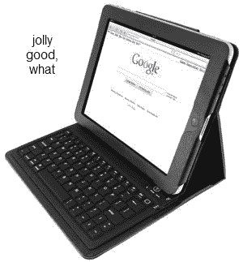

# 内置键盘的 iPad 保护套即将面市 TechCrunch

> 原文：<https://web.archive.org/web/https://techcrunch.com/2010/08/24/ipad-case-with-built-in-keyboard-hitting-us-soon/>

# 内置键盘的 iPad 保护套即将面市

在英国有一款 [iPad](https://web.archive.org/web/20221209224703/http://www.crunchgear.com/tag/ipad/) 保护套[(尽管不幸的是目前缺货)，保护套内有一个蓝牙键盘。增加了一点重量，但是如果你在那上面做的不仅仅是打字，你可能会喜欢有实体键。它正在通过联邦通信委员会，所以预计它很快就会在我们的海岸。](https://web.archive.org/web/20221209224703/http://www.gearzap.com/ipad-folio-with-integrated-bluetooth-keyboard-black.html)

当然，KeyCase 售价 60 英镑，也就是 90 多美元。这是一个昂贵的案例——这个价格你可以买到[碳纤维](https://web.archive.org/web/20221209224703/http://www.crunchgear.com/2010/07/12/carbon-fiber-ipad-case-makes-me-want-to-put-a-turbo-in-my-ipad/)、[相机](https://web.archive.org/web/20221209224703/http://www.crunchgear.com/2010/07/07/the-ipad-cam-case-rights-the-ipad-by-adding-a-swivel-camera/)或 [DODOcase](https://web.archive.org/web/20221209224703/http://www.crunchgear.com/2010/05/28/the-ipad-dodocase-wins-our-hearts-and-money/) (便宜得多)。

[通过[斜线齿轮](https://web.archive.org/web/20221209224703/http://www.slashgear.com/bluetooth-ipad-keyboard-case-crosses-fcc-2498671/)