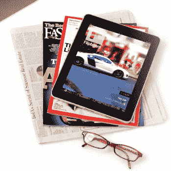

# iPad 杂志需要新蓝图 

> 原文：<https://web.archive.org/web/http://techcrunch.com/2011/01/30/ipad-mags-new-blueprint/>

自从 iPad 问世以来，印刷媒体公司一直在这种新媒体中摸索前进，但到目前为止，他们只是被自己绊倒了。他们将 iPad 视为一个新的[围墙花园](https://web.archive.org/web/20230203010016/https://techcrunch.com/2008/07/24/apples-app-store-the-new-walled-garden/)，在这里人们会神奇地为他们在浏览器中免费获得的文章付费。但是如果他们想让人们付费，他们的体验必须比在网上更好，但通常不是这样。

这种令人遗憾的状况对杂志和报纸来说都是真实的。例如,*《纽约时报》*的 iPad 应用程序很漂亮，但是有缺陷。所有的链接都被从文章中剔除，甚至从博客中。与此同时，大多数 iPad 杂志只不过是印刷版的 pdf 文件，附带一些照片幻灯片和视频。它们变成了巨大的文件——我最近下载了一期 350 MB 的文件，有些《连线的 T6》是 500 MB 的文件——里面的文章和印刷版一样陈旧。在触摸屏上复制死树出版模式是一种过时的方法。

尽管评论很差，下载量也不令人鼓舞，但媒体公司去年为他们的 iPad 应用程序销售了价值数百万美元的广告，因为广告商希望与任何闪亮的新东西联系在一起。毫无疑问:是广告收入推动媒体公司拥抱 iPad，而不是读者。新闻集团本周即将推出的纯 iPad 版报纸[和*日报*也是如此，但至少它将完全为 iPad 打造。我怀疑它需要一段时间来发挥其真正的潜力——不彻底改造阅读体验就推出一个新的出版物已经足够困难了——但我很想知道它会走向何方。](https://web.archive.org/web/20230203010016/https://techcrunch.com/2011/01/27/the-daily-launch-nyc/)

然而，我没有屏住呼吸。我已经写了我对日报应该是什么样子的想法。

> 从读者的角度来看，最佳的 iPad 报纸应该是三样东西:
> 
> *   社交网站:它应该向你展示你的朋友和你信任的人在阅读和传播什么，无论是在出版物中还是在网络上。
> *   **实时:**新闻每秒都有突发，出版物需要尽可能的实时才能跟上。一个“每日”已经听起来太慢了。
> *   **本地:**该设备知道你在哪里，应该相应地提供新闻和信息，包括天气、本地新闻和评论。

至少，苹果应该修复 iTunes 中的[订阅问题](https://web.archive.org/web/20230203010016/http://www.nytimes.com/2011/01/17/business/media/17apple.html)。目前，付费杂志或报纸的每一期都必须作为应用内购买单独购买。但是订阅并不能拯救媒体公司。事实上，他们更聪明的做法是免费提供应用程序，从广告商那里赚更多的钱，因为广告商希望接触到尽可能多的人。广告也应该更有价值，因为它们在应用程序中看起来更好，看起来更像杂志广告，点击时可以占据整个屏幕。

但是让这些媒体应用程序社会化和实时化是关键。它应该像博客或 Twitter 一样不断更新。它应该像 [Flipboard](https://web.archive.org/web/20230203010016/http://flipboard.com/) 一样具有社会性，因为它通过将链接分解为完整的文章、图片和视频，向我显示我关注的人在其他地方阅读和转发的内容。

与 iPad 报纸相比，iPad 杂志更有机会打破这种模式，但如果他们只是试图改变其印刷出版物的用途，他们就无法做到这一点。像*这种从零开始的日常*才是正确的想法。但杂志比报纸更擅长的是包装新闻，提炼大创意，并以一种能让读者铭记在心的叙事弧线来呈现故事。

如果我在创作一本 iPad 杂志，它看起来一点也不像杂志。它看起来更像一个媒体应用程序，不会有任何订阅，甚至不会有明显的问题。每当你打开它，新的内容就会出现，就像你访问 TechCrunch 或启动 Flipboard 或 Pulse News Reader 一样。为了让它上瘾，它必须是实时的。但这也比简单地阅读任何人在你的 Twitter 或脸书信息流中链接的所有内容更有选择性。

相反，它将向读者呈现从原创文章和视频到主题精选流的连续统一体。这些精选的信息流将把来自工作人员作者和编辑的推文与其他记者、企业家和专家针对任何特定主题或部分的推文结合起来。这些信息流将像 Flipboard 一样被展开成杂志一样的布局，但会有更多的过滤器来显示趋势故事，并突出显示最热门的内容。

同时，会有一个视图只显示该出版物中的文章。此外，除了按时间倒序排列的最新帖子之外，还有其他导航应用的方式。除了每小时的突发新闻和分析，还会有更长的叙述。这些不一定是 10，000 字的文章(尽管这可能是其中的一部分)，而是带读者经历一系列的经历来讲述一个故事。

也许你可以从一篇文章开始，然后是一个主题的视频采访，一个互动的信息图，然后以一个关于这个主题的精选推文流结束。在每一点上，读者都会被牵着手从一个经历到另一个经历，带着对主题更全面的理解离开。补充图像和数据应该总是在她手边。当然，读者可以通过评论、推文、分享、民意调查等方式深入其中。

数字杂志或报纸应该像一个媒体应用程序，而不是 PDF 浏览器。它需要利用技术来讲述更好的故事。这些技术包括展示技术(沉浸式全景照片、交互式图表)和过滤外部来源新闻的数据筛选技术。

你希望在媒体应用程序中看到什么，而你今天却没有得到？