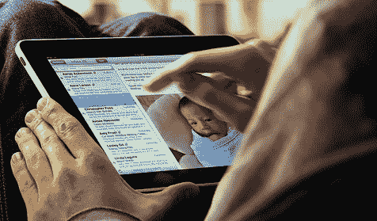

# 为什么我妈妈的下一台电脑会是 iPad

> 原文：<https://web.archive.org/web/https://techcrunch.com/2010/01/31/ipad-moms-next-computer/>

# 为什么我妈妈的下一台电脑会是 iPad

***编者按**:这是由[百万美元](https://web.archive.org/web/20230302071814/http://www.wired.com/gadgetlab/2009/02/shoot-is-iphone/) iPhone 游戏**is shoot*和新发布的*吉姆·罗德户外射击*的开发者伊森·尼古拉斯(Ethan Nicholas)撰写的客座博文。在 iPad 发布之前，尼古拉斯就已经在构思他的下一款平板电脑游戏了。

互联网是一个有趣的地方。在苹果[宣布](https://web.archive.org/web/20230302071814/http://www.crunchgear.com/2010/01/27/apple-unveils-the-ipad-at-last/)其新的 [iPad](https://web.archive.org/web/20230302071814/http://www.crunchbase.com/product/tablet) 后，我对 Slashdot 和 Digg 等网站上针对它的仇恨感到厌恶。就连我通常同意的 Penny Arcade 公司的人都说“iPad 的展示是我在苹果舞台上见过的最糟糕的东西”，苹果没有为这款设备做好准备。

如果你相信他们，iPad 将会是一个巨大的失败。

嗯，网上没洗过的群众也预言 iPod 会失败。他们当时错了，现在也错了。

iPad 是给不喜欢电脑的人用的电脑。不喜欢升级 3D 驱动程序、调整屏幕分辨率或安装新内存的人。他们不明白为什么他们的电脑越用越慢，他们的系统托盘里有 25 个图标，每天都要等 10 分钟系统才能启动。

对于大多数人来说，iPad 是最理想的选择。它做的事情不像“真正的”计算机那么多，但它做的事情即使是不懂技术的人也能理解，而且出错的方法也少得多。因此，如果你在接触一台“电脑”之前就已经成功说服自己，iPad 是一台无用的、被锁定的、充满数字版权管理的“电脑”，我有两个词送给你:

我妈妈。

我的母亲是一位 60 多岁的可爱女士，她……嗯,“不懂电脑”可能是一种很好的表达方式。我经常不得不弄清楚为什么她的电脑运行得如此之慢，或者为什么打印不出来，或者当那些不与电脑为伴的人每天坐下来的时候，会发生无数其他的随机事情。

iPad 非常适合她。这正是她所需要的。它可以让她在长途飞行中看电影、听音乐和看书。它将使使用电脑变得有趣，而不是令人讨厌的琐事。

但它也不允许她安装大量的新闻和天气预报小工具，这些小工具一开机就会启动，让她的电脑慢如蜗牛。它不会突然忘记如何与网络通信，或者被所有的软件安装和卸载弄得不知所措，以至于最终不得不崩溃并从头重新安装系统。换句话说，我妈妈的下一台电脑将是 iPad，我梦想有一天我能最终摆脱沉重的枷锁，成为家里唯一一个知道如何让电脑正常工作的人。

你知道吗？外面有成千上万像她一样的人。他们比我们多。他们终于有机会成为高效、自给自足的计算机用户，而不是不断要求家人修理他们的计算机，或者更糟糕的是，让极客小组继续工作。

不，iPad 并不适合所有人。但我要公开声明，对于世界各地的非计算机爱好者来说，iPad 将重新定义计算。

(图片由 Flickr/ [Scott Chang](https://web.archive.org/web/20230302071814/http://www.flickr.com/photos/myuibe/4310110236/) )