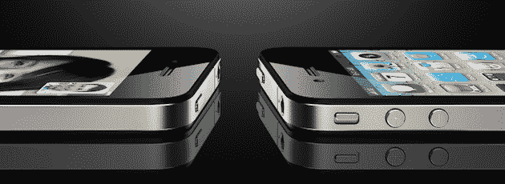
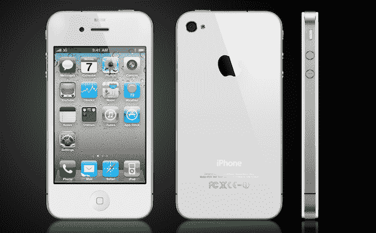

# 威瑞森 iPhone 传言的绝佳时机 

> 原文：<https://web.archive.org/web/https://techcrunch.com/2010/10/06/iphone-4-verizon-yes-again/>

威瑞森 iPhone 的传闻和 iPhone 本身一样古老。所以无论什么时候有人说出来，你都要半信半疑。这就像披头士来到了 iTunes。它最终会发生，但谁知道什么时候。也就是说，今天的[华尔街日报报道](https://web.archive.org/web/20230207003936/http://online.wsj.com/article/SB10001424052748703735804575536191649347572.html)关于威瑞森准备在 2011 年初推出 iPhone 的消息再次成为苹果控制的泄密事件。所以是时候真正相信。

现在，我当然不确定苹果是否给了《华尔街日报》这个故事——但让我们看看最近的历史。今年 1 月，随着有关 iPad 的传言四起，《华尔街日报》有一篇报道称，这款平板电脑的价格可能在 1，000 美元左右。当时，我指出了为什么[这散发着苹果](https://web.archive.org/web/20230207003936/https://techcrunch.com/2010/01/04/apple-tablet-pricing/)降低期望值的味道，这样他们就可以把期望值打得落花流水。几天后，苹果公司的一位前营销经理证实了这一点。结果呢？史蒂夫·乔布斯在台上宣布 iPad 起价仅为 499 美元。嘣。

今年 7 月，有传言称，由于天线问题，苹果将不得不召回 iPhone 4。当苹果召开一场惊喜的发布会时，这些传言只会愈演愈烈。但是在发布会的前一天,《华尔街日报》又报道了苹果[不会召回设备](https://web.archive.org/web/20230207003936/https://techcrunch.com/2010/07/15/iphone-4-recall/)的消息。再说一次，这看起来是关于设定期望的。第二天，苹果是否召回了该设备？没有。但是没有人恐慌，因为每个人都知道他们不会。

如果你回到去年，6 月 19 日，苹果公司有史以来最成功的产品发布会，iPhone 3GS。那天晚上，股市收盘后,《华尔街日报》爆料称，苹果公司首席执行官史蒂夫·乔布斯几个月前在休病假期间接受了肝脏移植手术。这样一个独家新闻的时机很奇怪——不可否认，这个时机对苹果有利。据说乔布斯很好，很快就会回来工作。

所有这些故事有什么共同点？每篇文章均由《华尔街日报》记者 Yukari Iwatani Kane 撰写或合著。猜猜谁也是今天威瑞森 iPhone 故事的作者之一？没错。

那么苹果为什么要泄露这样的消息呢？这很明显。威瑞森 iPhone 的消息将很快平息所有关于安卓在美国市场上对抗 iPhone 势头的谈论。这种说法得到了一份又一份报告的支持，比以往任何时候都更加响亮。就在这个国家的销售而言，Android 显然超过了 iPhone。媒体正在抓住这个故事[大时代](https://web.archive.org/web/20230207003936/http://www.newsweek.com/2010/10/03/how-android-is-transforming-mobile-computing.html)。

考虑到苹果从 iPhone 上赚的钱(数十亿)与谷歌从 Android 上赚的钱(几乎没有)不成比例，你可能会认为苹果不会关心这个。但有迹象表明，它们确实如此。乔布斯一直在对安卓系统进行[毫不掩饰的抨击](https://web.archive.org/web/20230207003936/https://techcrunch.com/2010/09/01/apple-ios-activations/)(通常是为了回应谷歌毫不掩饰的抨击)。今年年初，他与员工的谈话[被泄露，这清楚地表明他感觉受到了 Android 的威胁。](https://web.archive.org/web/20230207003936/http://www.wired.com/epicenter/2010/01/googles-dont-be-evil-mantra-is-bullshit-adobe-is-lazy-apples-steve-jobs/)

同样，鉴于苹果的成功和[成熟的模式](https://web.archive.org/web/20230207003936/https://techcrunch.com/2009/11/11/while-rivals-jockey-for-market-share-apple-bathes-in-profits/)，他们可能不应该关心。这根本就不是一场公平的比赛。但是他们有。威瑞森的 iPhone 就是最好的证明。

今天标志着一个特别有趣的日子，因为在三藩市的 CTIA 或其周边地区发布了一波新的 Android 设备。在现在的移动世界里，是安卓，安卓，安卓。不仅仅是消费者意识到了这一点，所有重要的开发者也意识到了这一点。考虑到苹果一年只发布一次新手机，在夏天，他们没有什么可以抗衡的。除了威瑞森的 iPhone。

《华尔街日报》的报道还指出，第五代 iPhone 也在研发中。但那是显而易见的。这与之前所有 iPhones 的时间表相同。事实上，这款第五代 iPhone 可能已经研发两年了。这个故事的关键是，和硕将在今年年底大规模生产 CDMA iPhone，威瑞森将出售它。

这实际上是凯恩最近几个月报道的第二个威瑞森 iPhone 谣言。但是三月份的第一次，小心翼翼地没有明确说威瑞森将会得到 iPhone——只是说苹果正在开发 CDMA 版本的设备。所有迹象表明这是真的，而且已经有一段时间了— [我们也听到了同样的事情](https://web.archive.org/web/20230207003936/https://techcrunch.com/2010/08/08/verizon-iphone-january/)。但这个故事可能只是为了用威瑞森的暗示吊起人们的胃口。今天的是肉。

有趣的是，今天故事的原始版本说了完全相同的事情:只是 CDMA 版本的 iPhone 即将推出。后来，它被更改为专门指定威瑞森作为它将出现的提供商。看起来，有些人没有得到足够清楚的信息。

一些威瑞森特有的附加功能:

> 苹果公司正在制造其 iPhone 的一个版本，威瑞森无线将于明年年初销售
> 
> 据一位知情人士透露，威瑞森无线一直在与苹果会面，增加容量并测试其网络，为 iPhone 用户的大量数据负载做准备。该运营商正寻求避免美国电话电报公司遭受的那种公关打击，当时渴求数据的 iPhones 的激增使其网络不堪重负，特别是在纽约和旧金山。
> 
> 知情人士说，苹果最初决定不为威瑞森开发手机，而是专注于基于 GSM 的版本，GSM 是美国电话电报公司和世界上大多数移动运营商使用的一种更普遍的移动技术。
> 
> 知情人士当时说，在早些时候的讨论中，威瑞森对苹果要求威瑞森不允许其零售合作伙伴销售这款手机的做法犹豫不决。这些人说，威瑞森还拒绝放弃通过其专有服务销售音乐和视频等内容的能力。

最后一部分特别让我害怕。虽然我绝对会是排队购买威瑞森网络 iPhone 的第一人。这和威瑞森的 iPhone 是有区别的。毫无疑问，威瑞森想要出售的 iPhone 装载了他们[现在在他们的 Android 手机](https://web.archive.org/web/20230207003936/https://techcrunch.com/2010/09/09/android-open/)上装载的同样的垃圾。既然威瑞森现在已经凭借安卓的受欢迎程度获得了优势，苹果会不得不对威瑞森的一些要求做出让步吗？我希望不会，但我很担心。

如果苹果真的关心美国的市场份额——同样，有迹象表明他们确实关心——他们需要威瑞森胜过威瑞森需要他们。这是一个糟糕的处境——一个苹果公司近年来不习惯的处境。

如果这是一次泄露，苹果有没有可能只是再一次用它作为谈判策略？也许吧。但似乎有太多的烟雾——所有的 CDMA 报道，[在& T 说着关于他们如何不害怕失去 iPhone 的蠢话](https://web.archive.org/web/20230207003936/https://techcrunch.com/2010/09/22/att-iphone-verizon/),以及苹果如果想在美国继续增长，确实需要另一家运营商的事实——这次谣言不会是真的。

所以我现在持谨慎乐观的态度，因为明年一月我将拥有一部真正可以作为手机使用的手机。最好上面没有 V 星人的标志。最好是白色的。

**更新**:以下是《华尔街日报》对此事的评论:

> 认为《华尔街日报》仅仅依靠苹果的战略泄密的想法是可笑的。

老实说，我不知道该怎么理解。他们是不是误读了我写的东西，认为我说只有《华尔街日报》依靠泄密？或者他们是在暗示他们确实会泄密，但那不是他们唯一依赖的*的东西？*