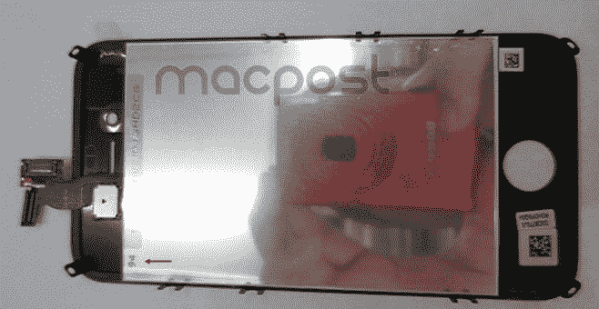
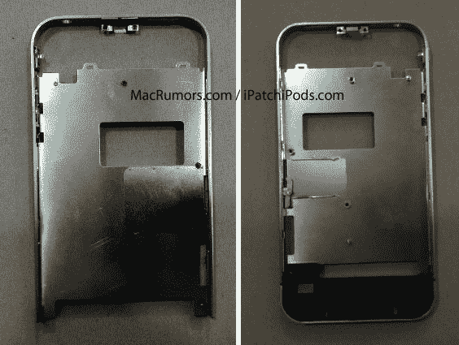

# iPhone 谣言疯传！新泄漏指向两种型号，相似的外壳 

> 原文：<https://web.archive.org/web/https://techcrunch.com/2011/08/29/iphone-4s-iphone-5/>

# iPhone 谣言疯传！新的泄露指向两种型号，相似的外壳

是时候听听你每周一次的下一代 iPhone 谣言了。朋友们，这个版本太棒了。随着每个网站都声称拥有真正的交易，所谓的 iPhone 组件到处都在泄露。很难说哪些组件是直接从富士康的生产线上搬来的，但当它们被视为一个整体时，这些组件描绘了一幅有趣的画面，即苹果即将大幅改变路线，并完全颠覆手机市场。

据报道，苹果将在 9 月或 10 月发布下一代 iPhone。目前有两个相互矛盾的传言，称苹果正在开发一款低价 iPhone，可能是代号为 N94 的 iPhone4S，以及一款内部称为 N97 的更高端的 iPhone 5。

就在上周，大量声称的 iPhone 零件出现在网络上。大多数与当前的 iPhone 4 设计相似，有一个物理 Home 键和相似的整体尺寸。 [Macpost](https://web.archive.org/web/20221206132445/http://www.macpost.net/1084/more-iphone-n94-prototype-photos-leaked-%E2%80%93-is-this-iphone-4s-or-iphone-5/) 和 [Engadget](https://web.archive.org/web/20221206132445/http://www.engadget.com/2011/08/29/iphone-n94-prototypes-front-assembly-leaked-set-to-be-an-iphon/) 今天早上都发布了相同的一组“泄露”照片，显示了大多数人认为是低价 iPhone 4S。这些零件的标签为 N95，EVT1(工程验证测试)日期为“2011 年 3 月 3 日”。

包括这些来自 ubreakifix.com 的早期维修零件在内的其他几个泄露进一步支持了这样的说法，即至少有一款即将推出的 iPhone 型号将与当前的 iPhone 4 非常相似。路透社上周进一步证实了这一说法，宣布苹果将很快在 T2 发布 8GB 的 iPhone 4。甚至[这个声称是为 iPhone 4S 设计的机箱](https://web.archive.org/web/20221206132445/http://www.macrumors.com/2011/08/25/iphone-4s-casing-resembles-iphone-4-with-some-antenna-changes/)也与 iPhone 4 中使用的非常相似，除了对天线进行了一点调整，并且缺少 home 键的空间。

到目前为止，包括关于云 iPhone T10 的讨论，似乎都表明苹果公司正在瞄准低端市场推出下一代 iPhone。但这感觉不太对。到目前为止，苹果公司一直坚持相当紧的两年更新周期，这表明一个重大的重新设计是由于去年 6 月。那从未发生过。

就在今天早上，[行业监管机构 DigiTimes](https://web.archive.org/web/20221206132445/http://www.digitimes.com/news/a20110829PD201.html) 援引上游面板供应商的话，与之前的传言相反，报道称 iPhone 5 将采用小于 4 英寸的 LCD，并采用金属背板，而不是 iPhone 4 中使用的强化玻璃和泄露的 iPhone 4S 零件。这位消息人士表示，包括单核 A4 芯片在内的内部组件很可能会继续用于这款 iPhone。苹果会针对不同的细分市场推出类似的产品，只是因为外观上的差异，这种事情并不是没有听说过。然而，苹果公司同时发布两款 iPhone 手机是史无前例的。iPhone 4S 和 iPhone 5，如果它们都是真的，就打破了苹果传奇的保持简单，愚蠢的咒语，但正式发出了与低端黑莓和 Android 设备的战争信号。

当然，这一切都只是愚蠢的猜测，直到蒂姆·库克、乔纳森·伊夫或其他人上台正式宣布下一代 iPhone，或者更确切地说，iPhone。然而，这些泄漏正以一种荒谬的速度发生。苹果可能很快会再次面对 iPhone 4 的惨败。