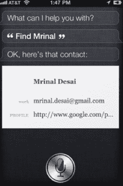

# iPhone 4S 非常聪明 

> 原文：<https://web.archive.org/web/http://techcrunch.com/2011/10/14/iphone-4s-siriously-smarter/>

# iPhone 4S 要聪明得多

***编者按**:以下客座博文由 [Mrinal Desai](https://web.archive.org/web/20230204120945/http://www.linkedin.com/in/mrinaldesai) 撰写，他是 LinkedIn 的早期员工，也是 [CrossLoop](https://web.archive.org/web/20230204120945/http://www.crossloop.com/) 和 [addappt](https://web.archive.org/web/20230204120945/https://techcrunch.com/2010/09/04/mobile-contacts-social-network/) 的联合创始人。你可以在推特上关注他。*

和许多人一样，我对 iPhone 4S 上的语音助手 Siri 感到非常惊讶。十天前，当斯科特·福斯特尔在发布会上介绍它的时候，这是一件真正让我印象深刻的事情。现在我们终于可以玩它了。

在苹果产品发布会后，我通常在家的晚上会告诉你(嗯..销售)我的妻子新的功能和我如何需要它。这是一条说服人们不要这种产品的途径。这些“需求”现在已经被前几代 iPhone、两代 iPad、Apple TV、MacBook、MacBook Pro 和一个被苹果路由器上的无线比特包围的家所满足。但那天晚上我回家时，一切都是关于 Siri——我生命中的“另一个人”。我从来没有提到双核 A5 处理器的规格，或者它有 7 倍更好的显卡，甚至 HSPA+的下载速度——她不在乎。一个普通人，不像我们中的许多人，不关心引擎盖下的是什么，不关心产品是开放的还是封闭的，不关心 Flash、HTML5 或原生应用。我发现自己列出了所有我将会变得多么有效率的情景，终于有了可以实际使用的东西。它将是我完成所有待办事项的完美伴侣！

提醒对我来说是一个常见的工作流程问题，我总是将它们添加到我的日历中。安排会议——我们一直都在这么做。开车时改变路线——非常频繁。我经常在“印度弹性时区”工作，我发现自己在给迟到的人发短信。虚拟助理是一个完整的行业，因为我们希望专注于重要的事情，而不是繁忙的事情。我可以想象未来会有更多我喜欢的 Siri 应用:

*   当你开车四处寻找停车位时
*   航班状态:Siri，联航# 1234 航班准点吗？
*   旅游预订:Siri，12 月 15 日去波士顿最便宜的机票是多少？未来的 Kayak？
*   更本地化:搜索一种类型的业务，比如裁缝。营业吗？Siri，打电话给商家。按通话付费广告？
*   交易:在我所在的地方一英里内有交易吗？
*   电影:Siri，能告诉我三月十五日在哪里上映吗？电影《戴利·贝利》能在网飞即时频道上看到吗？如果是，请将其添加到我的队列中。
*   商业:Siri，你能告诉我附近的商店有没有阿迪达斯 Forest Hills 的鞋吗？在 Siri 找到它(如果有的话)后，Siri 可以帮我绘制路线
*   社交:去开会。Siri 你能告诉我我和这个人的相互联系人是谁吗？

提问是一种内在的学习和探索的追求。加上上下文和意义，我们突然超越了关键词。谷歌一直在做的一件事就是弄清楚上下文。当你用关键词“苹果”搜索时，你是想找苹果还是苹果公司？苹果只是改变了游戏规则——又一次。它让手机变得更加智能，而不仅仅是做更多的事情。

最后也是非常重要的，用户获取。身处一个嘈杂的世界，同时又是一名推销员，我非常在意的一件事就是获取用户。我是一个渴望学习产品设计元素的学生，这些元素天生就能吸引新用户。我渴望了解为什么人们会买他们买的东西；为什么他们用他们用的东西。他们是如何发现他们所使用的东西的？

所以倒回去一点。记得我拿到第一部 iPhone (3GS)的时候。我对我的新玩具兴奋得头昏脑胀，忍不住要告诉我认识的每个人这件事。不仅如此，我还做了演示。我说服了尽可能多的人放下他们的黑莓手机(我换了一部),继续前进。更接近的总是应用程序。我最喜欢的是[陶笛](https://web.archive.org/web/20230204120945/https://techcrunch.com/2008/11/07/smules-ocarina-a-textbook-example-of-how-to-build-a-great-iphone-app/)。我会通过麦克风展示我隐藏的音乐技能(或缺乏)。随着音乐在世界各地播放，平稳旋转的地球仪从未停止吸引“wows”和“oohs”——我向你保证，他们不是关于我如何演奏陶笛。这是我见过的最大、润滑最好的有机口碑传播机。这很像我们带着印有“梅西百货”标志的购物袋，或者穿着 Gap 帽衫，或者穿着巴塞罗那队球衣时所做的广告。我们为自己的产品感到自豪，我们愿意花大价钱(欧洲足球的球衣价格是 70-80 美元一件)来做广告。这种情感如此强烈，以至于它很快成为我们想要分享的身份的一个组成部分。

 
有了 Siri，不用说数百万([苹果公司报告预购量超过百万](https://web.archive.org/web/20230204120945/http://www.apple.com/pr/library/2011/10/10iPhone-4S-Pre-Orders-Top-One-Million-in-First-24-Hours.html)，分析师现在预计[本季度将再售出数百万](https://web.archive.org/web/20230204120945/http://www.forbes.com/sites/briancaulfield/2011/10/14/analystled-by-iphone-4s-apple-could-sell-24-million-iphones-in-december-quarter/))的 iPhone 4S 用户将四处游行，向朋友、家人和同事炫耀他们的新朋友 Siri。如果它像演示的那样起作用，它会让每个人都想要一个。因此，苹果神来之笔，给了我们每个人弹药，让我们通过一个一直在我们身边的产品宣传他们的品牌。有了 Siri，他们也给了我们一个理由，让我们现在更经常地从口袋里拿出手机，向完全陌生的人演示。

在内心深处，我非常希望 Siri 能够识别我的名字——这是大多数人通过碎纸机发送的信息。是的，如果你忘记了你的周年纪念日，却有了 4S，那就怪 Siri 吧。我知道我很想在我的最后一个周年纪念日拥有它。