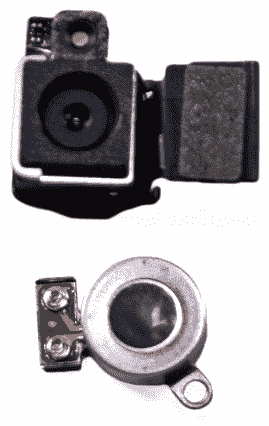

# iPhone 4S 拆卸:没什么可看的，伙计们

> 原文：<https://web.archive.org/web/http://techcrunch.com/2011/10/13/iphone-4s-teardown-nothing-to-see-here-folks/>

# iPhone 4S 拆卸:这里没什么可看的，伙计们

虽然 iPhone 4 的第一次拆解(不包括 Gizmodo 粗糙的活体解剖)因其设计的新颖性而非常令人兴奋，但 4S 并没有提供太多东西。iPhone 5 候选人的轻微失望，即 4S 本质上是一个规格凸起，意味着这次拆解必然不会那么激动人心。

尽管如此，还是有变化，iFixit 敏锐地指出了这些变化。

最大的变化当然是增加了[更大更强大的 A5 芯片](beta.techcrunch.com/2011/04/13/analysis-of-apples-a5-its-not-what-we-know-its-what-we-dont-know/)。现在人们对它的了解并不比它第一次出现在 iPad 2 上时多多少，但它确实存在，这一点是肯定的。无线芯片已经升级到允许四频和 HSPA+功能，但对此没有太多可说的。

摄像头当然有所改进，[我仔细看了一下苹果早前的说法](https://web.archive.org/web/20230205013302/https://techcrunch.com/2011/10/04/the-iphone-4s-camera-upgrade-explained/)。实际的相机模型从外面看起来并不令人印象深刻；BSI 传感器和更好的玻璃拍照效果不好。

显然，振动马达(右下方)被换成了一个更好的、不那么嗡嗡作响的马达。没有感受到这两款设备的嗡嗡声，我不能说这是否是一个改进，但我不认为苹果公司会因为对它的性能感到满意而放弃它。

差不多就这些了。布局和焊接方面的一些小变化，以适应更大的 A5 芯片等也可以找到，但它们不是实质性的。