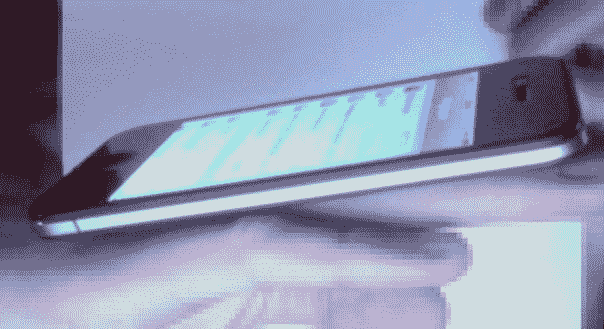
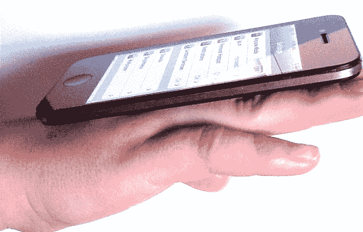

# 又一个可疑的 iPhone 5“谍照”出现了 

> 原文：<https://web.archive.org/web/http://techcrunch.com/2011/08/04/iphone-5-spy-shot-debunked/>

# 又一张可疑的 iPhone 5“谍照”出现了

我们已经看到了一款[大脚风格的 iPhone 5](https://web.archive.org/web/20230203044204/https://techcrunch.com/2011/07/28/is-this-the-iphone-5/) 。我们已经看到了一个[完全伪造的(但据说是基于真实交易的)iPhone 5](https://web.archive.org/web/20230203044204/https://techcrunch.com/2011/08/01/fake-iphone-5-supposedly-leaks-the-real-iphone-5s-design/) 。现在，来认识一下:奇怪的角度，令人质疑的歪斜的 iPhone 5。

这张照片来自 [MacRumors 论坛的常客 *guigsh*](https://web.archive.org/web/20230203044204/http://forums.macrumors.com/showthread.php?p=13112497#post13112497) ，整个早上都在博客上疯传。Guigsh 声称，在“禁止拍照”的情况下，他与该设备的接触“只有 2 分钟”，所有这些都发生在“一家法国运营商的办公室”

现在，好的一面是:这张照片非常符合我们长期以来听到的一些传言:更苗条？没错。显示屏周围的边框更小？当然可以。但是锥形背呢？还是更明显的圆边？Ehhhh——稍微有点，但那可能是 Photoshop 中拉伸/扭曲的副作用。

说到这个，我很确定这就是这里发生的事情。盯着图片看一两分钟，事情就开始变得..*关*。然后你开始注意到:为什么他的食指这么长？为什么耳机的孔开得那么大？他为什么要这样拿着它？你看它的时间越长，它就越像一个被拉伸的 iPhone 4，这样的握法可以最大限度地减少手指的明显拉伸。

论坛英雄 [roow110](https://web.archive.org/web/20230203044204/http://forums.macrumors.com/showpost.php?p=13113732&postcount=147) 开始用他的 iPhone 4 和一点 Photoshop 变形来重现这个镜头。这是他的“字面上 30 秒的 Photoshop 工作”(**为清楚起见，下面的照片是一个确认的赝品，试图重现上面的镜头，以便揭穿它**):

看来这个流言在我看来被终结了。你怎么想呢?

(**更新:**流言被双重终结！ [Giz](https://web.archive.org/web/20230203044204/http://gizmodo.com/5827839/is-this-the-iphone-5-slim/gallery/1) 发现这张照片在*附近漂浮了一整天*，然后 *Guigsh* 把它贴成了他自己的，最初的标题(法语)是“这样的照片会让一些网站疯狂……”)