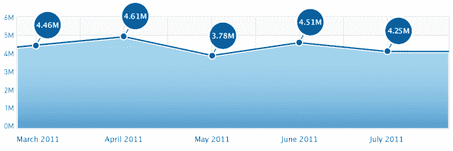
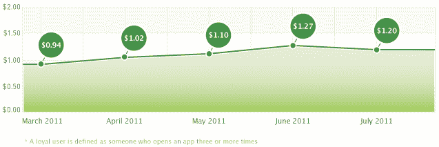

# 7 月 iPhone 应用下载量下降，应归咎于激励性安装打击(谢谢？)

> 原文：<https://web.archive.org/web/https://techcrunch.com/2011/08/31/iphone-app-downloads-drop-in-july-incentivized-install-crackdown-to-blame-thank/>

# 7 月 iPhone 应用下载量下降，应归咎于激励性安装打击(谢谢？)

营销技术公司 Fiksu 发布了新数据,显示 iPhone 上的移动应用安装量呈下降趋势。从广义上来说，考虑到 iPhone 用户群的规模，这种增长是微不足道的，但任何非上升趋势都是令人好奇的。

Fiksu 表示，iPhone 应用程序的日安装量从 6 月份的 450.5 万下降到了 7 月份的 425 万。

【T2

[Fiksu App Store 竞争指数](https://web.archive.org/web/20230203071259/http://www.fiksu.com/resources/fiksu-indexes#competitive-index)衡量美国前 200 名免费 iPhone 应用程序的平均日总下载量，其数据来源于 Fiksu for Mobile Apps 用户获取平台上的应用程序记录的 27 亿次移动应用程序操作。这些操作包括应用启动、注册和应用内购买等。

Fiksu 首席执行官 Micah Adler 说:“(下降趋势)的一个原因可能是缺乏激励性的促销活动，许多人一直利用这些活动来批量购买下载量和提高排名。应用营销人员现在开始将预算重新分配给非激励性的促销活动，这些活动可以以更低的净成本带来更高的忠诚用户转化率。”

你可能还记得，[苹果在 4 月份取缔了激励性安装](https://web.archive.org/web/20230203071259/https://techcrunch.com/2011/04/19/apple-clamps-down-on-incentivized-app-downloads/)，并开始拒绝使用按安装付费或从 iTunes 应用商店提供墙的应用。

Fiksu 还指出，获得一个忠实用户的成本(根据每个忠实用户的成本指数)也下降了。7 月份，在连续四个月上涨后，这一价格下降了 5.5%，至 1.20 美元。

 那么，苹果对奖励性安装的打击真的是罪魁祸首吗？为此，我们求助于应用分发和货币化领域的市场领导者 [Tapjoy](https://web.archive.org/web/20230203071259/https://www.tapjoy.com/) 。有趣的是，它没有评论。

但是，Flurry Analytics 的彼得·法拉戈证实，从 4 月到仲夏，总体趋势是正确的。然而，他不能保证 Fiksu 的具体数字。“随着每次采购成本价格的降低(激励性安装)，我们看到价格上涨，”他指出。