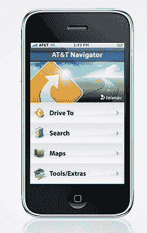

# iPhone 应用程序碎片化 FUD 正在逼近 

> 原文：<https://web.archive.org/web/http://techcrunch.com/2011/02/07/iphone-app-fragmentation-fud/>

 ZDNet 今天下午发表了一篇报道，标题非常具有煽动性:[并非所有的 iPhone 应用程序都能在威瑞森的 iPhone 上运行——碎片即将出现](https://web.archive.org/web/20230202234827/http://www.zdnet.com/blog/mobile-news/not-all-iphone-apps-work-on-the-verizon-iphone-8212-fragmentation-looming/885)？哦不！Android 应该是有碎片化问题的平台，而不是 iPhone！末日一定快到了，对吧？那鸿

作者 James Kendrick 指出，Telenav 刚刚发布了一款可以在威瑞森 iPhone 上运行的即时路线导航应用。更重要的是，Kendrick 说 Telenav 告诉他，这个应用程序必须重新编写才能在新设备上运行。先不说最初的应用程序被称为“美国电话电报公司导航器”，所以很明显他们不得不重新命名，Kendrick 指出，“*威瑞森 iPhone 需要修改 Telenav 应用程序，使其能够与手机中的新硬件兼容。”*

那么什么样的修改呢？Telenav 没有明确说明。Kendrick 写道:“该公司没有详细说明是哪些硬件差异导致了这些变化，但两个版本的 iPhone 的主要差异在于无线电(GSM 与 CDMA)，或许还有 GPS 芯片组。

嗯。好吧。

但是等等，我已经用了威瑞森的 iPhone 大约两个星期了，因为我在评测中测试了它。我已经在新的硬件上使用了几十个应用程序，还没有发现一个应用程序不能工作。这包括几个利用手机 GPS 芯片的定位应用程序。他们都工作，未经修改。

此外，当我与苹果谈论在威瑞森 iPhone 和美国电话电报公司 iPhone 上运行的应用程序时，他们向我保证，我所有的应用程序都将一如既往地运行。他们确实注意到，威瑞森可能会像美国电话电报公司一样推出一些自己的应用，但这些应用显然无法在其他硬件上运行。但这似乎更多地取决于运营商，并与他们自己的服务捆绑在一起，而不是技术障碍。

等等，让我们看看美国电话电报公司航海家。为什么美国电话电报公司的名字会出现在标题中？哦，因为它是直接记在你的美国电话电报公司账单上的。虽然没有提到，但这肯定会阻止它在威瑞森 iPhone 上工作。

威瑞森 iPhone 显然有一些内部变化 CDMA 芯片和改进的天线设计，其中最主要的是——但我看不出这些会导致应用程序不得不返工，从而导致应用程序商店的碎片化。也许逐圈应用程序有一些特殊之处(我不使用任何应用程序)。但除了运营商计费，我不确定那是什么。这肯定不是 GPS 芯片引起的问题，或者 Foursquare、Gowalla 等也会有问题。他们没有。

重点是，虽然“分裂即将来临”听起来很可怕，并成为一个性感的标题，但在我看来，这完全是胡说八道。这是一个在威瑞森的 iPhone 上使用过他所有应用程序的人的观点——同样是未经修改的。

**更新**:ZDNet[发布了一个新故事](https://web.archive.org/web/20230202234827/http://www.zdnet.com/blog/mobile-news/correction-telenav-gps-app-not-due-to-differences-in-iphone-hardware/898)纠正了他们之前的故事。他们是 Telenav 更新的关键部分:

> 从我们的角度来看，应用程序开发中的唯一差异与后端项目有关，而与硬件无关，包括 1。)由于威瑞森版本计入 iTunes 账户，而美国电话电报公司导航器计入美国电话电报公司账单，账单发生变化 2。)应用程序设计中的品牌差异，因为这是一个 TeleNav 品牌应用程序；3 .)TeleNav GPS 和美国电话电报公司 Navigator 的功能集是不同的，应用程序也需要为此重新设计。

因此，就像我们上面的情况一样，需要改变的主要是账单和品牌信息。