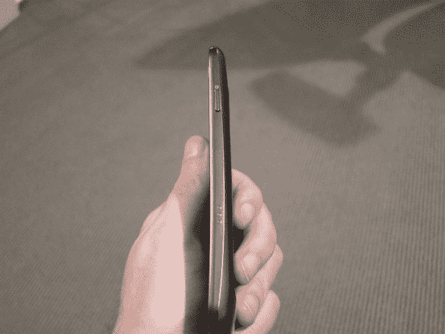
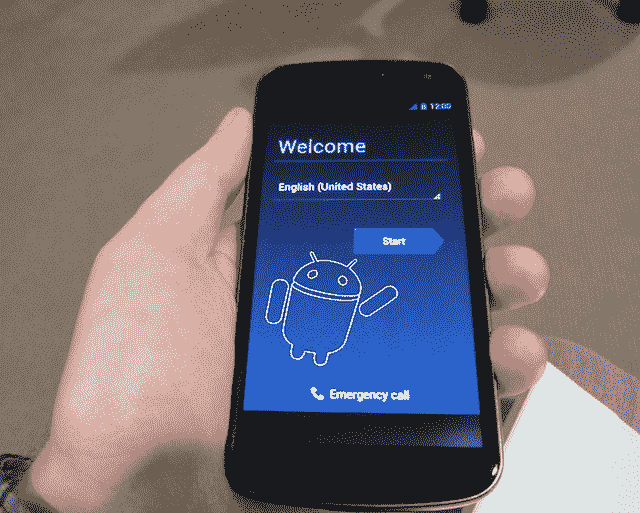

# iPhone 爱好者对 Galaxy Nexus 的看法

> 原文：<https://web.archive.org/web/https://techcrunch.com/2011/12/14/iphone-galaxy-nexus-review/>

你得把它交给谷歌。他们知道我更喜欢苹果产品，并且在过去几年里一直对谷歌的许多举措持批评态度。然而，他们不怕让我测试他们的最新产品。老实说，我不确定苹果会不会这么做。但我认为这是谷歌的明智之举。一方面，他们可能会得到负面的评价，但是他们知道很多人会轻视来自我的负面评价。另一方面，如果是积极的:肉汁火车时间。

因此:我对星系 Nexus 的想法。但是在我开始之前…

与其做一个全面的评论——你可能已经看过[很多这样的](https://web.archive.org/web/20230406200046/http://www.techmeme.com/111117/p43#a111117p43)——鉴于我现在为 TechCrunch 写一个以苹果为中心的专栏，我认为这是继续我的“iPhone 爱好者的视角……”系列的绝佳机会。作为一些背景，这里是我以前从同一角度对 [Nexus One](https://web.archive.org/web/20230406200046/https://techcrunch.com/2010/01/12/iphone-versus-nexus-one-2/) 、 [HTC EVO 4G](https://web.archive.org/web/20230406200046/https://techcrunch.com/2010/05/29/htc-evo-4g/) 、 [Nexus S](https://web.archive.org/web/20230406200046/https://techcrunch.com/2010/12/31/nexus-s-iphone-review/) 、a [Windows Phone](https://web.archive.org/web/20230406200046/https://techcrunch.com/2010/12/23/iphone-windows-phone/) 、甚至 [iPhone 4](https://web.archive.org/web/20230406200046/https://techcrunch.com/2010/07/03/iphone-4-review/) 的故事。

几周前，我的同事杰森·金凯德(Jason Kincaid)在一篇文章中采用了类似的方法，但角度略有不同——称之为:[一个最初的 iPhone 爱好者学会了热爱 Android，直到切换回 iPhone……回顾 Galaxy Nexus](https://web.archive.org/web/20230406200046/https://techcrunch.com/2011/12/04/galaxy-nexus-iphone-4s/) 。奇怪的是，在使用 Android 多年后，他刚刚换回 iPhone 但他表示，特别是 Galaxy Nexus 和冰淇淋三明治可能会让他再次换回 iPhone。与此同时， [GigaOm 的达雷尔·埃瑟林顿也从 iPhone 用户的角度看待 Galaxy Nexus，并最终决定 iPhone 4S 仍然是他的设备。所以我是来打破僵局的。](https://web.archive.org/web/20230406200046/http://gigaom.com/apple/review-the-galaxy-nexus-from-an-iphone-owners-perspective/)

自从 2007 年第一部 iPhone 发布以来，我一直在使用它。毫无疑问，这是我有史以来最喜欢和最常用的小玩意。在这段时间里，我尝试了从 G1 到 Nexus S 的十几种不同的安卓设备，结果肯定是喜忧参半。我非常讨厌 G1，总体上喜欢 Nexus One，认为 EVO 4G 或多或少是垃圾，基本上喜欢 Nexus S。但在我看来，没有一款手机能与 iPhone 媲美。

那么 Galaxy Nexus 怎么样呢？

几周前，在我去欧洲之前，有人给了我这个设备。鉴于它是解锁的，我有一个 3G SIM 卡，我一直在使用它——就像我使用上面列出的任何其他 Android 设备一样多。有几个晚上，它是我外出时的主要设备。不幸的是，我还没有能够用它测试任何种类的 4G 网络，所以把这一切都看作是 Galaxy Nexus 3G 的评论。

首先，Galaxy Nexus 太大了。当我坐在沙发上时，4.65 英寸的屏幕很好，但出去走走感觉就像是扎克·莫里斯拿着他的 T2 戈登·盖柯的手机。我认为自己的手对于一个成年男性来说是中等大小的，屏幕太大了，以至于它扼杀了我的几个单手操作(特别是因为许多 Android 应用程序使用了顶部导航系统)。我承认，对于 Gmail 等一些应用程序来说，拥有比 iPhone 3.5 英寸屏幕更大的屏幕非常好。不过 4.3 寸可能更好。这太大了。

虽然屏幕太大，但我很高兴谷歌终于决定摆脱硬件菜单按钮，在屏幕上全力以赴。以前的 Android 硬件总是因为在按钮上包含固定的导航按钮而变得更糟。有了冰淇淋三明治，所有这些按钮现在都可以基于软件。甚至不再有像 iPhone 那样的硬件按钮——都是软件。

我喜欢这个。随着时间的推移，iPhone home 键会磨损，当您点按它时会发出噪音。(当然 Galaxy Nexus 还是有右侧的唤醒/电源键。)如果苹果选择在未来的 iPhone 硬件迭代中保留这个按钮，我希望苹果在这个按钮上做一些更有创造性的事情。也许按钮上的多点触控顶部允许你在打开的 iOS 应用程序之间滑动，这将使物理按钮的延续变得值得。

我还喜欢 Galaxy Nexus 上的指示灯。Galaxy Nexus 和 iPhone 都有振动或音频提示选项，提醒你有新消息，但如果手机不在我身上，我经常会错过这些。灯可以让你不必打开屏幕就能看到是否有新信息等待。这是黑莓做对的少数几件事之一，而苹果出于某种原因没有费心去模仿。

Galaxy Nexus 硬件的其余部分还有待改进。iPhone 给人的感觉就像是一个完全经过精心设计的物体。相比之下，Galaxy Nexus 仍然感觉相当便宜和塑料。这并不可怕，但你会认为三星在这一点上可以做得更好。有些人会喜欢选择移动到后面去接触电池，但是这样做的方法仍然是一个笑话。你必须把它撕掉。每次做的时候，我都感觉像是在从手指上剥下一枚指甲——太不愉快了。

设备上的续航本身就很不错。我觉得 Galaxy Nexus 在充满电的情况下，续航时间至少和 iPhone 4S 一样长，在某些情况下甚至可能更长。再说一次，我没有在 4G 网络上试过，众所周知，4G 网络会更快地耗尽电池。(我也没有遇到一些 iPhone 4S 用户自发布以来一直报告的电池放电问题。)但不要担心，这不是配备 30 分钟电池的 EVO。

Galaxy Nexus 上的摄像头肯定比 iPhone 4S 差，无论是百万像素(8 比 5)，还是图像质量。但 iPhone 4S 也是一款好得离谱的相机。在我看来，Galaxy Nexus 仍然是一款不错的傻瓜相机替代品。这款相机似乎比我用过的任何其他安卓设备都要好。一个问题是，虽然有一种方法可以从锁屏直接进入相机(就像 iOS 5 一样)，但如果相机之前没有运行，那就太慢了。你将点击相机按钮，观看 Android 主屏幕加载，然后相机应用程序加载。这感觉更像是一个宏，而不是一个特性。

让我们来谈谈冰淇淋三明治。又被称为 Android 4.0 的艺术家非常扎实。毫无疑问，软件在速度上比以前的迭代有了很大的提高，但主要是可用性。我真的很喜欢多任务托盘和一些新的小工具。

不幸的是，该系统仍然缺乏 iOS 用户所享受的许多精致的修饰。大多数 Android 用户可能会认为这种批评是扯淡，但事实一直如此。我想对于一个奔驰车主来说，很难向一个本田车主描述当两台机器都从 A 点开到 b 点时，对细节的关注如何让他们的驾驶体验更好。作为一个本田车主，我不确定我会不会买它-我想我必须体验才能理解它。大多数 Android 爱好者不会花足够的时间来充分欣赏 iOS 的差异。

尽管如此，如果 Android 团队想要转变(或者至少说服)大多数 iOS 用户，他们在这方面还有相当多的工作要做。话又说回来，他们可能不(或者不应该)太在意将 iOS 用户转换到 Android。所有非智能手机用户仍然是更大的目标(对谷歌和苹果而言)。

其他听起来像是 nits，但让我疯狂的 ICS 包括持续关注文本字段，只需再次点击键盘即可弹出。如果我在一个文本字段中，我显然想输入一些东西。为什么我必须再次点击？这并不总是发生，但它经常发生——尤其是在第三方应用程序中。

另:为什么消息和 Google+ Messenger 有单独的应用？苹果把 iMessage 烤进了他们的短信 app，为什么谷歌没有？如果他们担心反竞争问题，为什么他们要把所有 Google+的东西捆绑到 ICS 中呢？同样，为什么 Gmail 和 Email 继续是两个独立的应用？[为什么网络浏览器还不是 Chrome 浏览器](https://web.archive.org/web/20230406200046/https://techcrunch.com/2011/05/17/google-chrome-android/)！？

新的 People 应用程序 social unification 很棒——我喜欢大图片。但是我的上帝，谷歌需要他们的复制/合并检测的帮助。我的一个朋友有四个独立的条目——一个是他的电话号码，一个是他的 Gmail/Google+，一个是 Twitter，还有一个是另一个电子邮件。其他几个有三个不同的条目。大多数人至少有两个。此外，谷歌还提供了一个选项，可以在账户和同步中链接你的脸书账户，但它什么也不做。我确信这是由于谷歌/脸书的纷争，但是为什么要在你的操作系统中包含一些完全损坏的东西呢？

冰淇淋三明治的语音命令功能与 Siri 相比简直是个笑话——[，但这种情况可能很快就会改变](https://web.archive.org/web/20230406200046/http://www.techmeme.com/111214/p8#a111214p8)，我们将拭目以待。

Jason 在他的文章中提到，在通知方面，iOS 仍然远远落后于 Android，我不同意这一点。我发现 Android 的通知托盘远不如 iOS 上的有用。例如，如果我收到三封新邮件，在 Android 上，我只看到我有三封新邮件都分组在一起。有了 iOS，我至少可以看到一些背景。推特也一样。这个托盘中提醒的大小在 Android 中也不统一，所以脸书提醒看起来更重要，因为它们有巨大的徽标。

不过，我确实喜欢 Android 通知托盘中的“全部清除”功能。iOS 微清除按钮仍然是一个急需修正的笑话。

谈到网络浏览器，可以说是所有这些设备中最重要的功能，毫无疑问，iOS 在这方面仍然有很大的优势。我看到了双方关于为什么一个比另一个快的争论——最近， [data today 偏向 iOS](https://web.archive.org/web/20230406200046/https://techcrunch.com/2011/12/13/battle-of-the-browsers-ios-5s-browser-is-still-slightly-better-than-androids-says-sencha/)——但仅仅做了一个简单的用例测试，mobile Safari 就全面击败了谷歌的 not-call-it-Chrome 移动网络浏览器。一些页面仍然拒绝在 Android 的浏览器上正确呈现。而那些有这种功能的手机似乎无法实现最简单的功能:双击以缩放。你在安卓上做，很有可能你会看到一个随机段落的中间。

当你做像这样看似简单的事情时，你仍然会在 ICS 中看到一点滞后。还是没有应有的顺畅。在很大程度上，ICS 修复了 Android 的许多性能问题，但很多时候你仍然会看到这里和那里的口吃。

然后是应用程序。

为谷歌说句公道话，冰激凌三明治目前只在 Galaxy Nexus 上推出，它甚至还没有在美国正式推出，但这里还有很多工作要做。我在 Nexus S 上安装的一个应用程序现在在 Galaxy Nexus 上经常崩溃。我没有在后台悄悄关闭，而是得到一个漂亮的大窗口样式的弹出窗口，显示它已经停止运行。许多其他应用程序在大屏幕上看起来相当糟糕，只是因为它们没有针对大屏幕进行优化——同样，ICS 的更广泛版本有望解决这一问题。

我对 Galaxy Nexus/ICS 上的 Android 应用程序的主要问题仍然是那些在 iOS 上也可用的应用程序。当应用程序同时存在于两个平台上时，很容易对它们进行比较，iOS 版本几乎总是胜出——而且经常是压倒性胜利。以 Twitter 的最新版本为例。它刚刚更新，可以在这两个平台上运行。在 iOS 上很流畅，在 ICS 上，滚动时有明显的口吃。Facebook Messenger 和脸书本身的情况要糟糕得多——没什么大不了的，[只是这两个平台上最大的应用](https://web.archive.org/web/20230406200046/http://www.zdnet.com/blog/facebook/facebook-is-now-the-most-popular-android-app/6091)。

两个平台之间应用程序差异的原因仍然是[争论的热门话题](https://web.archive.org/web/20230406200046/https://plus.google.com/100838276097451809262/posts/VDkV9XaJRGS)。还是那句话，我知道的都是我看到的:app 到 app，iOS 在大多数情况下还是轻松击败 Android。一个反例是[声音跟踪](https://web.archive.org/web/20230406200046/http://soundtracking.com/)，我上周在 LeWeb 的舞台上讲过。我实际上认为他们的应用程序在 Android 上更好。但这与性能关系不大，更多的是因为它可以访问 iOS 不提供的挂钩，如后台 Spotify 集成。Android 开发者应该更多地关注 Android 的这些好处，而不是让他们的应用程序完全移植到他们的 iOS 应用程序上。在翻译中似乎总是会丢失一些东西——通常是严重丢失。

现在听起来好像我在关注消极的一面。需要强调的是，Galaxy Nexus 毫无疑问是我用过的除 iPhone 以外最好的手机。毫无疑问，它在某些方面比 iPhone 做得更好——即所有的谷歌应用程序和除 Twitter 之外的任何第三方后台/操作系统集成，Twitter 现已被纳入 iOS 5。谷歌也设法在应用数量上与苹果不相上下。这一切都很好——竞争是好事。

谷歌需要采取的下一步措施(或帮助第三方开发者采取的措施)涉及应用质量。简而言之:为了利用 ICS 提供的优势，他们需要为开发人员创建更好的工具。这不会在 6 个月内发生，但如果谷歌努力的话，这是有可能发生的。

除此之外，iOS 拥有巨大优势的是无形资产。就像在体育运动中一样，不清楚你能“教”得多好。在某种程度上，谷歌可能不得不承认，iOS 的外观和感觉比 Android 更好，因为苹果的整个结构都是由设计、紧密集成和对细节的关注编织而成的。谷歌的优势在别处；他们应该接受这个事实。

谷歌在这方面做了一些非常好的工作。Galaxy Nexus 和冰激凌三明治都是 Android 平台的新巅峰。但最终，还是归结为一件非常简单的事情:我想每天使用哪种设备？当我不做评论的时候，我应该用哪部手机？还是 iPhone。毫无疑问。

继续努力，谷歌。

