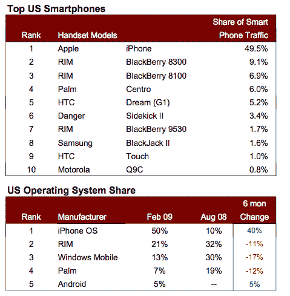
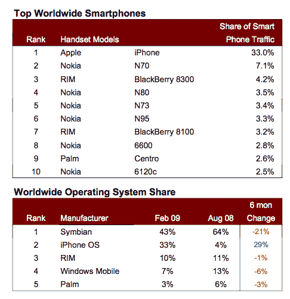

# iPhone 占美国智能手机网络流量的 50 %, Android 已占 5% TechCrunch

> 原文：<https://web.archive.org/web/https://techcrunch.com/2009/03/24/iphone-now-50-percent-of-smartphone-web-traffic-in-the-us/>

# iPhone 占美国智能手机网络流量的 50 %, Android 已经占了 5%

根据今天早上发布的 AdMob Mobile Metrics 报告，iPhone 现在占美国智能手机移动网络流量的 50%。在过去的六个月里，iPhone 已经从黑莓和 Windows Mobile 手中夺走了部分市场份额。2008 年 8 月，iPhone 仅占智能手机移动网络流量的 10%。与此同时，黑莓的份额从 32%上升到 21%(Curve 和 Pearl 比 Storm 更强)，而 Windows Mobile 受到的冲击更大，从 30%下降到 13%。Palm 也从六个月前的 19%下降到 7%。

另一个在移动网络使用方面显示增长的智能手机操作系统是 Android，它在推出仅三个月后就获得了 5%的份额。这比一月份的 3%有所上升。iPhone 和 Android 的进步表明，当手机采用功能齐全的浏览器并支持丰富的网络应用时，会有什么样的可能性。

在全球范围内，运行塞班操作系统的智能手机(大部分来自诺基亚)仍然以 43%的份额主导着移动网络流量。但这比 8 月份的 64%有所下降。在全球范围内，iPhone 已经从 4%上升到 33%。所有其他移动操作系统也关闭了。

这个数据是从 AdMob 的移动广告网络中推断出来的，并且只看智能手机的份额。总体而言，智能手机产生了全球移动网络流量的 33%，高于六个月前的 26%。完整的报告嵌在下面。

【http://viewer.docstoc.com/
[Admob 移动指标 2009 年 2 月](https://web.archive.org/web/20221209131241/http://www.docstoc.com/docs/5063069/Admob-Mobile-Metrics-February-2009)–获取更多[信息技术](https://web.archive.org/web/20221209131241/http://www.docstoc.com/documents/technology/)