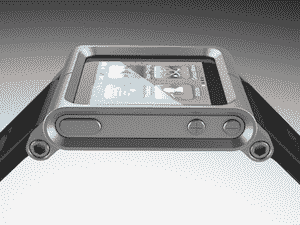

# iPod Nano 手表从 Kickstarter TechCrunch 众包融资近 100 万美元

> 原文：<https://web.archive.org/web/http://techcrunch.com/2010/12/16/ipod-nano-watch-million/>

# iPod Nano 手表从 Kickstarter 获得了近 100 万美元的众包资金

大约一个月前，[我们报道了](https://web.archive.org/web/20230205044016/https://techcrunch.com/2010/11/24/ipod-nano-watch/)的抖音和 LunaTik 多点触控手表套件如何通过众包融资初创公司 [Kickstarter](https://web.archive.org/web/20230205044016/http://kickstarter.com/) 成为融资史上的领先者。该项目需要超过 345，000 美元才能获得冠军。嗯，它得到了它——还有更多。

离资金截止只有两个小时了，[把 iPod nanos 变成手表的项目](https://web.archive.org/web/20230205044016/http://www.kickstarter.com/projects/1104350651/tiktok-lunatik-multi-touch-watch-kits)接近一百万美元的资金。是的，就通过 Kickstarter 获得的资金而言，他们现在是第二大项目的两倍多。总共有 13，000 多人为该项目捐助了 918，000 多美元。

尤其疯狂的是，筹款的最初目标是 15000 美元。显然，该项目的创始人斯科特·威尔森低估了需求。

那么它会成为第一家 100 万美元的 Kickstarter 公司吗？应该很近了。仅在过去一天，就有 1000 多人将总额推高到 10 万美元以上。我们已经看到许多项目在最后 24 小时内强劲反弹。我们不确定它是否能达到 100 万美元的里程碑，但我们对前景感到兴奋，并将继续关注！Kickstarter 的贾斯汀·卡兹马克告诉我们。

第一批手表将于本月底上市，其余的将于明年初上市。你可以在这里观看它在中国制造。