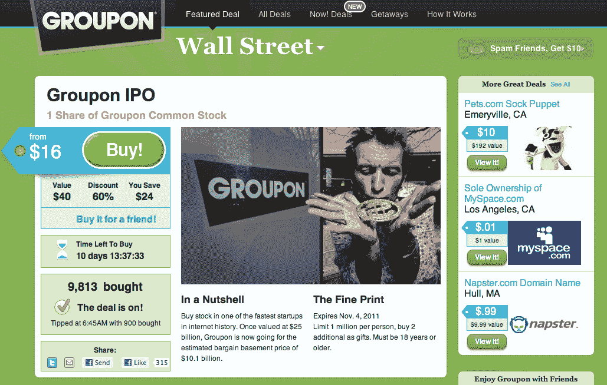

# 怡保！:Groupon 成为自己的热门打折商品 

> 原文：<https://web.archive.org/web/https://techcrunch.com/2011/10/25/ipoh-groupon-becomes-its-own-hot-discounted-deal/>

# 怡保！:Groupon 成了自己热门的打折商品

随着 Groupon 路演的进行，以及其 IPO 的倒计时预计将在 11 月 4 日达到高潮，公众期待已久的每日交易巨头上市就要到了。但是这段旅程并不是没有打嗝。虽然该公司目前拥有每日交易市场 54%的份额，并且[在其第三季度收益报告中有一些亮点](https://web.archive.org/web/20230205002657/https://techcrunch.com/2011/10/21/groupons-quarterly-growth-slows-to-9-percent-but-operating-losses-cut-to-almost-zero/)，但每日交易巨头已经从一度希望的 250 亿至 300 亿美元的估值下降到可能约 114 亿美元。

相比较而言，考虑到承销商[可疑的早期估价](https://web.archive.org/web/20230205002657/http://dealbook.nytimes.com/2011/10/17/the-missed-red-flags-on-groupon/)，高达 62%的折扣，Groupon 本身现在对渴望削减息票的投资者来说是一笔非常划算的交易。多亏了 Cat5 Commerce 的[Runningshoes.com](https://web.archive.org/web/20230205002657/http://runningshoes.com/)团队中的一些搞笑人物，我们现在有了[一个令人敬畏的模拟交易，Groupon 自己以每股 16 美元的折扣价向](https://web.archive.org/web/20230205002657/http://runningshoes.com/groupon-ipo)提供其普通股。

需要澄清的是:这笔交易并不是由 Groupon 自己创造的。这是由第三方制作的，仅用于讽刺目的；尽管毫无疑问会有很多人被这笔交易愚弄，因为模拟交易页面用一个精心打磨的讽刺精确地捕捉到了 Groupon 的设计和尖刻的言辞。除了 Pets.com 的袜子木偶和 Myspace 的独家所有权，Groupon 的普通股看起来很便宜。我的意思是，来吧，你现在可以节省 24 美元一股！你简直不能击败这个底价。当然，照此发展下去，这些低价不会永远持续下去。还是会？

正如 Runningshoes' Groupon for Groupon 所说的那样，*“最诱人的、你无法拒绝的优惠就在你面前。拥有一家被《福布斯》视为“有史以来发展最快的公司”的股份，将类似于管理罗马帝国的一个省。街上的人？他们会知道你的名字。建筑物里的人？他们可能也会知道。来吧。让沃伦·巴菲特今天看起来像个傻瓜。”*

干得好，Runninshoes.com，干得好。特别是考虑到只有一个小链接隐藏在页面下面，这是 meta snarky 营销黄金。

为期待 Runningshoes 的路演干杯。

对于那些保持跟踪的人来说，域名 runningshoes.com[在 4 月份被 Cat5 Commerce 以 70 万美元](https://web.archive.org/web/20230205002657/http://www.bizjournals.com/stlouis/news/2011/04/22/cat5com-buys-runningshoescom-for.html)收购。

**更新:** [显然 Groupon 没想到这居然这么好笑](https://web.archive.org/web/20230205002657/http://blogs.wsj.com/deals/2011/10/25/groupon-loves-satire-except-when-its-about-their-ipo/)。

