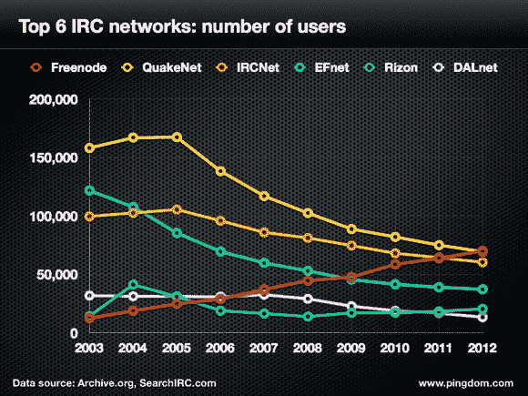

# 自 2003 年以来，IRC 已经失去了 60%的用户，但是机器人的生活才刚刚开始

> 原文：<https://web.archive.org/web/http://techcrunch.com/2013/01/06/irc-has-lost-60-of-its-users-since-2003-but-life-as-a-robot-is-just-beginning/>

# 自 2003 年以来，IRC 已经失去了 60%的用户，但是机器人的生活才刚刚开始

互联网中继聊天(IRC)已经失去了 60%的用户，从 2003 年的 100 万减少到今天的 40 万。还有 IRC 频道？2003 年有 50 万人；现在这个数字只有一半。这在很大程度上是由于网络、社交媒体和工具的出现，它们能做的比纯文本多得多。

# IRC 没有死

但是它真的像上周宣布的那样已经死亡了吗？在极客世界里，我一直听说 IRC。我在 Twitter 和脸书上询问人们是否使用它，毫无疑问，开源和开发者群体马上回应说，它仍然是他们的聊天世界的选择。

来自 Chartio、Basho、Canonical、Citrix 的极客以及 OpenStack 和 Cloudstack 中的活跃成员都表示使用 IRC。Canonical 的艾伦·波普:

> 我们有大约 600 名员工和数百名社区人员。IRC 对我们每天有效的交流是有意义的。

但是 IRC 已经不再是过去的样子了，它逐渐演变成了诸如[篝火晚会](https://web.archive.org/web/20230405143037/http://campfirenow.com/)这样的服务。

# 你好，机器人

然后 [Redmonk 分析师 Donnie Berkholz](https://web.archive.org/web/20230405143037/http://redmonk.com/dberkholz/) 问我关于 Chatbot 的事情，这是一个由 [Hubot](https://web.archive.org/web/20230405143037/http://hubot.github.com/) 管理的 GitHub 聊天项目，由 GitHub 运营团队开发。营火是行动小组事实上的通讯工具。Hubot 是一个坐在中间的机器人，向团队展示发生了什么，而不是告诉他们。Hubot 是开源的，在 Node.js 上用 CoffeeScript 写的，是大家机器人之间共享脚本的标准化方式。在 GitHub，团队使用 Hubot 来连接其通过 JSON APIs 编写的各种工具。它还连接到外部 API。

根据 Hubot 的网页:

> 我们为 Hubot 提供了一小组核心脚本[:比如发布图片、翻译语言以及与谷歌地图集成。](https://web.archive.org/web/20230405143037/https://github.com/github/hubot/tree/master/src/scripts)
> 
> 真正有趣的事情发生在你添加自己的脚本的时候。我们维护着一个社区 Hubot 脚本库，你可以把它添加到你自己的机器人上。一定要个性化你的 Hubot 你公司的机器人应该是一个充满内部笑话、定制集成和普遍欢乐的地方。

考虑到人们的工作方式，聊天机器人特别有用。一个 GitHub DevOps 团队可能会有夏威夷或波特兰的成员在同一个项目上工作。登录 Campfire，团队成员可以看到基础设施的新部署。他们可以检查分支的最后一次构建的状态。他们可以看到 GitHub 应用程序的运行情况。

[slide share id = 14937051 & doc = puppetatgithub-121029135107-PHP app 01 & type = d]

聊天机器人允许 Hubot 成为篝火对话的一部分。如果你确实在一个外壳或网站工作，你必须告诉人们你做了什么。在聊天机器人中，Hubot 会帮你做到。

篝火是有效的，因为它可以显示图像和做的事情，你只是不能在 IRC 的纯文本世界。

但是 IRC 的所有根源都在于这种现代形式的自动化。伯克霍尔茨在一次电子邮件采访中对我说:

> 由于 IRC 的开放协议和开发人员的大量使用，IRC 的自动化接口被称为
> 
> [bots](https://web.archive.org/web/20230405143037/http://en.wikipedia.org/wiki/Internet_Relay_Chat_bot)
> 
> 已经流行多年了。最初，它们只是用来控制网络上的 IRC 频道(如聊天室),没有频道注册的概念，但是它们经常在软件开发的环境中用来做一些事情，如
> 
> [report every commit](https://web.archive.org/web/20230405143037/https://lwn.net/Articles/518955/)
> 
> 或者每一个新的 bug。两个最流行的可扩展机器人是
> 
> [Eggdrop](https://web.archive.org/web/20230405143037/http://www.eggheads.org/)
> 
> (Tcl)和
> 
> [Supybot](https://web.archive.org/web/20230405143037/http://www.supybot.org/)
> 
> (Python)。
> 
> #ChatOps 和 Hubot 是下一代机器人的一部分，不仅设计用于报告和查询，还用于采取行动。虽然 Hubot 最初是为 37signal 的篝火聊天而不是 IRC(现在是一个适配器
> 
> [exists](https://web.archive.org/web/20230405143037/https://github.com/nandub/hubot-irc)
> 
> )，甚至 37 个信号
> 
> [described](https://web.archive.org/web/20230405143037/http://37signals.com/svn/archives2/launch_campfire_easy_group_chat_for_business.php)
> 
> 作为面向大众的 IRC，区别并不重要。#ChatOps 的概念是基于 Hubot 主要作为系统管理员工具而不是开发者工具的使用，从而将聊天室和 IT 操作集成到#ChatOps 中。

所以 IRC 其实根本没有死。它只是变成了一个机器人——就像其他东西一样。