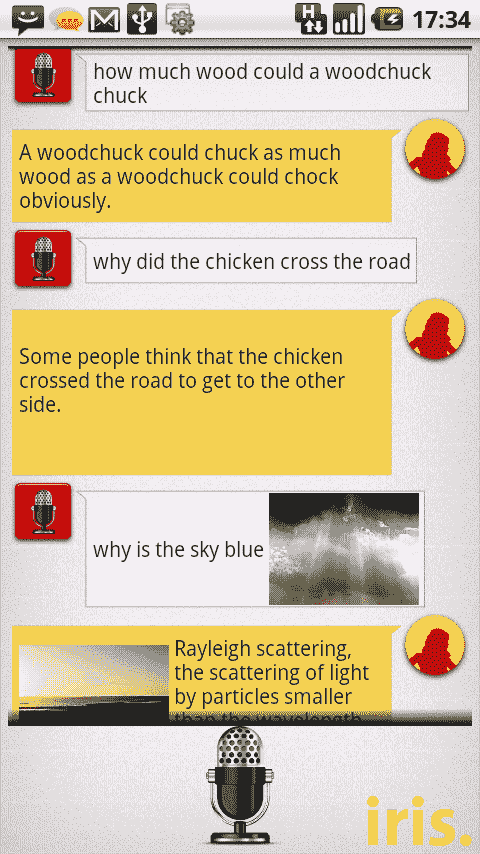

# Iris(有点)是 Android TechCrunch 的 Siri

> 原文：<https://web.archive.org/web/https://techcrunch.com/2011/10/17/iris-is-sort-of-siri-for-android/>

# Iris(有点)是安卓系统的 Siri

虽然语音控制从一开始就是安卓系统的一部分，但 T2 的 Siri 却以其卓越的搜索和理解能力破坏了这一乐趣。然而，在纳拉扬·巴布的带领下，一个来自 Dexetra.com[的勤劳团队在一次黑客马拉松中仅用了 8 个小时就造出了一个类似 Siri 的东西。](https://web.archive.org/web/20230203081929/http://www.dexetra.com/)

Iris 允许您搜索各种主题，包括皈依、艺术、文学、历史和生物。你可以问它“鱼是什么？”它会回复一段来自维基百科的关于我们鳍朋友的文章。

该应用程序将很快在 Android Marketplace 上推出，但我最近尝试了一下，发现它有点稀疏，但相当酷。它使用 Android 的语音转文本功能来理解基本问题，Narayan 和他的朋友们一直在改进这款应用程序。
最酷的事？他们用了八个小时完成了这个应用程序。

> 当我们开始看到结果时，每个人都很兴奋，开始了高速编码竞赛。很快，我们就在 Iris 中加入了语音输入、文本到语音转换以及许多幽默元素。直到深夜，我们才决定用“爱丽丝”这个名字，反过来就是 Siri。我们还逆向工程了一次疯狂的扩张——智能竞争对手 Siri 的模仿者。我们仍然处于有趣的模式，但当我们开始使用它时，结果实际上很好，真的很好。

你可以在这里获得早期的 APK 测试版，但是我建议等待本周正式版的到来。它只是告诉你神奇的事情会在任何地方突然出现。