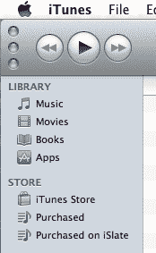

# “App Store”是否和微软的“Windows”一样通用？TechCrunch

> 原文：<https://web.archive.org/web/http://techcrunch.com/2011/03/01/is-app-store-as-generic-as-microsofts-windows/>

随着科技公司为无处不在而战，出现这样的争议也就不足为奇了。使用通用词作为产品名称总是有风险的，因为建立通用传统(如苹果的“i-”前缀)很难监管。今天处于危险之中的是苹果的“应用商店”商标，我相信我们的读者都知道，该商标成立于 2008 年，可以说是第一个真正的平台，独立开发者可以通过它提供移动应用程序、游戏等。

他们同时申请了商标。然而，从那以后，微软一直声称苹果公司对这个通用术语没有专属权，这个术语可能适用于任何其他移动应用商店。好像面巾纸也注册了“纸巾”的商标。[苹果公司只是围绕](https://web.archive.org/web/20230203032135/http://www.techflash.com/seattle/2011/03/apple-fights-for-app-store-trademark.html)展开了争论，然而，它指出微软自己也为其最突出的产品保留了一个简单的通用术语:Windows。众所周知，窗口既是透明的入口，让光线从外面进入里面，也是导航计算机操作系统的视觉隐喻。

这是值得考虑的一点。但不是唯一的一个。

苹果有一个强有力的案例:“应用商店”或多或少是由他们推广的。有一段时间没有竞争对手，所以“应用商店”在很长一段时间里只指苹果。“应用商店”也(他们说)是一个“双关语”，意在唤起苹果商店。这在业内肯定引起了一些关注。尽管如此，这个术语并不是随意选择的。竞争对手也有选择，谷歌(Google)和 RIM 等公司的名字就证明了这一点。

不过，微软的说法同样合理:你真的能仅仅因为是第一个注册商标就注册这么宽泛的术语吗？“苹果在‘App Store’中的任何次要含义或声誉都是事实上的次要含义，不能将通用术语‘App Store’转化为受保护的商标。”换句话说，“应用商店”并不是因为苹果而爆红，而是因为它是任何人在描述这种类型的东西时都会用到的术语。很明显(但不是法定义务)，每个类似的服务也可以被称为“应用商店”。观察这张漂亮的文氏图:

这肯定有意义吗？反过来说，我们现在用这个词当然是因为苹果让我们用了这个词。这是创新还是模仿的先有鸡还是先有蛋的争论。老实说，在科技行业，这种观点几乎没什么争议。100 次里有 99 次是模仿。

苹果在 Windows 操作系统上对微软的攻击有着稍微不同的因素，但它们确实非常相似。与苹果一样，微软普及了导航文件系统的“窗口”[方法](https://web.archive.org/web/20230203032135/http://en.wikipedia.org/wiki/WIMP_%28computing%29)，但并没有发明这种方法。你在*的*窗口看到了这个，虽然你可能没有在窗口看到*。但微软不会追究那些说他们的应用程序或操作系统打开了一个窗口的人，尽管其中也有同样适用的词语:查看器、面板、选项卡。不过“windows”现在已经很难成为操作系统的卖点了，当然，如果苹果因为拥有“T10”Windows 而决定将 OS X 的名字改为“Windows OS X”，那微软就惨了。*

或许苹果可以自称普及了“app”这个词？这很可疑。这只是“应用”这个词的缩写，这个词很久以前就开始使用了。

此外，App Store 是否也在 iTunes Store 的保护下运行？在 iTunes 中，音乐和电影旁边有一个“应用程序”部分。其实它并不是一家独立的商店，就像音乐和电影版块彼此独立一样。iTunes 帮助普及了在线音乐所有权，但苹果并没有尝试为“音乐商店”注册商标。这不是很相似吗？

有许多商标成为通用词汇的例子:乐高、飞盘、塔泽尔。但这些都是无稽之谈。他们没有提及他们所做的事。苹果似乎正试图做到这一点。目前还不清楚苹果的商标是合法的、正确的，还是两者都合法，或者两者都不合法。这是一个非常微妙的问题。我个人的看法是，“App Store”一开始是通用的，但它的创意蒙上了一层霜。但这是一种极度精细的区分，一点小争论可能会让我转向另一个方向。

你们怎么看？对于拥有 Word 和 Office 商标的微软来说，这是一个不确定的局面，还是苹果做得过火了？