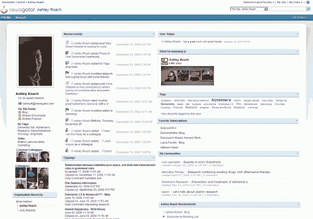

# 企业 RSS 死了吗？Newsgator 首席执行官:“谁在乎？”TechCrunch

> 原文：<https://web.archive.org/web/https://techcrunch.com/2009/01/15/is-enterprise-rss-dead-newsgator-ceo-who-cares/>

企业 RSS 承诺远不止是服用类固醇的谷歌阅读器。

它允许群组使用推送技术随时了解私人更新，而不会弄乱电子邮件。同样，我每天都用 [SM2](https://web.archive.org/web/20221208015030/http://sm2.techrigy.com/main/) 来监控关于 CrunchBase 的新闻。目前我每天都会收到一封电子邮件，但如果我能订阅一个有密码保护的 RSS 订阅源就更好了。

周一，Marshall Kirkpatrick 声称[企业 RSS 已死](https://web.archive.org/web/20221208015030/http://www.readwriteweb.com/archives/rip_enterprise_rss.php)——引用 Newsgator 的持续现金注入作为市场已死的证据。Brad Feld 回应了他对[为什么企业 RSS 还活着](https://web.archive.org/web/20221208015030/http://www.feld.com/wp/archives/2009/01/enterprise-rss-at-newsgator-is-alive-and-well.html)的想法。

昨天，我与 Newsgator 的首席执行官 JB Holston 进行了交谈，并询问了他的想法:

你因 RSS 阅读器而出名——你想因解决什么问题而出名？

> 首先，尽管我们的品牌与消费者 RSS 阅读器相关联——FeedDemon、NetNewsWire、iPhone RSS 阅读器——但我们从未打算打造一款以消费者为中心的产品，然后把它扔给谷歌。从一开始，我们就瞄准了企业号。
> 
> 我们希望以解决协作问题而闻名。我们有社交小工具，例如路透社的小工具使用我们的技术。我们还有一个社交网站应用程序，它基本上将微软的 SharePoint 变成了企业的脸书。【下面截图。]
> 
> 我们的企业 RSS 服务有两个方面:大约 150 家供应商使用的 Saas 部署，以及位于防火墙后面的本地服务器——目前大约有 125 个客户端。

你为什么一直筹集现金？

> Newsgator 在四年半前首次获得资助，实际上，我们已经从不同的团体获得了三轮资助。从技术上讲，已经有六轮了，但只有三场不同投资人的活动。到目前为止，我们已经筹集了 3900 万美元。
> 
> 如果我们只是一个 iPhone 开发者，这似乎很多(我们的 iPhone 应用程序进入了《时代》杂志的前十名)，但正如我之前所说，我们非常专注于企业。融资 3900 万美元在这个领域很常见。

你对企业 RSS 的消亡有什么回应？

> 谁在乎呢。它不必被称为企业 RSS，因为那只是后端协议。从我们的角度来看，企业 RSS——无论是为 CMS、门户增强、社交计算还是替换外部信息源而部署——都只是一种使能技术。
> 
> 我们的客户不会来找我们说“我们想要企业 RSS”。他们带来了具体的问题，如“修复我们的门户”、“帮助我们推动协作”等，然后我们就去使用 RSS。他们不关心它是如何发生的。
> 
> 从我们的角度来看，博客领域的对话已经超越了 RSS。看到有人说“因为企业初创公司需要现金，所以企业 RSS 市场已经死了”，这有点令人吃惊。
> 
> RSS 是令人难以置信的技术，如果没有人谈论它，那只是因为市场成熟到强调解决方案，而不是技术。

这当然是一个有趣的论点，但我不认为市场已经开始理解企业 RSS 的力量。

也许我们只是太沉迷于糟糕的收件箱习惯，而不去担心如何从收件箱中清理新闻。当然，我们才刚刚开始使用在线协作，而不必去想它。只有时间能告诉我们 RSS 在企业中渗透有多深。

