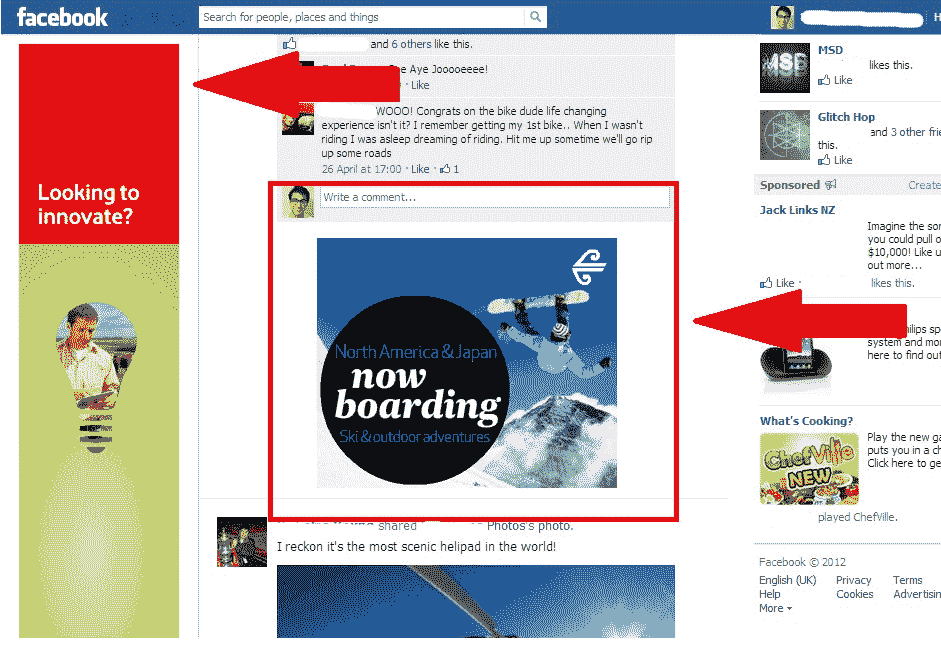

# 脸书正在新西兰测试新的新闻推送和摩天大楼展示广告单元吗？不，广告软件再次来袭 

> 原文：<https://web.archive.org/web/https://techcrunch.com/2012/08/30/is-facebook-testing-out-new-newsfeed-and-skyscraper-display-ad-units-in-new-zealand/>

去年 12 月，纽西兰是第一个获得脸书新时间表的国家。现在，随着脸书对更多广告(和收入)的推动，这个国家看起来可能正在进行另一次特殊的亮相，将社交网络带入显示前沿的新领域。

新西兰的一位读者给我们发来了一些截图(嵌入在下面),似乎显示了他页面上两个新区域的广告:左侧(不是右侧)的一座摩天大楼和直接在他的新闻提要中的一个放大的显示广告。**更新**:一名 Facebook 用户称这是广告软件，不是合法的脸书测试。全部细节如下。

如果这些单元真的是脸书测试，它们将是脸书展示广告的最新发展:本月早些时候，该公司开始在用户的新闻订阅中发布来自品牌粉丝页面的[帖子，不管这些用户是否“喜欢”这些页面。在新西兰出现的广告是直截了当的展示单元，而不是“故事”，似乎是这一主题的变体。](https://web.archive.org/web/20221230125508/https://techcrunch.com/2012/08/14/facebook-page-ads/)

读者 Raghav Saxena(碰巧)在在线广告公司 Kadabra 工作，他说不管他在脸书是否“喜欢”这家公司，广告都会出现。在他的两个例子中，新西兰航空是他喜欢的一家公司，现在以广告的形式出现；但是 Travian games，现在也以区块式显示广告的形式出现在他的新闻提要中，却不是这样。同时，在他看来，摩天大楼的广告与他的社交图毫无关联。

他在一封电子邮件中告诉我:“我确实‘喜欢’新西兰航空，但我不认为广告在现阶段是基于喜欢而有针对性的，因为我目前正在看烦人的‘获得绿卡’广告以及‘你会和谁结婚’广告。”。

Saxena 指出，在他的页面上出现新的广告之前，他的帐户被“锁定”,短时间内无法进入。当他回到网上时，广告出现了。

“脸书到处都在停工，我听说奥克兰和新普利茅斯的人也有同样的经历，”他说。他还指出，它们似乎也让页面浏览起来略显笨拙。"广告也干扰了 FB 自由向下滚动的能力."

至于左边的摩天大楼，一位在第三方脸书营销公司工作的消息人士将其描述为“一座实验室大小的摩天大楼，这对脸书来说是不正常的。”(互动广告局是一个帮助设定在线广告标准的组织。)他说，他所说的“正常”是指他看起来不熟悉的东西。他建议甚至可以是另一家公司在背后支持，或者是一个行动驱动的广告。

这可能不太正常，但它似乎是广告的一块明显的不动产:当你在你的新闻订阅上滚动得足够低时，在你通过你的页面、群组、应用程序、朋友和兴趣的标签后，你会有一个无尽的空白栏。

脸书以在有限的用户群中测试新事物而闻名，所以这可能是另一个发生这种情况的例子，新西兰是这种特殊迭代的试验品。

当脸书在该国首次推出时间轴时，[注意到](https://web.archive.org/web/20221230125508/http://gigaom.com/2011/12/06/its-a-start-facebook-begins-timeline-rollout-in-new-zealand/)新西兰是 first moves 的一个关键市场:

> “作为一家全球性公司，我们需要获得美国以外的视角和洞察力。新西兰是一个很好的起点，因为它讲英语，所以我们可以阅读反馈并迅速做出改进。”

我们已经要求脸书发表评论，当我们收到回复时，我们会更新这个帖子。

**更新**:我们还没有收到脸书发言人的回复，但脸书的风险运营分析师 Cheraag Sabzeh 评论如下:“这肯定是广告软件。脸书绝不会在新闻提要之间或左侧放置横幅广告。卸载粗略的插件或扩展可以让这些广告从你的脸书页面上消失。”然而，那条评论现在似乎已经被删除了，尽管脸书帮助中心的[广告页面](https://web.archive.org/web/20221230125508/https://www.facebook.com/help/adware)指出广告不应该出现在页面的左侧。

更新 2: 和完整的脸书声明…

> “这些程序声称给予用户在脸书的特权，但用未经脸书批准的广告掩盖你的个人资料和新闻。事实上，我们每天收到的超过 90%的广告投诉都与广告软件程序及其显示的广告有关。这些项目极大地改变了人们在脸书的体验，绕过了脸书的质量和安全控制。此外，广告软件程序会降低脸书速度，引起用户混淆，并通过显示横幅广告来混淆已验证的用户内容。为了确保我们所有用户的最佳体验，并维护脸书产品的完整性，我们要求用户在返回脸书之前从浏览器中删除这些广告软件产品。有关移除这些产品的更多信息，请参见[此处](https://web.archive.org/web/20221230125508/https://www.facebook.com/help/adware)。”

