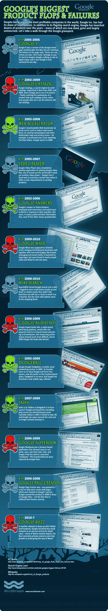

# 没有比失败更成功的了:谷歌最大的产品失败了 

> 原文：<https://web.archive.org/web/https://techcrunch.com/2010/08/18/is-google-me-nex/>

# 失败是最成功的:谷歌最大的产品失败了

这里有一些在[脸书的](https://web.archive.org/web/20221205142512/http://facebook.com/)模仿者[脸书的](https://web.archive.org/web/20221205142512/https://beta.techcrunch.com/2010/08/18/facebook-location/)发布前夕的信息图，这为基于位置的初创公司 [Foursquare 和 Gowalla](https://web.archive.org/web/20221205142512/https://beta.techcrunch.com/2010/08/18/facebook-places-gowalla/) 敲响了[的丧钟。](https://web.archive.org/web/20221205142512/http://twitter.com/mbaratz/status/21534687759)

在谷歌的墓地里漫步是一个教训，告诉我们当成功的公司不再专注于他们的核心竞争力而去追逐小人物时，它是多么的罕见。在 Wave、Jaiku 和 Foursquare 前身 Dodgeball 之间，谷歌是“未能扼杀下一件大事”部门的惯犯。

随着今天的签到工具的推出，脸书的产品团队似乎可能会步搜索巨头[创业粉碎](https://web.archive.org/web/20221205142512/http://www.quora.com/)的后尘。毕竟，你上一次问脸书问题是什么时候？

图片:[文字流](https://web.archive.org/web/20221205142512/http://www.wordstream.com/articles/google-failures-google-flops)