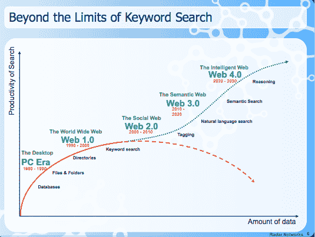

# 关键词搜索即将达到临界点吗？

> 原文：<https://web.archive.org/web/https://techcrunch.com/2008/04/25/is-keyword-search-about-to-hit-its-breaking-point/>

随着网络上的数据越来越多，筛选所有数据的主要方式——关键词搜索——有一天将无法提供我们想要的准确信息。事实上，一些人认为关键词搜索已经产生了收益递减——正如上面由[新星斯皮瓦克](https://web.archive.org/web/20221207205940/http://novaspivack.typepad.com/)制作的幻灯片所暗示的。斯皮瓦克是语义网初创公司 [Radar Networks](https://web.archive.org/web/20221207205940/http://www.radarnetworks.com/) 的首席执行官和创始人，他认为语义搜索将有助于解决这些问题。但是，任何对如今在谷歌上找东西比一年前还要花更长时间感到沮丧的人都知道，他的观点有一定道理。

“关键词搜索还可以，”他说，“但是如果信息爆炸继续下去，我们需要更好的东西。”今天，大约有 13 亿人在网上，超过 1 亿个活跃的网站。随着越来越多的人涌入，网络上的信息量呈指数级增长，以容纳所有这些搜索者，他们自己也感到有必要将自己的个人和社会信息放到网络上。

在某一点上，有数十亿的网页需要筛选，关键字搜索就不再管用了。这是一个大海捞针的问题，干草堆每秒钟都在变得越来越大。

斯皮瓦克解释道:

> 关键词搜索引擎返回的是草堆，但我们真正寻找的是针。谷歌这种关键字搜索的问题在于，只有高引用率的页面才会出现在搜索结果的顶端。你得到了一大堆结果，但是你想要的页面——你正在寻找的“针”——可能不会被其他页面大量引用，所以它不会出现在第一页。这是因为关键词搜索引擎不理解你的问题，他们只是找到与你问题中的词相匹配的页面。

那么我们如何超越关键词搜索和谷歌的 PageRank 呢？有许多方法正在尝试:社交搜索、标签、引导搜索、自然语言搜索、统计方法、开放搜索、语义搜索和(出路)人工智能。他们都有自己的问题。标签太乱，不一致。自然语言需要太多的计算能力，难以扩展，并且不能很好地处理结构化数据。语义搜索可能是最有前途的，但它本质上需要重写每一个网页。

Spivack 在本月早些时候于阿姆斯特丹举行的 [Next Web conference](https://web.archive.org/web/20221207205940/http://thenextweb.org/2008/04/03/nova-spivack-the-semantic-web-as-an-open-and-less-evil-web/) 的一次演讲中谈到了这些问题。这是我迄今为止听到的对语义网最清晰的解释之一(我在下面嵌入了他的完整幻灯片)。语义网只不过是一套标准，如果被广泛采用，将有助于计算机从网上的海量数据中提取意义。但它不是一种野蛮的软件方法，而是将智能融入到数据中。“你需要使用的所有数据都由数据本身携带，”Spivack 说。哑软件，智能数据。无论创建了多少亿个网页，这种方法都是可伸缩的。

斯皮瓦克说，关键是:

> *像网络对待文档一样对待数据。*
> 
> 你正在把网络变成一个数据库，你的数据也成为其中的一部分。您的数据成为全球数据库的一部分。语义网将让你从一个数据记录移动到另一个数据记录，就像你从一个网页移动到另一个网页一样。

采用语义网有许多障碍，但是它的目标是值得努力的。可以肯定的是，搜索需要发展，谷歌、雅虎和微软也需要发展。当然，他们可以采用任何证明最有效的方法或组合。

问题是:他们会不会，或者他们是否太执着于关键词搜索而无法超越它？